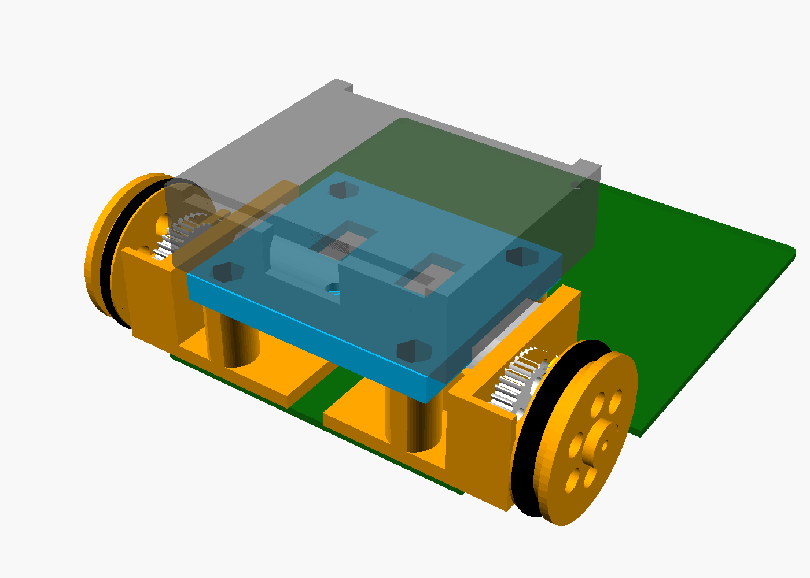

# Linetracer2 — 子ども向け教材ライントレーサー

Raspberry Pi Pico ＋ TC78H653FTG ＋ 130 モーター ×2 の、**全部足付き部品（スルーホール）で子どもが自分ではんだ付けできる**ライントレーサー。
基板そのものがシャーシで、センサー 6 個を基板の裏に直付けし、3D プリント（Bambu Lab P1S）のギヤボックス（1 段 5:1）で 130 モーターを高速に回す。
**テープ・接着剤は使わず、M3 ねじ（2 種類）だけで組み立てる。** 部品は秋月・ホームセンター・タミヤ品など、**T 番号のある店で買える定番品だけ**。

| 基板（表） | 組み立て図 |
|---|---|
|  |  |

| 項目 | 内容 |
|------|------|
| マイコン | Raspberry Pi Pico（Pico 2 / Pico W も可）、MicroPython |
| モータードライバ | 東芝 TC78H653FTG（秋月 AE-TC78H653FTG モジュール ¥200、スモールモード 2A×2ch） |
| モーター・駆動 | FA-130RA-2270 ×2、タミヤ 8T ピニオン → 3D プリント 40T（m0.5）1 段 5:1、車輪 φ32（O リング P-24）、車軸 真鍮 φ2 |
| センサー | フォトリフレクタ LBR-123F ×6（TC4051BP で ADC 1 本に切替、外乱光キャンセル付き） |
| 電源 | 単3×3本（アルカリ 4.5V / ニッケル水素 3.6V）。電池ボックスはデッキにねじ止め、スイッチで ON/OFF |
| 基板 | 2 層 100×100 mm、1.6 mm、全部品スルーホール（ピッチ 2.54 mm 以上、センサーのみ 1.8 mm）、**rev.A1** |
| 3D プリント | 枠 L/R・デッキ・平歯車 ×2・車輪 ×2・スキッド（PLA 約 30 g、サポート不要） |
| UI | ボタン×2（START/SELECT）、LED×3、圧電ブザー（オプション）、I2C 拡張（OLED を直挿し可） |
| 性能（計算値） | 最高速度 理論 5 m/s（ソフトで 1.5〜2.5 m/s に制限）、加速 4 m/s² でモーター電流 約 1.4 A |
| コスト（1 台） | 全部新品 約 ¥2,400、**Pico を再利用すれば 約 ¥1,500**（`docs/05_bom.md`） |

## ドキュメント

| ファイル | 内容 |
|---------|------|
| [docs/01_requirements.md](docs/01_requirements.md) | 要件定義（依頼内容・派生要件・買い方のルール・コスト目標） |
| [docs/02_concept.md](docs/02_concept.md) | 形・寸法・駆動系の計算・重心・電池 |
| [docs/03_circuit.md](docs/03_circuit.md) | 回路設計（ピン割り当て表、各ブロックの計算） |
| [docs/04_pcb.md](docs/04_pcb.md) | 基板設計（改訂履歴・配置・配線・DRC・発注方法・再生成方法） |
| [docs/05_bom.md](docs/05_bom.md) | 部品表（秋月の通販コード・買う店）、コスト、10 台分の買い物リスト |
| [docs/06_assembly.md](docs/06_assembly.md) | 組み立て手順書（はんだ付けの順番・チェック・ねじ止め・トラブル） |
| [docs/07_firmware.md](docs/07_firmware.md) | ソフトウェア（MicroPython のセットアップ、ライブラリ、PD 制御の調整） |
| [docs/08_knowledge.md](docs/08_knowledge.md) | 知見メモ（部品のクセ、買い方、KiCad/Freerouting/OpenSCAD のハマりどころ、設計判断） |
| [hardware/mechanical/README.md](hardware/mechanical/README.md) | 3D プリント部品と P1S の印刷設定、ねじの一覧 |
| [hardware/mechanical/assembly.stl](hardware/mechanical/assembly.stl) | 全体を組み立てた 3D（STL、ブラウザで回して見られる） |
| [hardware/kicad/Linetracer2_pcb.step](hardware/kicad/Linetracer2_pcb.step) | 部品付き基板の 3D（STEP、Fusion 等の CAD 用） |
| [docs/Linetracer2_schematic.pdf](docs/Linetracer2_schematic.pdf) | 回路図 PDF |
| [docs/datasheets/README.md](docs/datasheets/README.md) | 使った部品のデータシート（リンク集） |

## フォルダ構成

```
Linetracer2/
├── README.md
├── docs/                     設計資料（Markdown）、回路図/基板 PDF、画像、データシートのリンク
├── hardware/
│   ├── kicad/                KiCad 10 プロジェクト（.kicad_pro / _sch / _pcb）
│   │   ├── lib/              自作シンボル・フットプリント（TC78H653 モジュール、LBR-123F、ブザー等）
│   │   ├── bom/              部品表 CSV（秋月の通販コード入り）
│   │   └── reports/          ERC / DRC レポート、ネットリスト
│   ├── gerber/               製造用 Gerber・ドリル
│   ├── Linetracer2_rev.A1_gerber.zip   ← 基板メーカーにそのまま渡す
│   └── mechanical/           3D プリント部品（OpenSCAD 元データ、STL、組み立て図）
├── firmware/micropython/     ライブラリ・標準プログラム・授業用サンプル
└── scripts/                  回路図・基板を生成するスクリプト（再生成用）
```

## 状態（2026-10-05, rev.A1）

- [x] 要件定義・構成・駆動系の計算
- [x] 回路図（ERC エラー 0・警告 0）
- [x] 基板レイアウト・配線（DRC エラー 0、未配線 0）、Gerber 出力（rev.A1: ブザーの穴を追加）
- [x] 部品選定・BOM・コスト見積り（T 番号のある店・定番品だけ）
- [x] 3D プリント部品（ねじ止めのデッキ、印刷できる 40T 平歯車、干渉チェック済み）
- [x] MicroPython ライブラリとサンプル
- [ ] **試作 1 台目の製作と実測**（センサーの感度、ギヤのかみ合い、PD ゲイン、電池の持ち）
- [ ] 試作結果を反映した rev.B（`docs/04_pcb.md` §7）
