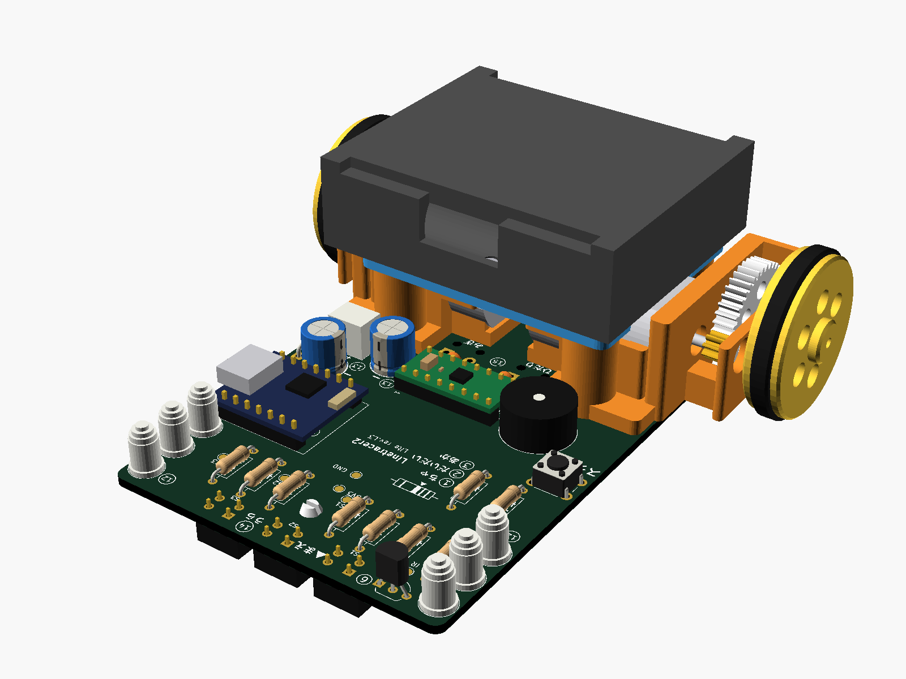

# Linetracer2 — 子ども向け教材ライントレーサー

Raspberry Pi Pico ＋ TC78H653FTG ＋ 130 モーター ×2 の、**全部足付き部品（スルーホール）で子どもが自分ではんだ付けできる**ライントレーサー。
基板そのものがシャーシで、センサー 6 個を基板の裏に直付けし、3D プリント（Bambu Lab P1S）のギヤボックス（1 段 5:1）で 130 モーターを高速に回す。
**テープ・接着剤は使わず、M3 ねじ（2 種類）と 3D プリントのツメで組み立てる。** 部品は秋月・ホームセンター・タミヤ品など、**T 番号のある店で買える定番品だけ**。

| 基板（表） | 組み立て図 |
|---|---|
|  |  |

| 項目 | 内容 |
|------|------|
| マイコン | Raspberry Pi Pico（Pico 2 / Pico W も可）、MicroPython |
| モータードライバ | 東芝 TC78H653FTG（秋月 AE-TC78H653FTG モジュール ¥200、スモールモード 2A×2ch） |
| モーター・駆動 | FA-130RA-2270 ×2、タミヤ 8T ピニオン → 3D プリント 40T（m0.5）1 段 5:1、車輪 φ32（O リング P-24）、車軸 真鍮 φ2 |
| センサー | フォトリフレクタ LBR-123F ×6（TC4051BP で ADC 1 本に切替、外乱光キャンセル付き） |
| 電源 | 単3×3本（アルカリ 4.5V / ニッケル水素 3.6V）。電池ボックスはデッキにねじ止め、スイッチで ON/OFF |
| 基板 | 2 層 100×100 mm、1.6 mm、全部品スルーホール（ピッチ 2.54 mm 以上、センサーのみ 1.8 mm）、**rev.A1** |
| 3D プリント | 枠 L/R・デッキ・平歯車 ×2・車輪 ×2・ツメで差し込むスキッド（PLA 約 30 g、サポート不要）。電池ボックスをツメで留めるデッキも用意（任意） |
| UI | ボタン×2（START/SELECT）、LED×3、圧電ブザー（オプション）、I2C 拡張（OLED を直挿し可） |
| 性能（計算値） | 最高速度 理論 5 m/s（ソフトで 1.5〜2.5 m/s に制限）、加速 4 m/s² でモーター電流 約 1.4 A |
| コスト（1 台） | 全部新品 約 ¥2,370、**Pico を再利用すれば 約 ¥1,500**（`docs/05_bom.md`） |

## 「Linetracer2 Lite」（rev.L3：XIAO ESP32C6（ピンヘッダ）＋ LBR-127HLD ＋ ブザー ＋ フルカラー LED）

標準版から部品を減らした版も用意した（詳しくは [lite/README.md](lite/README.md)）。**Lite のファイルはすべて `lite/` フォルダにまとめてあり、標準版のファイルとは混ざらない**。**枠・デッキ・平歯車・車輪の 3D プリント部品、ねじ、モーター、電池ボックスは標準版と共通**で、基板・ソフト・前の支え（Lite 用ボールキャスター）が違う。
rev.L2（2026-10-05）でマイコンを **Seeed Studio XIAO ESP32C6**、センサーを **LBR-127HLD** に変え、rev.L3（2026-10-07）で **XIAO をピンヘッダ付けに、ブザーとフルカラー LED 6 こ・テストパッドを追加、配線を全部手で引き直し（交差なし・ビア 0）、Lite 用ボールキャスター**を作った。ロボット全体の 3D モデル（STL / GLB）もある。

| | 標準版 rev.A1 | Lite rev.L3 |
|---|---|---|
| マイコン | Pico をピンヘッダで付ける | **XIAO ESP32C6 をピンヘッダで付ける**（Wi-Fi / Bluetooth 付き） |
| センサー | LBR-123F 6 個 ＋ マルチプレクサ TC4051BP | **LBR-127HLD 3 個を ADC に直結**（マルチプレクサなし） |
| ボタン / LED / ブザー | 2 / 3 / オプション | **1 / フルカラー 6（PL9823、左右に 3 こずつ、信号線 1 本）/ あり（START ボタンと同じピン）**（XIAO の黄 LED も使える） |
| タイヤ / 前の支え | O リング P-24 / スキッド 4.0 mm | **TPU の印刷タイヤ / ボールキャスター 7.5 mm**（センサーが背高なので前を上げる） |
| 電池電圧の測定 | あり | **なし**（XIAO の ADC 3 本をセンサーで使い切る） |
| はんだ付け | 約 230 か所 | **約 120 か所** |
| 基板 / シルク | 100 × 100 mm / 英語中心 | **65 × 100 mm** / **記号だけ**（つくる順番 ①〜⑮・＋−・抵抗の色）。説明は手順書 `lite/docs/assembly.md` |
| **1 台の部品代（全部新品）** | 約 ¥2,370 | **約 ¥2,530（+¥160）** |

> Lite rev.L3 はマイコンをピンヘッダで付ける。基板側を**ピンソケット**にすれば、標準版のようにマイコンを回収して使い回すこともできる（`lite/docs/assembly.md` §3）。

| Lite のロボット全体（3D） | Lite の基板（3D） |
|---|---|
|  |  |

## ドキュメント

| ファイル | 内容 |
|---------|------|
| [docs/01_requirements.md](docs/01_requirements.md) | 要件定義（依頼内容・派生要件・買い方のルール・コスト目標） |
| [docs/02_concept.md](docs/02_concept.md) | 形・寸法・駆動系の計算・重心・電池 |
| [docs/03_circuit.md](docs/03_circuit.md) | 回路設計（ピン割り当て表、各ブロックの計算） |
| [docs/04_pcb.md](docs/04_pcb.md) | 基板設計（改訂履歴・配置・配線・DRC・発注方法・再生成方法） |
| [docs/05_bom.md](docs/05_bom.md) | 部品表（秋月の通販コード・買う店）、コスト、10 台分の買い物リスト |
| [docs/06_assembly.md](docs/06_assembly.md) | 組み立て手順書（はんだ付けの順番・チェック・ねじ止め・トラブル） |
| [docs/07_firmware.md](docs/07_firmware.md) | ソフトウェア（MicroPython のセットアップ、ライブラリ、PD 制御の調整） |
| [docs/08_knowledge.md](docs/08_knowledge.md) | 知見メモ（部品のクセ、買い方、KiCad/Freerouting/OpenSCAD のハマりどころ、設計判断） |
| [lite/README.md](lite/README.md) | **Lite rev.L3**（XIAO ESP32C6 ＋ LBR-127HLD ＋ ブザー。変更点と理由、配線のルール、コスト比較、回路・基板・部品表・組み立て・ソフトの違い） |
| [lite/docs/assembly.md](lite/docs/assembly.md) | Lite の組み立て手順書（基板の記号の見かた、つくる順番 ①〜⑮） |
| [lite/hardware/Linetracer2-Lite_assembly.stl](lite/hardware/Linetracer2-Lite_assembly.stl) | **Lite のロボット全体の 3D**（基板・部品・枠・モーター・ギヤ・電池ボックス・キャスター。STL、ブラウザで回して見られる。色つきは同じ名前の `.glb`） |
| [hardware/mechanical/README.md](hardware/mechanical/README.md) | 3D プリント部品と P1S の印刷設定、ねじの一覧 |
| [hardware/mechanical/assembly.stl](hardware/mechanical/assembly.stl) | 全体を組み立てた 3D（STL、ブラウザで回して見られる） |
| [hardware/kicad/Linetracer2_pcb.step](hardware/kicad/Linetracer2_pcb.step) | 部品付き基板の 3D（STEP、Fusion 等の CAD 用） |
| [docs/Linetracer2_schematic.pdf](docs/Linetracer2_schematic.pdf) | 回路図 PDF |
| [lite/docs/Linetracer2-Lite_schematic.pdf](lite/docs/Linetracer2-Lite_schematic.pdf) | Lite の回路図 PDF |
| [docs/datasheets/README.md](docs/datasheets/README.md) | 使った部品のデータシート（リンク集） |

## フォルダ構成

```
Linetracer2/
├── README.md
├── docs/                     設計資料（Markdown）、回路図/基板 PDF、画像、データシートのリンク
├── hardware/
│   ├── kicad/                KiCad 10 プロジェクト（.kicad_pro / _sch / _pcb）
│   │   ├── lib/              自作シンボル・フットプリント（TC78H653 モジュール、LBR-123F、ブザー等）
│   │   ├── bom/              部品表 CSV（秋月の通販コード入り）
│   │   └── reports/          ERC / DRC レポート、ネットリスト
│   ├── gerber/               製造用 Gerber・ドリル
│   ├── Linetracer2_rev.A1_gerber.zip   ← 基板メーカーにそのまま渡す
│   └── mechanical/           3D プリント部品（OpenSCAD 元データ、STL、組み立て図。両方の版で共通。Lite は前の支えだけ 7.5 mm）
├── firmware/micropython/     ライブラリ・標準プログラム・授業用サンプル
├── scripts/                  回路図・基板を生成するスクリプト（再生成用。LT2_VARIANT=lite で Lite も作る）
└── lite/                     ★ Lite 一式（rev.L3: XIAO ESP32C6 版。標準版とは別フォルダ）
    ├── README.md             Lite の設計書（変更点・コスト比較・組み立て・ソフト）
    ├── docs/                 回路図/組立図 PDF、3D 画像
    ├── hardware/             KiCad プロジェクト、Gerber（Linetracer2-Lite_rev.L3_gerber.zip）、ロボット全体の 3D（STL / GLB）
    ├── firmware/micropython/ Lite 用ソフト（XIAO ESP32C6 用 MicroPython。センサー 3 個・ボタン 1 個・フルカラー LED 6 個・ブザー）
    └── scripts/              Lite 専用の生成スクリプト（回路図・配置と手で引いた配線・シルク・配置の確認用の絵）
```

## 状態（2026-10-05, rev.A1）

- [x] 要件定義・構成・駆動系の計算
- [x] 回路図（ERC エラー 0・警告 0）
- [x] 基板レイアウト・配線（DRC エラー 0、未配線 0）、Gerber 出力（rev.A1: ブザーの穴を追加）
- [x] 部品選定・BOM・コスト見積り（T 番号のある店・定番品だけ）
- [x] 3D プリント部品（ねじ止めのデッキ、印刷できる 40T 平歯車、干渉チェック済み）
- [x] MicroPython ライブラリとサンプル
- [ ] **試作 1 台目の製作と実測**（センサーの感度、ギヤのかみ合い、PD ゲイン、電池の持ち）
- [ ] 試作結果を反映した rev.B（`docs/04_pcb.md` §7）
- [x] 低コスト版 Lite rev.L1 の回路図・基板（ERC 0・DRC 0・警告 0）・部品表・ソフト（2026-10-05）
- [x] Lite rev.L2（XIAO ESP32C6 ＋ LBR-127HLD）の回路図・基板・部品表・ソフト・スキッド 7.5 mm（2026-10-05）
- [x] Lite rev.L3（XIAO をピンヘッダで、ブザー、手で引いた配線、Lite 用ボールキャスター、ロボット全体の 3D と干渉チェック）（2026-10-07）
- [ ] Lite の試作（LBR-127HLD の高さ、キャスターの転がり、3 センサーでの走り、`lite/README.md` §10）
