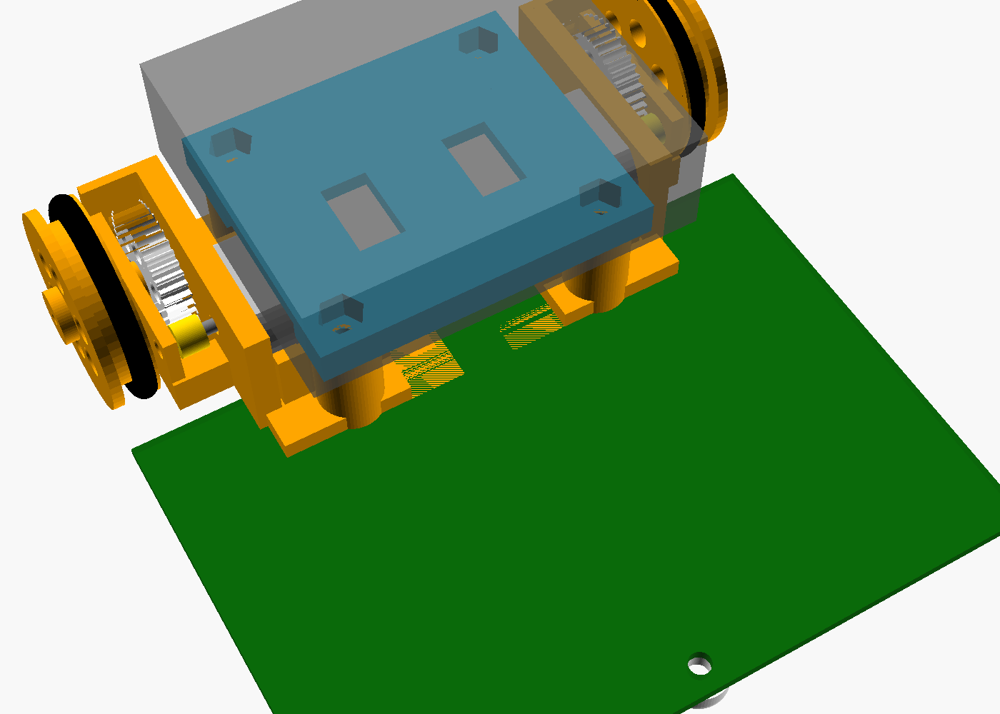

# 02. 形（全体構成）と駆動系の設計

> 最終更新: 2026-10-05（rev.A1: 電池ボックスをねじ止めするデッキを追加）／ 関連: `01_requirements.md`, `04_pcb.md`, `hardware/mechanical/`

---

## 1. 全体の形

**基板そのものがシャーシ**。前にセンサー、後ろに 2 つのモーター、モーターの上に 3D プリントの**デッキ**、その上に電池ボックス。
**テープ・接着剤は使わず、全部 M3 ねじで固定する**（M3×20 ×4 本で「基板・ギヤボックス枠・デッキ」をまとめて締め、電池ボックスは底の皿穴 2 か所でデッキにねじ止め）。

```
          ← 前（進行方向） y=0
 ┌──────────────────────────────────────────────┐
 │Q1 BZ  [S1]  [S2]  [S3] (ｽｷｯﾄﾞ) [S4]  [S5]  [S6]  SW1│ ← センサー6個は「裏面」
 │      R  R  R  R  R  R   R  R  R  R  R  R       SW2│   （レンズが床を向く）
 │              [ U2 4051 ]  [J3]         LED×3    │
 │ ┌──────────── Pico ────────────┐ ┌U3┐ C1        │
 │USB                             │ │  │ C2  R  R  │
 │ └──────────────────────────────┘ └──┘ D1   R R  │
 │ [J2 I2C]                     M1+-  M2+-  J1(電池)│
 ├──┐ ・(ねじ)                              (ねじ)・┌──┤ y=70
 │車│  ┌─────モーターL──────┐┌─────モーターR──────┐  │車│
 │輪│  └────────────────────┘└────────────────────┘  │輪│
 │  │ ギヤ        （この上にデッキ＋電池ボックス）  ギヤ│  │
 │  │ ─────── 車軸 y=88 ──────     ──────── 車軸 ───│  │
 └──┘ ・(ねじ)                              (ねじ)・└──┘ y=100
```

| 項目 | 値 |
|------|----|
| 基板外形 | 100 × 100 mm（後ろの左右に車輪・ギヤ用の切り欠き 17.5 × 30 mm） |
| 全幅（車輪込み） | 約 104 mm |
| 全長 | 約 104 mm（車輪が後端から 4 mm 出る） |
| 高さ | 約 43 mm（電池ボックス上面） |
| 接地 | 後輪 2 輪（駆動）＋前スキッド 1 点 ＝ **3 点接地** |
| ホイールベース | 84 mm（スキッド y=4 → 車軸 y=88） |
| トレッド | 約 96 mm |
| センサーの前出し | 車軸から 84 mm 前（＝曲がり始めを早く検出できる） |
| 質量（見積り） | 約 0.21 kg（単3アルカリ×3 込み） |

### 1.1 なぜこの形か

1. **基板＝シャーシ**: 部品が一番少なく、安い。ねじ 4 本でギヤボックスとデッキ（電池の台）が一緒に付く。
2. **センサーを基板裏に直付け**: LBR-123F（TPR-105F の後継）は検出距離が数 mm と短いので、基板を床すれすれ（下面 4 mm）にして、センサーのレンズ面を床から 2.5 mm にする。
3. **モーターと電池は後ろ（駆動輪の上）**: 重さの約 8 割が駆動輪にかかり、滑りにくい（加速・減速が速い）。
4. **センサーは最前列**: 車軸からの距離が長いほど、少しのずれを大きく検出でき、高速でも安定する。
5. **3 点接地**: 4 点だと床の凹凸でどこか 1 点が浮く。3 点なら必ず全部が接地する（＝センサー高さが一定）。
6. **ねじだけで組む**: テープは剥がれる・位置がずれる・分解できない。M3 ねじ（長さ 20 mm と 8 mm の 2 種類だけ）なら、分解して部品を交換でき、毎回同じ位置に付く。

| 前から | 後ろから | 分解図 |
|---|---|---|
|  |  |  |

---

## 2. 高さ方向の寸法（側面図）

```
  電池ボックス (17mm)         ┌─────────────┐  ← 上面 ≒ 43mm
                             └─────────────┘  ← 底 = デッキ上面 26.1mm（M3×8 皿ねじ 2 本）
  デッキ (3D プリント)         ▀▀▀▀▀▀▀▀▀▀▀▀▀▀▀   ← 下面 23.6mm（モーターを上から押さえる）
  柱 (枠の一部)          ┃                ┃     ← 上面 20.6mm（M3×20 が基板の裏から貫通）
  モーター (厚さ15mm)  ┌───────────┐            ← 上面 23.5mm
  軸の高さ 16mm   ─ ─ ─│     ●     │─ ─ ─ ● 車軸(16mm) ⊙ 車輪 Ø32
                       └───────────┘ ギヤボックス枠
  基板 1.6mm  ════════════════════════════════  ← 上面 5.6mm / 下面 4.0mm
  センサー(1.5mm) ▄                    スキッド▼  ← レンズ面 2.5mm
  床 ─────────────────────────────────────────── 0mm
```

| 部位 | 床からの高さ |
|------|------|
| 車軸 = モーター軸 | 16.0 mm（車輪 Ø32 の半径） |
| 基板下面 | 4.0 mm（スキッドの高さで決まる） |
| 基板上面 | 5.6 mm |
| ギヤボックス枠の床板 | 基板上面からモーター下面まで 2.9 mm |
| 平歯車 40T の下端 | 基板上面より 0.1 mm 下 → **基板の切り欠きの中を通す**（切り欠きを 17.5 mm にした理由） |
| センサーのレンズ面 | 約 2.5 mm（センサーを基板にぴったり付けた場合） |
| 枠の柱の上面 ＝ デッキの下面（ねじの所） | 20.6 mm |
| デッキの板の下面（モーターの上） | 23.6 mm（モーター上面との すき間 0.1 mm） |
| デッキ上面 ＝ 電池ボックスの底 | 26.1 mm |
| 電池ボックス上面 | 約 43 mm |

**スキッド**: 3D プリントの丸い足（φ8.6、高さ 4.0 mm）。床側から **M3×8 皿ねじ**（頭は床から 0.7 mm 上に引っこむ）を差し、基板の表で **ナイロンナット**で締める（センサーのはんだが 0.2 mm の所にあるので金属ナットは不可）。
高さ 3.5 / 4.0 / 4.5 mm の 3 種類を用意してあり、**スキッドを替えるだけでセンサーと床の距離を調整できる**。
※ rev.A の φ10 のスキッドは、となりのセンサー（PS3・PS4）の本体に 0.35 mm 重なっていたので φ8.6 にした。

---

## 3. 駆動系

### 3.1 構成

| 部品 | 仕様 | 備考 |
|------|------|------|
| モーター | FA-130RA-2270 ×2 | 秋月 ¥150。定格 1.5〜3.0 V |
| ピニオン | m0.5 **8T**（2mm 軸穴） | **タミヤ ミニ四駆 GP No.289（15289）**。真ちゅう・プラ各 4 個入り ¥308 |
| 平歯車 | m0.5 **40T**（2mm 軸穴、車軸に圧入） | **3D プリント**（P1S、0.08 mm 層）、外径 21 mm、歯を 0.1 mm 細くして印刷誤差を逃がす |
| 減速比 | **5 : 1**（1 段） | 軸間距離 = 0.5 × (8+40) / 2 = **12 mm** |
| 車軸 | **真鍮丸棒 φ2 mm × 20 mm**（ホームセンター） | 片側 1 本ずつ。枠の穴は奥が止まりになっていて、差し込むだけで位置が決まる |
| 車輪 | 外径 約 31.4 mm（基準 32 mm） | 3D プリント＋ O リング P-24（NBR） |
| ギヤボックス枠 | 3D プリント（PLA） | `hardware/mechanical/linetracer2_mech.scad`。柱 2 本に M3×20 を通し、基板・デッキと一緒に締める |

### 3.2 モーターの特性（データシートより）

| 電圧 | 無負荷回転 | 無負荷電流 | 最高効率点 | 停動トルク | 停動電流 |
|------|-----------|-----------|-----------|-----------|---------|
| 1.5 V | 9,100 rpm | 0.20 A | 6,990 rpm / 0.66 A / 0.59 mN·m | 2.55 mN·m | 2.2 A |
| 3.0 V | 17,400 rpm | 0.26 A | 13,770 rpm / 0.96 A / 0.99 mN·m | 4.71 mN·m | 3.6 A |

ここから: 巻線抵抗 R ≒ 3.0 / 3.6 = **0.83 Ω**、トルク定数 Kt ≒ 4.71 / 3.6 = **1.31 mN·m/A**。

### 3.3 速さの見積り（質量 m = 0.20 kg、車輪半径 r = 16 mm、減速比 G = 5、ギヤ効率 85%）

**最高速度**（モーター平均電圧 3.0 V 相当、軽負荷 15,000 rpm）

```
車輪回転 = 15,000 / 5 = 3,000 rpm = 50 回転/秒
速度     = 50 × π × 0.032 m = 5.0 m/s   （理論上限。実際は PWM で 1.5〜2.5 m/s に制限）
```

→ ハードとしては十分すぎるほど速い。**ソフトの「最高速度設定」で子どもの腕前に合わせて上げていける**のが教材として良い点。

**加速に必要な電流**（目標 4 m/s²）

```
必要な力       F = m·a = 0.20 × 4 = 0.80 N   → 片輪 0.40 N
車輪トルク     0.40 N × 0.016 m = 6.4 mN·m
モータートルク 6.4 / (5 × 0.85) = 1.5 mN·m
モーター電流   1.5 / 1.31 + 0.26 ≒ 1.4 A / 個   （TC78H653 スモールモード 2A 以内）
```

**注意: 起動電流**

止まっている状態で電池電圧 4.5 V をいきなり全部かけると、`I = 4.5 / (0.83 + 0.22 + 電池内部抵抗)` で **3 A 以上** 流れ、
TC78H653FTG の過電流検出（ISD、VM=4V で約 2.8 A）が働いて **出力が止まったまま（ラッチ）** になる。
→ ソフトで以下を必ず行う（`firmware/` のライブラリに実装済み）。

1. **デューティ上限**: 電池電圧を ADC で測り、モーター平均電圧が 3.0 V を超えないように上限を自動計算
2. **ソフトスタート**: デューティを 1 ms ごとに少しずつしか変えない（加速度制限）
3. **ISD 復帰**: 万一止まったら STBY を一度 L→H にして復帰

### 3.4 ギヤ比を変えたい場合

基板はねじ穴とシルクの目安線だけなので、ギヤボックス枠を作り直せば自由に変えられる。

| 組合せ | 減速比 | 軸間距離 | 最高速度(理論) | 加速時電流(4m/s²) | 向いている用途 |
|--------|-------|---------|----------------|-------------------|---------------|
| 8T → 40T | 5.0 | 12 mm | 5.0 m/s | 1.4 A | **標準**（速さ重視） |
| 8T → 48T | 6.0 | 14 mm | 4.2 m/s | 1.2 A | 加速・電池持ち重視 |
| 8T→36T + 10T→24T (2段) | 10.8 | — | 2.3 m/s | 0.8 A | 低学年向け（ゆっくり・壊れにくい） |

※ 車軸位置（y=88）を変えずに軸間距離が変わる場合は、モーターの位置を前後にずらした枠を作る。

### 3.5 代替案（3D プリンタが無い場合）

| 案 | 長所 | 短所 |
|----|------|------|
| タミヤ ダブルギヤボックス（12.7:1） | 確実に組める | 1 台 ¥1,000 前後でコスト超過、高さが変わりセンサー位置の再設計が必要 |
| TT ギヤードモーター（1:48、秋月 ¥350） | 安くて頑丈、130 サイズモーター入り | 遅い（4.5V で約 0.5 m/s）、車輪 65 mm で基板が高くなるため要再設計 |
| 2mm 軸＋ミニ四駆ギヤ・ホイール | 部品が手に入りやすい | 枠（軸受け）は結局自作が必要 |

---

## 4. 重さのバランス（静止時）

スキッド（y=4）と車軸（y=88）での支え方を、各部品の重さと前後位置から計算。

| 部品 | 質量 | 位置 y | 車軸まわりのモーメント |
|------|------|--------|------------------|
| 基板 | 28 g | 45 mm | 1,204 g·mm |
| 電子部品（Pico・モジュール・センサー等） | 16 g | 30 mm | 928 |
| モーター ×2 | 36 g | 76 mm | 432 |
| ギヤ・車輪・枠 | 25 g | 85 mm | 75 |
| 電池＋ボックス | 84 g | 78 mm | 840 |
| デッキ | 6 g | 79 mm | 55 |
| ねじ・ナット・スキッド | 10 g | — | 170 |
| **合計** | **205 g** | | **3,704 g·mm** |

- スキッド荷重 = 3,704 / 84 ≒ **44 g（21%）**、駆動輪 ≒ **161 g（79%）** → 滑りにくい。
- 重心高さ ≒ 22 mm（デッキの分だけ電池が 2 mm 高くなった）。4 m/s² で加速しても前の荷重移動は 20 g 程度なので、スキッドは浮かない（ウィリーしない）。
- 横転はしない（トレッドの半分 48 mm ÷ 重心高さ 22 mm ≒ 2.2 G まで耐える。タイヤが先に滑る）。

---

## 5. 電池

| 電池 | 電圧(3本) | 内部抵抗(3本) | 特徴 |
|------|----------|-------------|------|
| 単3 アルカリ | 4.5〜4.8 V（新品）→ 3.3 V（終止） | 約 0.5 Ω | 手に入りやすい。大電流で電圧が下がりやすい |
| 単3 ニッケル水素（eneloop 等） | 3.6〜4.2 V | 約 0.1 Ω | **おすすめ**。電圧が安定し、速さが落ちにくい |
| 単4 アルカリ / ニッケル水素 | 同上 | 単3 の約 2 倍 | 軽いが電流が取れない。練習用 |

- **4 本は絶対に使わない**（アルカリ新品 4 本 = 6.4 V で Pico の VSYS 最大 5.5 V を超える）。
- 電池ボックスは秋月「単3×3本 スイッチ付 XH コネクター付」（BH-331-3ASTH、¥130）。電源スイッチは電池ボックス側。
- 固定: ボックスの底の中央にある **φ3.5 の皿穴 2 つ（30 mm 間隔）** に M3×8 皿ねじを内側から通し、デッキに埋めたナットで締める。皿ねじの頭は底とほぼ面一なので電池に当たらない。
- 単4 を使う場合は「単4×3本 リード線・スイッチ付」（¥160）の線を J1 の穴に直接はんだ付けしてもよい（赤＝＋）。ねじ穴の位置が違うので、デッキの穴（`linetracer2_mech.scad` の `BOX_HOLES`）を合わせて印刷し直す。
