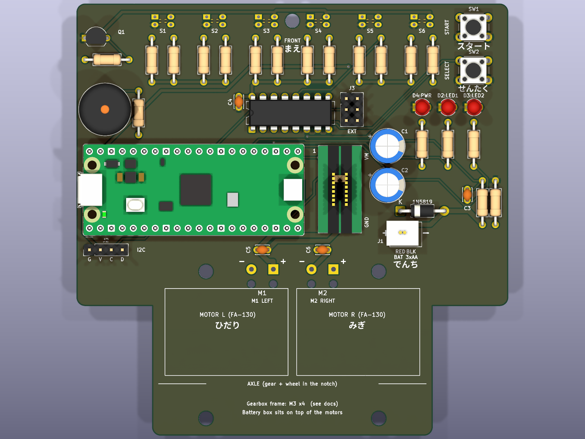
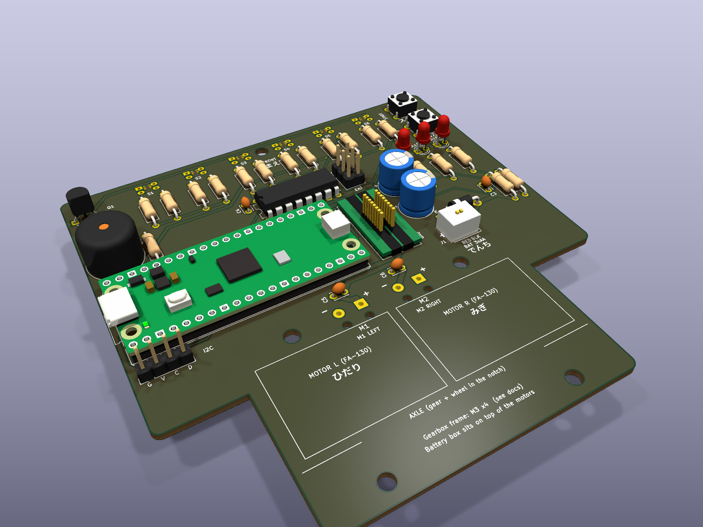
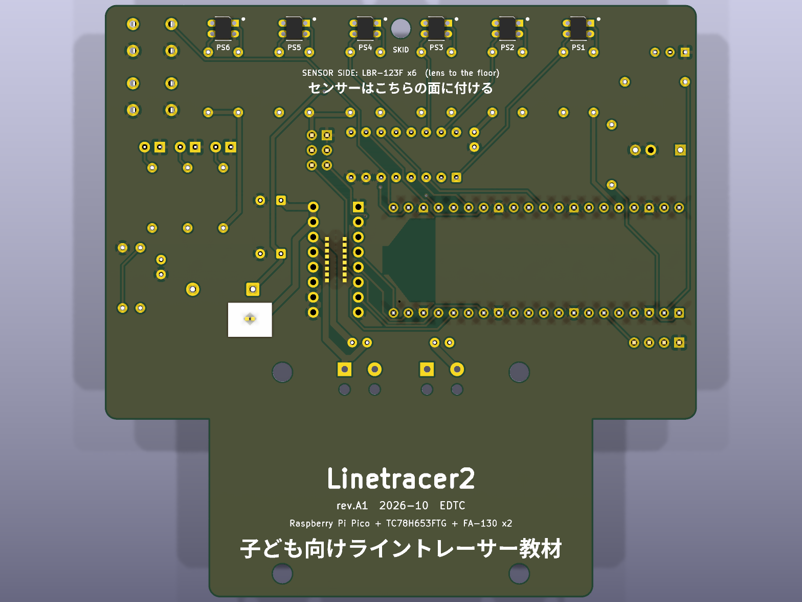
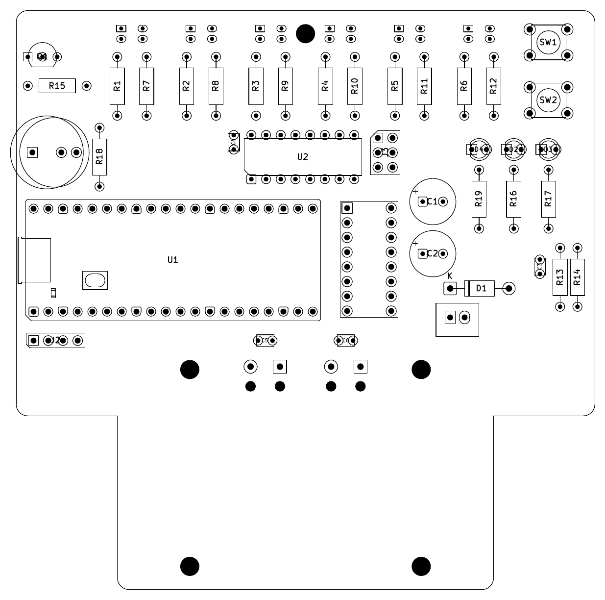

# 04. 基板設計

> 最終更新: 2026-10-05（**rev.A1**）／ KiCad 10.0.6 ／ `hardware/kicad/Linetracer2.kicad_pcb`
> 製造データ: `hardware/Linetracer2_rev.A1_gerber.zip`（Gerber 7 層 + ドリル 2 ファイル）

## 改訂履歴

| 版 | 日付 | 内容 |
|----|------|------|
| rev.A | 2026-10-04 | 最初の版（未製造） |
| **rev.A1** | 2026-10-05 | ① ブザー BZ1 に **5.0 mm 間隔の穴を追加**（秋月の 13 mm 圧電スピーカー PKM13EPYH4000-A0 が挿せるように。元の 7.6 mm 間隔の穴も残した）。新しい穴は GND ベタでつながるので配線は変えていない。② D4 の部品を「黄緑 LED」に（525 nm の緑は 3.3 V で暗い）。③ シルクの版数を rev.A1 に。④ 回路図の全部品に秋月の通販コードを記入。配置・配線は rev.A と同じ |



| 上面（3D） | 裏面（3D、センサー面） |
|---|---|
|  |  |

部品番号の位置（組立図、`docs/Linetracer2_assembly_top.pdf` / `_bottom.pdf`）:



---

## 1. 基板仕様

| 項目 | 値 |
|------|----|
| 外形 | 100 × 100 mm、角 R2。後ろの左右に車輪・ギヤ用の切り欠き 17.5 × 30 mm |
| 層 | 2 層（F.Cu = 部品面、B.Cu = センサー面）、両面 GND ベタ |
| 板厚 / 銅厚 | 1.6 mm / 1 oz（35 µm） |
| 表面処理 | HASL（鉛フリー可） |
| 最小配線幅 / 間隔 | 0.3 mm / 0.2 mm（電源系 0.25 mm） |
| 最小穴 | 0.35 mm（ビア）。部品穴 0.7〜1.1 mm、M3 穴 3.2 mm（NPTH）×5、配線固定穴 1.7 mm（NPTH）×4 |
| ビア | 5 個（0.7 / 0.35 mm）|
| 部品 | 52 フットプリント（取付穴 5 を含む）、パッド 193、ネット 59 |
| 配線 | 300 本、総延長 1,507 mm（表 819 / 裏 688 mm） |

### ネットクラス（`Linetracer2.kicad_pro`）

| クラス | 線幅 | クリアランス | ネット |
|-------|------|------------|--------|
| Motor | 1.0 mm | 0.25 mm | `/VBAT`, `/MOT_OUT1〜4` |
| Power | 0.6 mm | 0.25 mm | `/VSYS`, `+3V3`, `/LED_K`（センサー LED 6 個分 115 mA） |
| Ground | 0.3 mm（ベタが主） | 0.2 mm | `GND` |
| Default | 0.3 mm | 0.2 mm | その他の信号 |

> 1.0 mm × 35 µm の銅は 25℃上昇で約 2.5 A 流せる。モーター 1 個あたりの電流（加速時 1.4 A、ISD で最大 3 A 程度）に対して十分。

---

## 2. 部品配置の考え方

```
 前 ──────────────────────────────────────────────
  Q1 R15      [S1][S2][S3](skid)[S4][S5][S6]     SW1 START
  BZ1         R R  R R  R R      R R  R R  R R   SW2 SELECT
  R18              C4[ U2 4051 ][J3]      D4 D2 D3
 ┌──────── Pico (USB 左) ────────┐ ┌U3┐ C1   R19 R16 R17
 │                               │ │  │ C2          C3 R13 R14
 └───────────────────────────────┘ └──┘ D1 1N5819
  J2(I2C)          C5  M1(+-)   C6  M2(+-)   J1(電池)
 ───(切欠)── [モーター L] [モーター R] ──(切欠)── ← ギヤボックス枠 M3×4
 後
```

| ルール | 理由 |
|-------|------|
| センサー 6 個は**裏面**、12 mm 間隔、基板の最前列（y=4） | 床から 2.5 mm。前に出すほど高速で安定 |
| センサーの抵抗はセンサーの真後ろに縦置き（左 = 100Ω、右 = 10kΩ） | 配線が最短。値を表に印刷 |
| スキッド穴は S3 と S4 の間（センサーと同じ列） | センサー高さがスキッド高さで正確に決まる |
| 4051 はセンサー列と Pico の間 | アナログ線を短く。MUX のチャンネルはピン配置に合わせて並べ替え（`03_circuit.md` 5.2） |
| Pico は USB を左端に向ける | ケーブルを横から挿せる。ADC・MUX 制御が前列、モーター制御が後列右端（ドライバの真横）に来る |
| モーター系（U3, C1, J1, モーター端子）は右後ろにまとめる | 大電流ループを小さく、アナログ部（前）から離す |
| ボタン・LED は右前の角 | 電池ボックス（モーターの上）に隠れない。子どもが触りやすい |
| 後ろ 30 mm は部品なし（モーターとギヤボックス枠の場所） | シルクでモーターの位置を表示 |

---

## 3. 配線のやり方（スクリプトで自動化）

1. `gen_pcb.py` … 外形・部品配置・取付穴（ネットリストから。回路図の UUID とリンク済み）
2. `route_pcb.py` … Specctra DSN を書き出し、**GND を除いて** Freerouting で自動配線 → 取り込み
3. 配線をロックして、**GND だけ** 2 回目の自動配線（ベタで届かないパッドの救済用）
4. 両面に GND ベタ（サーマルリリーフ 0.5 mm、孤立島は削除）
5. `post_pcb.py prune` … GND 配線を 1 本ずつ消してみて、ベタだけで接続が保てるものは削除（101 本中 99 本削除）
6. `post_pcb.py silk` … 部品番号の位置調整、子ども向けシルク（日本語・英語）、モーター位置の枠
7. DRC → 6 回試行して「未接続 0・エラー 0・配線長最短」のものを採用（`build_pcb.py`）
8. `sync_pcb.py` … 回路図の値・フィールド・ネットを基板に反映（KiCad の「回路図から基板を更新」と同じ。配置・配線は変えない）
9. `patch_revA1.py` … rev.A → rev.A1 の差分（BZ1 のフットプリント差し替え・D4 の値・版数）。配置・配線は変えない

---

## 4. チェック結果

| チェック | 結果 |
|---------|------|
| ERC（回路図） | **エラー 0、警告 0** |
| DRC（基板、回路図との整合チェック込み） | **エラー 0、未接続 0、フットプリント不整合 0**、警告 3 |

警告 3 件はすべて `track_dangling`（GND の 1 mm 程度の短い配線の端が「何にもつながっていない」扱い）。
これらは**ベタの島どうしをつなぐ橋**として必要なもので（消すと未接続になる）、端がベタの中にあるので電気的には問題ない。
ビアに置き換えると周りとのクリアランスが足りないため、そのままにしている（`reports/drc.rpt`）。

---

## 5. 発注のしかた（JLCPCB の例）

1. `hardware/Linetracer2_rev.A1_gerber.zip` をアップロード
2. 設定:

| 項目 | 設定 |
|------|------|
| Base Material | FR-4 |
| Layers | 2 |
| Dimensions | 100 × 100 mm（自動認識） |
| PCB Thickness | 1.6 mm |
| PCB Color | 何色でもよい（緑が最安・最速） |
| Silkscreen | White |
| Surface Finish | HASL（with lead / lead free どちらでも） |
| Outer Copper Weight | 1 oz |
| Via Covering | Tented |
| Remove Order Number | 指定しない場合、注文番号がどこかに印刷される（気にしなければそのまま） |

- 目安: 5 枚 約 $2〜4 + 送料、30 枚でも数千円（1 枚あたり ¥40〜100）。
- **部品実装サービスは使わない**（全部子どもがはんだ付けするため）。
- JLCPCB は海外の業者で、日本の T 番号（適格請求書）は出ない前提。**大学の会計で精算できるか先に確認**する。国内業者が必要なら、同じ Gerber で国内の基板サービス（P板.com 等）に見積りを取る（`05_bom.md` §4）。

---

## 6. 再生成・修正のしかた

### 6.1 スクリプトで全部作り直す（配置や回路を大きく変えるとき）

```bash
cd scripts
python3 gen_lib.py          # 自作シンボル・フットプリント（＋ ./kc sym/fp upgrade）
python3 gen_project.py      # .kicad_pro（ルール・ネットクラス）
python3 gen_schematic.py    # 回路図  → ./kc sch upgrade / erc / export netlist
python3 build_pcb.py 6      # 配置・配線（約 15 分）
./kpy sync_pcb.py           # 回路図の値・フィールドを反映
./kpy patch_revA1.py        # rev.A の基板ファイルを rev.A1 にするときだけ（build_pcb.py で作り直したときは不要）
./export_outputs.sh         # Gerber・BOM・PDF・3D 画像
```

（コマンドの細かい順番は各スクリプト冒頭のコメント参照。KiCad は flatpak 版、`./kc` = kicad-cli、`./kpy` = KiCad 付属 Python）

> 同じスクリプトで**Lite**（rev.L2: XIAO ESP32C6 版、`lite/hardware/`）も作れる: 環境変数 `LT2_VARIANT=lite` を付け、Lite 専用のスクリプトは `lite/scripts/` にある（手順は `lite/README.md` §9）。何も付けなければ標準版。

### 6.2 KiCad の画面で直す（小さな修正）

- `hardware/kicad/Linetracer2.kicad_pro` を KiCad で開いて普通に編集してよい。
- **ただし、手で直した後に `build_pcb.py` を実行すると上書きされる**。手直しを始めたら以後は GUI で管理し、スクリプトは使わない（またはスクリプト側にも同じ変更を入れる）。
- 回路図を直したら、基板エディタの「回路図から基板を更新（F8）」で反映。

---

## 7. rev.B で見直したい点（試作後に判断）

- [ ] センサー高さ（スキッド 4.0 mm）が実測で最適か。必要なら抵抗値（10 kΩ）を変える
- [ ] モーター端子のコンデンサ C5/C6 を基板からモーター側に移すか
- [ ] GND の短い橋配線（警告 3 件）をなくすよう、右上の LED まわりの配置を少し広げる
- [ ] 電池コネクタの逆差し対策（向きの決まった別コネクタ、または逆接続保護）
- [ ] 3D プリント枠の取付穴位置・切り欠きの寸法の実測確認
- [ ] ブザー（13 mm）が基板の左端から約 1 mm はみ出す。R18 を右へずらしてブザーを内側に入れる
- [ ] スキッドの穴 (50,4) がセンサー PS3/PS4 のはんだに近い（金属ナット不可）。穴を少し離すか、センサー間隔を見直す
