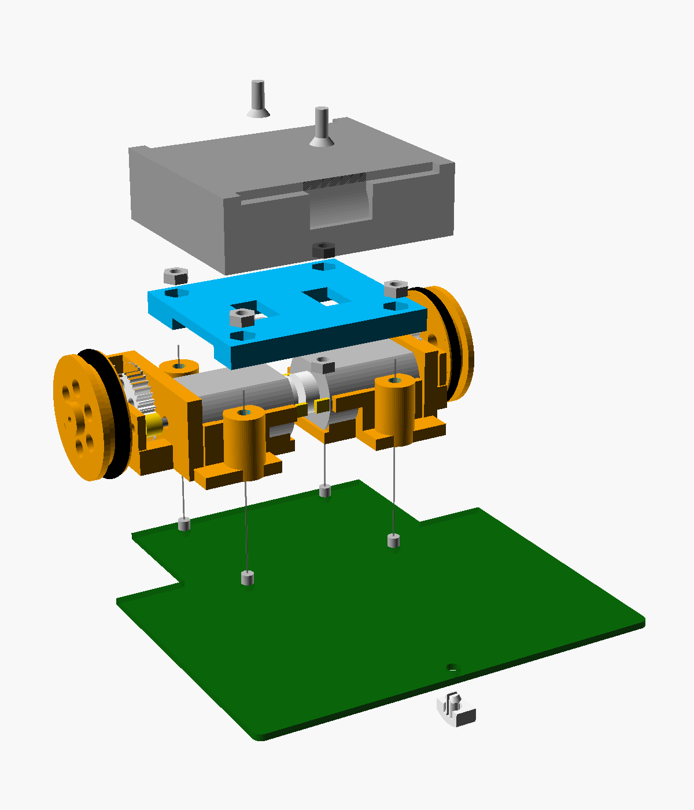
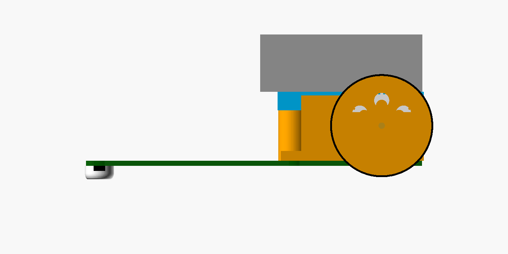
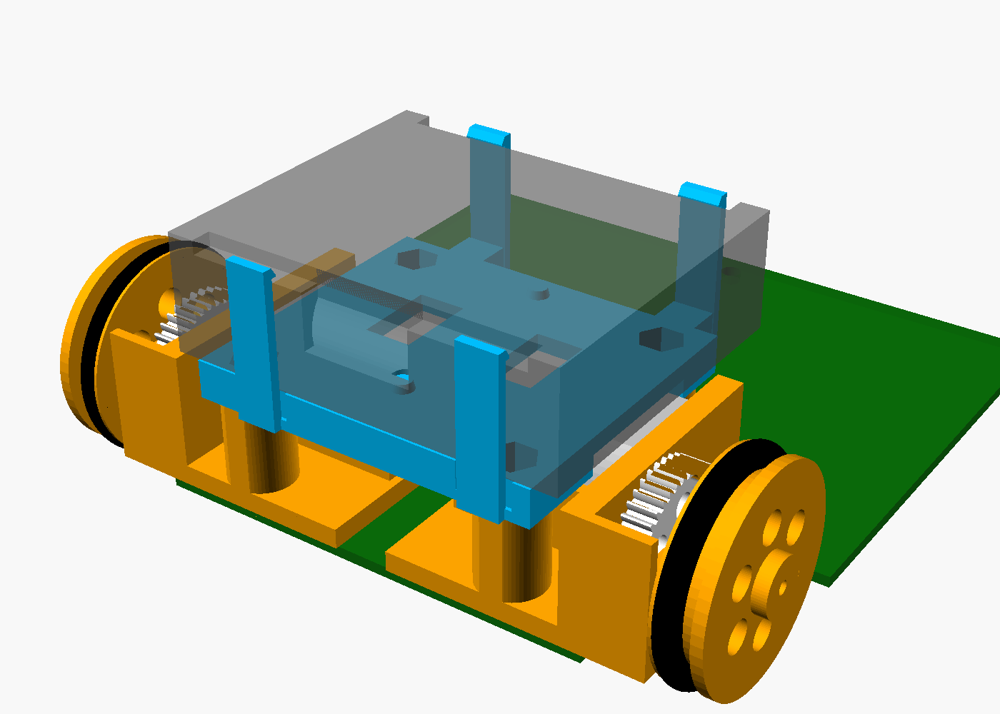
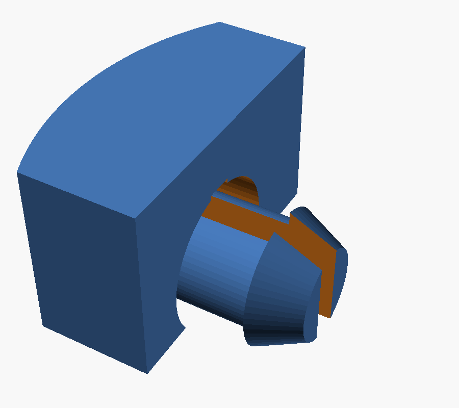
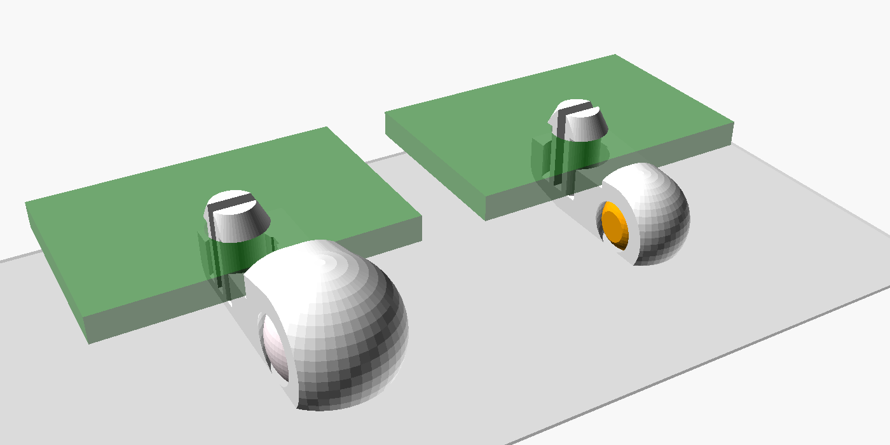
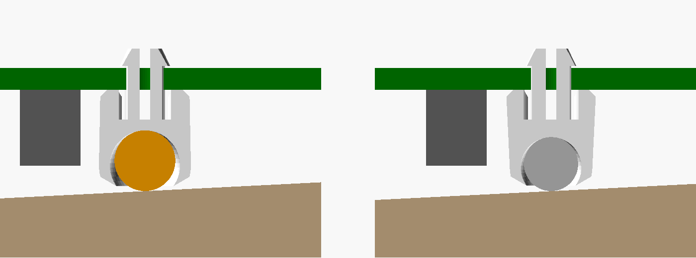
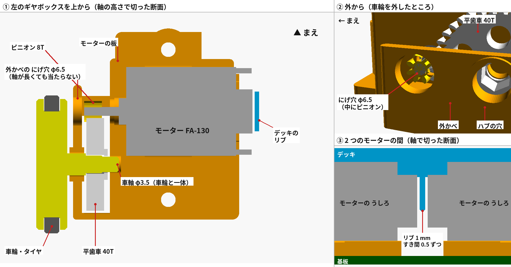

# 3D プリント部品（Linetracer2 rev.A1）

サークルの **Bambu Lab P1S（0.4 mm ノズル）** で印刷する前提。STL は**印刷する向きで**書き出してあるので、Bambu Studio に読み込んでそのまま並べればよい（回転不要・サポート不要）。

> **左右の枠は、ファイル名の側に付ける**: `frame_left.stl`（「L」の刻印）がロボットの**左**、`frame_right.stl`（「R」）が**右**。
> 注意: OpenSCAD の組み立て図（`assembly.png` / `assembly.stl`）は基板の座標（x 右・y 後ろ・z 上）で描いてあり、これは**実物の鏡うつし**になっている。図で右に描いてある枠が、実物では左の枠。STL はこれを直して、印刷すると実物どおりになるように書き出してある（2026-10-07）。


| 分解図 | 側面 | ツメ版デッキ（任意） | ツメのスキッド |
|---|---|---|---|
|  |  |  |  |

## 1. 部品と印刷設定（1 台分）

| ファイル | 部品 | 数 | 材料 | Bambu Studio の設定 | 体積 |
|---------|------|----|------|-------------------|------|
| `frame_left.stl` / `frame_right.stl` | ギヤボックス枠（モーターのゆりかご＋軸受け＋柱）。**「L」を左、「R」を右**に付ける | 各 1 | PLA | 0.20 mm Standard、壁 3、インフィル 30%、サポートなし | 8.9 cm³ ×2 |
| `deck.stl` | デッキ（電池ボックスの台。モーターの押さえも兼ねる） | 1 | PLA | 0.20 mm Standard、壁 3、インフィル 25%。**上下逆さ（電池側がベッド）**で書き出し済み | 7.7 cm³ |
| `gear40.stl` | 平歯車 40T（m0.5）。**穴は D 形**（車軸の平らな面に合わせる、§2.7） | 2 | PLA | **0.08 mm Extra Fine**、壁 4、インフィル 40%（壁の生成はクラシック・Arachne どちらでもよい）。ハブが上 | 1.0 cm³ ×2 |
| `wheel.stl` | 車輪（O リング P-24 をはめる）。**穴は D 形**（§2.7） | 2 | PLA | 0.16 mm、壁 3、インフィル 40%。ハブが上 | 3.4 cm³ ×2 |
| `skid_clip_h40.stl` | **スキッド（ツメで差し込む、高さ 4.0 mm、標準）** | 1 | PETG（PLA も可） | 0.12 mm、壁 3、インフィル 40%。**横倒し**で書き出し済み（ツメが層に沿って曲がるので折れにくい） | 0.14 cm³ |
| `skid_clip_h35.stl` / `skid_clip_h45.stl` | 同（センサー高さ調整用 3.5 / 4.5 mm） | 予備 | 同上 | 同上 | |
| `skid_clip_h75.stl` | **Lite 用スキッド（高さ 7.5 mm、ボールキャスターの代わりに使える）**。センサー LBR-127HLD が 5.6 mm と背が高いので前を持ち上げる（ロボットは後ろに 2.9° 傾く、センサーと床 約 2.25 mm） | 1（Lite のみ） | 同上 | 同上 | |
| `skid_clip_h70.stl` / `skid_clip_h80.stl` | 同（Lite のセンサー高さ調整用 7.0 / 8.0 mm → 床から 約 1.7 / 2.8 mm） | 予備 | 同上 | 同上 | |
| `skid_screw_h40.stl` | スキッド（ねじ止め版。ツメが折れたときの予備：M3×8 皿＋ナイロンナット） | (1) | 同上 | 0.12 mm、平らな面がベッド | 0.2 cm³ |
| `caster_print_h40.stl` | **ボールキャスター（試作・任意）: 玉ごと一度に印刷**（スキッドの代わり。玉は φ4、中で転がる） | (1) | PETG（PLA も可） | 0.12 mm、壁 3、インフィル 40%。**横倒し**で書き出し済み。玉と受けは最初から別々（はがす作業なし） | 0.23 cm³ |
| `caster_bead_h40.stl` | **ボールキャスター（試作・任意）: 受けだけ印刷、玉はダイソーのパール調ビーズ φ6** | (1) | PETG（PLA も可） | 同上 | 0.24 cm³ |
| `caster_lite_print_h75.stl` | **Lite rev.L3 の前の支え（標準）: ボールキャスター、玉ごと一度に印刷**。玉 φ6 がピンの後ろ、基板の下で転がる（§2.4） | 1（Lite のみ） | PETG（PLA も可） | 0.12 mm、壁 3、インフィル 40%。**横倒し**で書き出し済み | 0.3 cm³ |
| `caster_lite_print_h70.stl` / `caster_lite_print_h80.stl` | 同（センサー高さ調整用 7.0 / 8.0 mm、玉 φ5.5 / φ6） | 予備 | 同上 | 同上 | |
| `caster_lite_print45_h75.stl`（`_h70` / `_h80`） | Lite 用ボールキャスターの小さい版（玉 φ4.5（φ4.0 / φ5.0）がピンの真下。向きを気にしなくてよいが、床とのすき間が小さい） | (1) | 同上 | 同上 | 0.2 cm³ |
| `caster_lite_bead_h75.stl`（`_h70` / `_h80`） | Lite 用ボールキャスター（試作・**先生用**）: 受けだけ印刷、**φ4 の玉**（鋼球またはビーズ）を押し込む | (1) | 同上 | 同上 | 0.15 cm³ |
| `caster_lite_bead6_h75.stl`（`_h80`） | **Lite 用ボールキャスター: ダイソーのパール調ビーズ φ6 を押し込む**（2026-10-09）。標準と同じ形で玉がピンの後ろ、床〜受け 1.1 mm（§2.4） | (1) | 同上 | 同上 | 0.3 cm³ |
| `axle_jig.stl` | **車軸をけずる治具（先生用）**: 真鍮の車軸に平らな面（D カット）を付けるときのゲージ（§2.7） | 1（授業に 1 こ） | PLA | 0.20 mm、そのままの向き（みぞが上） | 2 cm³ |
| `deck_clip.stl` | **ツメ版デッキ（任意・試作）**: 電池ボックスをねじではなく 4 本のツメで押さえる | (1) | PLA / PETG | 0.20 mm、壁 3、インフィル 25%。**そのままの向き（ツメが上）**。ツメが左右対称でないので、実物どおりの向きで書き出してある（上の注意） | 9.0 cm³ |
| `tire_tpu.stl` | TPU タイヤ（O リングの代わり、任意） | (2) | TPU 95A | 0.20 mm、インフィル 100%、ゆっくり | 1.0 cm³ |
| `linetracer2_mech.scad` | 上記の元データ（OpenSCAD、寸法はすべてパラメータ） | — | | | |
| `assembly.stl` | **全体を組み立てた状態の 3D**（見る用。基板・モーター・電池ボックスは簡略形状、印刷しない。**実物の鏡うつし**） | — | | GitHub 上でそのまま回して見られる | |

- 1 台分 約 35 cm³（PLA 約 30 g、¥90 前後）。256 mm 角のベッドに **2〜3 台分を一度に**並べられる。
- 平歯車だけ設定が違う（細かい層）ので、**平歯車は別のプレート**にまとめて印刷する。
- 0.2 mm ノズルを持っていれば、平歯車は「0.2 mm ノズル・0.06 mm」で印刷すると歯の形がもっときれいになる（必須ではない）。

### 印刷時間の目安（Bambu Studio 2.08 の P1S 0.4 mm プロファイルでスライスした値、1 個ずつ）

| 部品 | 設定 | 時間 |
|------|------|------|
| 枠 L / R | 0.20 mm | 約 21 分 ×2 |
| デッキ | 0.20 mm | 約 16 分 |
| 車輪 | 0.16 mm | 約 13 分 ×2 |
| 平歯車 40T | 0.08 mm（壁 4・インフィル 40%） | 約 17 分 ×2 |
| スキッド（ツメ） | 0.12 mm | 約 3.5 分 |
| （ボールキャスター 玉ごと／ビーズ用） | 0.12 mm（PETG） | 約 4.5 分 ／ 約 4.5 分 |
| （ツメ版デッキ） | 0.20 mm | 約 23 分 |
| **1 台分** | | **約 2 時間**（まとめて並べるともう少し短い） |

### 平歯車は印刷できるか（スライス結果で確認済み、2026-10-05）

m0.5 の歯は先端の幅が約 0.28 mm で、0.4 mm ノズルの線（0.42 mm）より細い。そこで実際に Bambu Studio（CLI）で P1S 用にスライスし、G コードから**各層・各歯の外壁の通り道の半径**を測った。

| 壁の生成 | 結果（z = 0.24〜3.92 mm の 5 層） |
|---------|-------------------------------|
| クラシック（P1S プロファイルの既定） | **40 枚すべての歯が先端まで印刷される**（外形 r 約 10.50 mm、設計 10.50 mm） |
| Arachne | 同じく 40 枚すべて先端まで出る |

> 訂正（2026-10-05）: 最初の解析では「Arachne だと歯が欠ける」と書いたが、G コードの円弧命令（G2/G3、Bambu は多用する）を読み飛ばしていたための誤りだった。円弧も読む解析でやり直した結果が上の表。どちらの設定でもよい。

## 2. 固定のしかた（ねじとツメ。テープ・接着剤は使わない）

| 場所 | 固定 | 部品 | 理由 |
|------|------|------|------|
| 基板 ↔ 枠 ↔ デッキ | **ねじ** | なべ小ねじ M3×20 ×4、ナット ×4（デッキに埋める） | ロボットの重さ・ぶつかった衝撃・モーターの振動を全部受ける所。PLA のツメは荷重がかかり続けると少しずつ伸びて（クリープ）ゆるむ。またツメで基板をつかむには基板の下に回り込む形が要り、枠を平らに置いて印刷できなくなる（サポートが要り、層の向きも弱い） |
| 電池ボックス ↔ デッキ | **ねじ（標準）** または **ツメ（任意）** | 皿小ねじ M3×8 ×2、ナット ×2 ／ ツメ版デッキ `deck_clip.stl` | ねじは電池ボックスに元からある穴を使うので確実。ツメ版はねじ不要だが、電池ボックスの壁の高さ（データシートで 15.0 ±0.5 mm）に合わせる必要がある（§2.1） |
| スキッド ↔ 基板 | **ツメ（標準）** | なし（`skid_clip_h40.stl` を穴に押し込むだけ） | 床がスキッドを基板に押し付けるので、ツメは「落ちない」だけでよい。買いにくいナイロンナットが要らなくなった |
| モーター ↔ 枠 | ツメ（はめ込み）＋デッキで押さえる＋**デッキのリブ**（内側へずれない） | — | **ピニオンを先に軸に付けて**、モーターを車輪と反対側に 約 1 cm ずらしてゆりかごにはめ、板に当たるまで滑らせる（§2.5）。デッキの下のリブが 2 つのモーターの後ろの間に入る（§2.6） |

買う所: なべ小ねじ M3×20（ホームセンター／秋月 107437）、皿小ねじ M3×8（ホームセンター）、六角ナット M3（ホームセンター／秋月 114372）。

### 2.1 ツメ版デッキ（任意）の使い方

- 電池ボックスの**底の 2 つの穴にデッキの突起（φ3.2）が入って位置が決まり**、長い側の壁の上を **4 本のツメ**が押さえる。電池の出し入れのじゃまにはならない（ツメは壁の上にだけかかる）。
- **先に電池ボックスの壁の高さを測る**: ノギスで、ボックスの底から長い側の壁の上（両端の柱と真ん中の切り欠きの間の平らな所）まで。15.0 mm でなければ `linetracer2_mech.scad` の `BOX_SHOULDER_H` をその値にして `deck_clip.stl` を書き出し直す。
- 印刷はそのままの向き（ツメが上）。ツメは高さ方向に長い（約 20 mm）ので、曲げてもひずみは約 0.5% と小さい。PLA で折れる場合は PETG にする。
- 入れ方: 電池を抜いたボックスを上から押し込む（ツメが外に開いてパチッと閉じる）。外すときは前後のツメを外側に開いて持ち上げる。

### 2.2 ツメのスキッドの使い方

- 基板の裏から `SKID` の穴に押し込む（2 本に割れたピンがすぼまって通り、表に出たところで開いて抜けなくなる）。
- 外すときは基板の表に出たピンの先を指（またはラジオペンチ）でつまんで、すぼめながら裏へ押し出す。
- 印刷は横倒しの向き（書き出したまま）。ピンの割れ目 0.8 mm がスライス後も開いていることを G コードで確認済み。

### 2.3 ボールキャスター（試作・任意）

スキッド（そり）の代わりに、前を**転がる玉**で支える試し用。スキッドと同じ `SKID` の穴にツメで差し込む。



（左: ビーズ版、右: 玉ごと印刷版。緑は基板の前の端）

- 玉と受けは基板と床のすき間（4.0 mm）に入らないので、**玉は基板の前の端のすぐ前**に出し、基板の下のそり形の腕でピンまでつなぐ。腕は PS3・PS4 の間（幅 5 mm）を通る。
- 高さはスキッドの標準と同じ 4.0 mm（基板の下面〜床）。3.5 / 4.5 mm にするときは `SKID_H` を変えて書き出す。
- **標準版の基板専用**。Lite（`lite/`）はスキッドの穴が基板の端から 11 mm 奥にあり、この形だと腕が真ん中のセンサーの下を通ってしまう → Lite には別の形がある（§2.4）。

| | `caster_print_h40.stl`（玉ごと印刷） | `caster_bead_h40.stl`（ビーズ） |
|---|---|---|
| 玉 | **φ4** を受けの中で一緒に印刷（すき間 0.35 mm、玉の上は 0.55 mm） | **ダイソーのパール調ビーズ φ6** を床側から押し込む |
| 大きさ | ツメのスキッドと同じ幅 5 mm に収まり、**基板の上面より低い**。前への出っぱりは基板の端から 4.7 mm | 幅 7 mm、基板の上面より 1.6 mm 高い。前への出っぱり 7.6 mm |
| 接地点 | 基板の端の 1.5 mm 前（センサーの列の 5.5 mm 前） | 基板の端の 3.5 mm 前（センサーの列の 7.5 mm 前） |
| 床〜受けの下面 | 0.55 mm（ロボットの重さで玉が 0.35 mm 押し上げられると 約 0.2 mm、基板も 0.35 mm 下がる） | 1.16 mm（同じく 約 0.8 mm） |
| 部品 | 1 個 | 受け 1 個 ＋ ビーズ 1 個 |
| 予想 | 積層の段差とベッド側の小さな平ら（φ1.9、高さ 0.25 mm）があり、なめらかには転がらない。スキッドとの比較用 | よく転がるはず。ビーズの糸穴が床に来たときに少し段がつく |

- **玉ごと印刷版**: 印刷が終わったら、玉を指で押して回し、受けから離す（G コードで、各層の玉と受けの道すじの間に約 0.27 mm の空きがあること、玉の上に空の層が 4 層あることを確認済み）。動かなければ `BALL_CLR` を 0.4 に。玉の大きさは `PRINT_BALL_D`（φ4 より大きいと受けが基板の上面より高くなる）。
- **ビーズ版**: 先にビーズの直径をノギスで測り、6.0 mm でなければ `BALL_D` を変えて書き出す。床側の口（φ5.6 = 玉 −0.4 mm）にビーズを当てて押し込む。前側の半分は切れ目（0.8 mm）で離してあり、前に少し開いてパチッと入る。抜けやすければ `BALL_LIP` を 0.5 に、入らなければ 0.3 に。
- 玉ごと印刷版は床から受けまで 0.55 mm（ロボットの重さで玉が押し上げられると 約 0.2 mm）しかないので、床の段差やコースのつなぎ目で受けがこすれるかどうかを見ること。
- 試してスキッドより良ければ標準にする。そのときは重さのバランス（`docs/02_concept.md` §4）を、実際の接地点で計算し直す。

### 2.4 Lite のボールキャスター（Lite rev.L3 の標準、2026-10-07）

Lite は基板の下〜床が 7.5 mm あるので、**玉を基板の下**に入れられる。スキッドと同じ穴 (50, 11) に、同じツメのピンで差し込む。Lite rev.L3 ではこれが前の支えの標準（スキッド `skid_clip_h75.stl` も使える）。



（横から見た断面。左から `caster_lite_print`（標準、φ6 がピンの後ろ）、`caster_lite_print45`（φ4.5 がピンの真下）、`caster_lite_bead`（φ4 を押し込む）。左が前（黒いのは真ん中のセンサー）。床は後ろに向かって上がって見える（ロボットが後ろに 2.9° 傾くため）。玉は重さで受けの天井に押し付けられた位置）

| | `caster_lite_print_h75.stl`（**標準**） | `caster_lite_print45_h75.stl`（小さい版） | `caster_lite_bead_h75.stl`（先生用） | `caster_lite_bead6_h75.stl`（ダイソーのビーズ） |
|---|---|---|---|---|
| 玉 | **φ6** を一緒に印刷（ピンの 5.4 mm 後ろ）。**取り出せない** | φ4.5 を一緒に印刷（ピンの真下）。取り出せない | **φ4** の玉を床側から押し込む（ベアリング用の鋼球 φ4（モノタロウなど）か φ4 のビーズ。**買ったらノギスで測り**、4.0 mm でなければ `LITE_BEAD_D` を変える） | **ダイソーのパール調ビーズ φ6**（標準版の `caster_bead` と同じ）を床側から押し込む（ピンの 5.35 mm 後ろ）。**ノギスで測り**、6.0 mm でなければ `BALL_D` を変える。玉はなめらかでよく転がるが、糸の穴が床に来たときに少し段がつく |
| 床〜受けの下面（玉が押し上げられた状態、まわり全部同じ） | **0.89 mm** | 0.37 mm | 0.40 mm | **1.1 mm** |
| 基板の裏で使う範囲 | x 48.8〜54.55、y 7.7〜20.56 | x 48.8〜54.4、y 7.6〜14.4 | x 48.8〜53.8、y 7.7〜14.3 | x 48.8〜54.55、y 7.7〜20.4 |
| 向き | **玉が後ろ（車輪の側）**。基板に当たる面の **矢印がピン（前）を向く**。逆向きは真ん中のセンサーに当たって入らない | どの向きでもよい | どの向きでもよい | 標準と同じ（矢印がピンを向く） |
| 高さ | 7.0 / 7.5 / 8.0 | 7.0 / 7.5 / 8.0 | 7.0 / 7.5 / 8.0 | **7.5 / 8.0 だけ**（7.0 では φ6 の天井が足りない） |

| 高さ（同じ名前のスキッドと同じ） | 傾き | センサーと床 | `caster_lite_print`（玉・床〜受け） | `caster_lite_print45` | `caster_lite_bead` |
|---|---|---|---|---|---|
| 7.0 mm（`_h70`） | 2.5° | 1.7 mm | φ5.5・0.71 mm | φ4.0・0.20 mm | φ4・0.40 mm |
| **7.5 mm（`_h75`）** | **2.9°** | **2.25 mm** | **φ6・0.89 mm** | φ4.5・0.37 mm | φ4・0.40 mm |
| 8.0 mm（`_h80`） | 3.3° | 2.8 mm | φ6・0.89 mm | φ5.0・0.54 mm | φ4・0.40 mm |

- **センサーと床のすき間・傾きは、同じ高さのスキッドとまったく同じ**になるように玉の高さを決めた。ロボットの重さで玉はすき間の分だけ上に押されるので、**押し上げられた状態**で計算している（`-D LITE=true` で開くと echo に出る。「タイヤと玉の共通の接線」で計算し直した傾き・すき間も出して、スキッドと同じことを確かめた）。
- 受けの下面は**床と平行**（ロボットの傾きに合わせた）な浅い円すいなので、床とのすき間はまわり全部同じ。玉が大きいほどすき間が大きい（玉ごと印刷では、玉のまわり全部にすき間 0.35 mm が要るため）。
- 標準（φ6）は玉を**ピンの後ろ**に置いた（ピンのまわりのすき間と玉の部屋の間の壁 0.8 mm 以上）。印刷の上の面（基板の右側）は x 54.3 で平らに切ってあり、そこに玉より小さい窓（φ4.3）がある（玉は落ちない）。7.0 mm では天井が足りないので φ5.5。
- 基板の裏で使ってよい範囲は **x 45〜55、y 6.5〜21**（Lite rev.L3 の基板設計と決めた。パッド・銅が無い所。センサーから 0.3 mm 以上）、基板の表のツメは穴の中心から**半径 2.4 mm 以内**。`check_caster_lite_zone` で確認する（`LITE_ZONE`、`LITE_TOP_R`）。
- 印刷: 書き出したままの横倒し、PETG、0.12 mm。印刷後に玉を指で押して回し、受けから離す（標準版 §2.3 と同じすき間の設定: すき間 0.35 mm、上 +0.2 mm、ベッド側に 0.25 mm の平ら）。
- 押し込む版: 前と後ろの指（切れ目 0.8 mm）が開いて玉が入る。**先生が入れて、指でつまんで取れないことを確かめる**（取れるなら `BALL_LIP` を 0.5 に）。
- 書き出し: `$OS -D LITE=true -D SKID_H=7.5 -D 'part="caster_lite_print"' -o caster_lite_print_h75.stl linetracer2_mech.scad`（小さい版は `part="caster_lite_print45"`、ビーズ版は `part="caster_lite_bead"`）。組み立て図は `-D LITE=true` で標準のキャスターが出る（`-D 'LITE_SUPPORT="skid"'` などで切り替え）。

### 2.5 モーターの入れ方（2026-10-07 に直した）

以前の形では、**ピニオン（外径 5 mm）が枠の板の軸穴（φ3）を通らず**、ピニオンを付けずにモーターを入れると**外側の壁がじゃまでピニオンを軸に入れられなかった**（組み立てられない）。→ 板の軸穴を **φ5.6** に広げた（ほかの寸法は同じ）。

1. **ピニオンを先にモーター軸に押し込む**（外側の面を軸の先とそろえる）。平歯車・車軸は先に枠に付けておく。
2. モーターを、ゆりかごの**車輪と反対の側に 約 1 cm（10.5 mm）ずらして**上から押しこむ（パチッ）。このときピニオンは板の手前にある。
3. モーターを**車輪の側へ滑らせ**、缶の前の面が板に当たるまで押す。ピニオンが板の穴を通って平歯車とかみ合い、前の丸い出っぱりが板の穴に入る。かみ合わないときは車輪を少し回す。

OpenSCAD で確かめたこと（`check_pinion_plate`・`check_motor_slide`・`check_motor_drop`・`check_pinion_spur`、全部「空」）:
- ピニオン（外径 5.0 ＋ 0.1 mm）を軸に沿って最後の位置から 10.5 mm 動かしても、枠（板・外側の壁・下の棒）に当たらない。板の穴を φ3.0 に戻すと当たる（検出できる）。
- モーター全体（缶・前後の出っぱり・端子・ピニオン）を 10.5 mm 滑らせても枠に当たらない。0.3 mm 行きすぎると缶が板に当たる（＝板で止まる）。
- 10.5 mm ずらして上からはめるとき、当たるのは**ゆりかごの壁の軸より上（パチッとはまるツメ）だけ**。ずらしが 9.4 mm だとピニオンが板に当たる。
- ピニオンの歯（8T、歯みぞを平歯車の歯に合わせた向き）を軸に沿って滑らせても、平歯車 40T の歯に当たらない（向きが半歯ずれていると当たる）。
- 右の枠は左の鏡うつしなので同じ。

### 2.6 ギヤボックスの見直し（モーターのデータシートと突き合わせた、2026-10-07）

「ギヤボックスの 3D モデル、これでいいか見ておいて」という依頼で、FA-130RA-2270 のデータシート（Mercury Motor、秋月の PDF）の寸法・公差とモデルを 1 つずつ比べた。**直したのは 3 つ**（外かべの逃げ穴、デッキのリブ、ピニオンの形）。



（① 左のギヤボックスを上から見た断面（軸の高さで切った。上が前）。② 外から見たところ（車輪を外した）: 外かべの逃げ穴の中にピニオンが見える。③ 2 つのモーターの間を、モーターの軸で切った断面: デッキのリブ。図は `../../scripts/gearbox_figure.py` で作る）

| データシートの寸法 | 値 | モデル（`linetracer2_mech.scad`） |
|---|---|---|
| 全長（軸の先〜後ろの出っぱりの先） | 38.0 ±0.1 | 38.0（x 11.0〜49.0） |
| 軸の出っぱり（缶の前の面から。軸を後ろへ押した状態で測る） | **9.5 ±0.5** | 9.5（`SHAFT_TIP_X` 11.0〜`CAN_X0` 20.5） |
| 軸の前後のガタ（エンドプレイ） | **0.05〜0.4** | — |
| 缶 | 幅 20.1・厚さ 15.0、長さ 24.8 ±0.2 | `CAN_W` 20.1・`CAN_H` 15.0、x 20.5〜45.3 |
| 前の軸受けの出っぱり / 軸 | φ6.0 × 1.7 / φ2.0 | `BOSS_D` 6.0・`BOSS_L` 1.7 / φ2.0 |
| 後ろの出っぱり | φ9.8、3.7 | φ10、x 45.3〜49.0 |

| 見たところ | 分かったこと | 直したこと |
|---|---|---|
| **軸の先と外かべ** | 軸の先と外かべ（内側の面 x 10.5）のすき間は 0.5 mm。軸が長めの個体（+0.5）でガタが前へ寄る（+0.4）と、**軸の先とピニオン（軸の先とそろえて圧入）が 0.9 mm 前に出て、外かべに 0.4 mm 食いこむ** | 外かべに**逃げ穴 φ6.5**（ピニオンの外径 5.0 ＋ すき間）。穴のまわりに肉を残すため、外かべの前の端を y 73 → **70** へのばした。穴の外は車輪がふたをする |
| **モーターの前後の位置** | モーターははめ込みのツメの摩擦だけで止まっていた。入れるときに 10.5 mm 滑らせる道があるので、内側へずれても止める物が無い。ずれるほど歯の重なりが減り、4.5 mm で外れる | **デッキの下にリブ**（厚さ 1.0 mm、x 49.5〜50.5、y 71.5〜80.5、z 8.5〜18）。2 つのモーターの後ろの出っぱり（x 49.0 / 51.0）の間に入り、すき間は 0.5 mm ずつ。下の角に 0.3 mm の 45° の面取り（0.8 mm までの入れ足りないモーターは、デッキをのせると押し戻される）。それ以上ずれているとリブが出っぱりの上にのり、**デッキが約 7 mm 浮く**（気づける） |
| ピニオン | 組み立て図・ロボット全体の 3D では、ただの円柱だった | 歯のある 8T（`pinion8()`、平歯車にかみ合う向き）で描くようにした（実物はタミヤ 15289） |
| かみ合い | 軸間 12.0 mm（m0.5 ×（8 ＋ 40）÷ 2）。歯の幅の重なり 3.5 mm（軸が長い個体でも 2.6 mm） | そのまま |
| 外かべの形 | 逃げ穴の上の肉は 0.75 mm（外かべの上の面 z 14.4、穴の上 z 13.65）。サポートなしで印刷できる（φ6.5 の横穴の天井） | — |

確かめたこと（OpenSCAD、`-D LITE=true` と標準の両方）:
- `check_shaft_wall`（新しく足した）: 軸を 0.9 mm 前に出した最悪のモーター（軸 ＋ 軸の先とそろえたピニオン）が枠に当たらない → **空**。逃げ穴を消す（`-D WALL_RELIEF=false`）と**空でない**（＝このチェックで見つかる）。逃げ穴なしでも軸がふつうの長さ（`-D SHAFT_LONG=0`）なら空（＝以前の形は公称の寸法では当たらなかった）。
- `check_deck_motor` / `check_deckclip_motor`: リブ付きのデッキがモーターに当たらない → 空。リブを 2.4 mm に太くする（`-D MOTOR_STOP_W=2.4`）と空でない。
- そのほかのチェック（§3 の一覧、36 個 × 標準 / Lite）も全部空のまま。ロボット全体の干渉チェック（`../../scripts/export_assembly.sh`）も空。

その他の機械部品: 真鍮丸棒 φ2×20 mm（車軸）×2、タミヤ 8T ピニオン（15289）×2、O リング P-24 ×2、FA-130RA ×2、電池ボックス BH-331-3ASTH（`docs/05_bom.md`）。

### 2.7 車軸がすべらないように（D カット、2026-10-09）

「丸い車軸だと、平歯車や車輪がすべるのでは？六角や芋ねじは要る？」という質問に答えて計算した。

| 場面 | 車軸にかかるねじれ（トルク）の目安 |
|---|---|
| モーターが止められたとき（3 V の停動 4.7 mN·m × 歯車 5 倍 × 効率 0.85） | **約 20 mN·m**（いちばん大きい） |
| ふつうに走る・ぶつかってタイヤがすべるとき（ロボット 約 200 g、駆動輪に 78 %、TPU タイヤ μ 約 1、半径 16 mm） | **約 12 mN·m**（これ以上はタイヤが床ですべる） |
| 平歯車（穴 φ1.95、長さ 4.8 mm）の圧入がもちこたえる力（PLA がなじんだあとの面圧 3 MPa・摩擦 0.25 と仮定） | **約 20 mN·m**（ぎりぎり） |
| 車輪（穴 φ1.9、長さ 8.5 mm） | 約 40 mN·m |

- **平歯車の圧入はぎりぎり**。しかも 0.4 mm ノズルで印刷した φ2 の穴は ±0.1 mm くらいばらつくので、ゆるい個体ではすぐすべり、きつい個体では割れる。PLA は押されたままだと少しずつゆるむ（クリープ）。→ **すべり止めは要る**。
- ミニ四駆はつるつるの φ2 の軸に圧入だが、あれは寸法のそろった射出成形の部品だからもつ。
- **芋ねじ（M2）**: φ7 のハブに M2 のねじ穴は小さく、印刷したねじ山はすぐつぶれる。ねじ・六角レンチが小さく、子どもには向かない → 使わない。
- **六角の軸**: φ2 前後の六角棒はホームセンターで手に入りにくい → 使わない。
- **D カット（採用）**: 真鍮の車軸の片側に**平らな面を 0.3 mm**（平らな所の幅 1.7 mm）、外側の端から **17 mm**（車輪のハブ〜平歯車の先まで）付け、平歯車と車輪の穴を D 形にした。平らな面どうしで回すので、圧入がゆるくてもすべらない（圧入は抜け止めだけ）。内側の 3 mm は丸いまま（奥の止まり穴の軸受け）。外側の壁の穴（φ2.15）は平らな所で回るが、速さが低いので問題ない。
- けずり方（先生、1 本 2〜3 分）: `axle_jig.stl` を印刷し、20 mm に切った車軸を**ガードの側の穴から入れて、奥のかべに当たるまで**押す。上に 0.3 mm 出ている所を、**平らな金属やすりで、やすりがプラスチックに当たるまで**けずる（ガードがあるので内側の 3 mm はけずれない）。ノギスで平らな所が **1.7 mm** になっていれば OK（治具に「1.7」と刻んである）。バリは紙やすりで取る。
- 入れ方: 平歯車を枠に入れ、**車軸の平らな面を平歯車の穴の平らな所に合わせて**差す（合っていないと入らない）。車輪も同じ。
- 前の丸い穴にもどすときは `-D AXLE_FLAT=0` で書き出す。

## 3. 寸法の決め方

- OpenSCAD の座標は **基板の座標そのまま**（x: 右、y: 後ろ、z: 基板上面 = 0）。基板のねじ穴 (30,62)(30,96)(70,62)(70,96) と一致する。
- 車軸 y = 88、モーター軸 y = 76、どちらも基板上面から 10.4 mm（車輪 φ32 のとき）。ギヤ: ピニオン 8T・平歯車 40T（m0.5）、軸間 12 mm。
- モーターの前の板: 軸穴 **φ5.6**（ピニオン φ5.0 が通る）、その奥に前の丸い出っぱり用の穴 φ6.3。缶の前の面が板に当たってモーターの位置が決まる（§2.5）。
- 外かべ（車輪と平歯車の間の壁）: x 8.5〜10.5、y 70〜100.5。モーター軸の先（x 11.0）との間 0.5 mm、軸の位置に**逃げ穴 φ6.5**（§2.6）。
- デッキのリブ: x 49.5〜50.5、y 71.5〜80.5、z 8.5〜18（下の角に 0.3 mm 面取り）。モーターの後ろの出っぱり（x 49.0 / 51.0）とのすき間 0.5 mm（§2.6）。
- 高さ: 柱の上面 = デッキの下面 15.0 mm、デッキ上面（電池ボックスの底）20.5 mm、モーター上面 17.9 mm（デッキの板との すき間 0.1 mm でモーターを押さえる）。電池ボックス上面は床から約 43 mm。
- **M3×20** の先はデッキの中で止まる（デッキ上面より 2 mm 下）。M3×25 を使うと電池ボックスの底に当たるので不可。
- 電池ボックス BH-331-3ASTH-150MM の底の穴（φ3.5・皿、30 mm 間隔、中央）が (50,61)(50,91) に来る。
- スキッドは幅 5 mm（ツメ版）／ φ8.6（ねじ版）で、センサー PS3・PS4 の本体の間 9.3 mm に入る。rev.A の φ10 はセンサーに 0.35 mm 重なっていたので修正した。ツメ版は進行方向に丸いそり形で、接地点はセンサーの列の真下。

### 干渉チェック（OpenSCAD）

`part="check_*"` で部品どうしの重なりを計算できる。**全部「空」になれば OK**（2026-10-07、標準版・Lite（`-D LITE=true`）の両方で確認済み）。`-D LITE=true` のときは `check_caster_*` が Lite 用キャスター（§2.4）を調べる。

```bash
OS=~/.local/opt/openscad-2021/AppRun
for c in check_deck_motor check_deck_frame check_frame_motor check_box_frame check_deck_box \
         check_skid_sensor check_gear_frame check_wheel_frame \
         check_skidclip_sensor check_skidclip_pcb check_deckclip_motor check_deckclip_frame check_deckclip_box \
         check_caster_sensor check_caster_pcb check_caster_ball check_casterbead_ball; do
  $OS -D "part=\"$c\"" -o /tmp/$c.stl linetracer2_mech.scad 2>&1 | grep -q "empty" && echo "$c OK" || echo "$c NG"
done
# モーターの入れ方（§2.5）: ピニオンが板の穴を通る、モーターを滑らせる、上からはめる、ピニオンが平歯車に入る
# ＋ 軸が長いモーターでも外かべに当たらない（§2.6）
# ＋ 車軸の平らな面と、平歯車・車輪の D 形の穴（§2.7）
for c in check_pinion_plate check_motor_slide check_motor_drop check_pinion_spur check_shaft_wall check_axle_dflat; do
  $OS -D "part=\"$c\"" -o /tmp/$c.stl linetracer2_mech.scad 2>&1 | grep -q "empty" && echo "$c OK" || echo "$c NG"
done
# Lite 用キャスター（§2.4）。-D SKID_H=7.0 / 8.0 でも、-D LC_DEBUG_MIRROR=true（印刷した向き＝鏡うつし）でも「空」を確認済み
for c in check_caster_lite_sensor check_caster_lite_bead_sensor check_caster_lite_bead6_sensor check_caster_lite_pcb check_caster_lite_ball \
         check_caster_lite45_ball check_caster_lite_bead_ball check_caster_lite_bead6_ball check_caster_lite_pocketwall \
         check_caster_lite_pocketroot check_caster_lite_floor check_caster_lite45_floor check_caster_lite_bead_floor \
         check_caster_lite_bead6_floor check_caster_lite_ballfloor \
         check_caster_lite_zone check_skidclip_lite_zone; do
  $OS -D LITE=true -D "part=\"$c\"" -o /tmp/$c.stl linetracer2_mech.scad 2>&1 | grep -q "empty" && echo "$c OK" || echo "$c NG"
done
```

チェックの中身と、**わざとずらして「空でない」になる（＝チェックが効いている）ことを確かめた条件**（2026-10-07）:

| チェック | 調べること | わざとずらした条件（空でなくなる） |
|---|---|---|
| `check_pinion_plate` | ピニオン（φ5.0＋0.1）が軸に沿って 10.5 mm 動いても枠に当たらない | `-D PLATE_HOLE_D=3.0`（前の穴）、`-D PIN_MARGIN=0.7`（φ5.7） |
| `check_motor_slide` | モーター全体を 10.5 mm 滑らせても枠に当たらない | `-D SLIDE_END=-0.3`（0.3 mm 行きすぎ → 缶が板に当たる） |
| `check_motor_drop` | 10.5 mm ずらして上からはめるとき、ツメ（ゆりかごの壁の軸より上）以外に当たらない | `-D MOTOR_SLIDE=9.4`。ツメも含めると「空でない」（ツメが本当にある） |
| `check_pinion_spur` | ピニオンの歯を軸に沿って滑らせても平歯車の歯に当たらない | `-D PINION_PHASE=0`（半歯ずれ） |
| `check_shaft_wall` | 軸が 0.9 mm 長い（データシートの +0.5 とガタ 0.4）モーターでも、軸の先とピニオンが外かべに当たらない | `-D WALL_RELIEF=false`（逃げ穴なし）。※ `-D WALL_RELIEF=false -D SHAFT_LONG=0` は空 |
| `check_axle_dflat` | 平らな面を付けた車軸が、平歯車・車輪の D 形の穴の平らな所に当たらない（丸い所は圧入） | `-D AXLE_FLAT_CLR=-0.1`、`-D AXLE_FLAT=0.2 -D AXLE_FLAT_CLR=-0.05`（車軸のけずりが浅い） |
| `check_caster_lite_bead6_ball` / `_bead6_floor` / `_bead6_sensor` | ダイソーのビーズ φ6 の版も、玉と受けが離れ、床・センサーに当たらない | `-D LITE_BEAD_CLR=-0.05`、`-D CHECK_FLOOR_UP=1.15`（1.05 では空 → 計算 1.1 mm と合う） |
| `check_deck_motor` / `check_deckclip_motor` | デッキ（リブを含む）がモーターに当たらない | `-D MOTOR_STOP_W=2.4`（リブが後ろの出っぱりに当たる）、`-D DECK_UNDER=17.7` |
| `check_caster_lite_sensor` / `_bead_sensor` | 受け・玉がセンサー（＋0.3 mm）に当たらない | `-D 'LC_DEBUG_SHIFT=[0,-1.2,0]'` / `[0,-1.5,0]`（前へ 1.2 / 1.5 mm）、`-D LC_DEBUG_ROT=180`（標準を逆向き） |
| `check_caster_lite_pcb` | 基板に食いこまない（ピンは φ3.2 の穴の中） | `-D 'LC_DEBUG_SHIFT=[0,0,-0.1]'`（0.1 mm 上へ） |
| `check_caster_lite_ball` / `45_ball` / `_bead_ball` | 印刷したままの玉と受けが離れている | `-D BALL_CLR=-0.05` / `-D LITE_BEAD_CLR=-0.05` |
| `check_caster_lite_pocketwall` | 標準（φ6）の玉の部屋とピンのまわりのすき間の間に壁 0.75 mm 以上 | `-D LC_YB_MARGIN=-0.2`（玉を前へ） |
| `check_caster_lite_pocketroot` | ピンのまわりのすき間を 0.6 mm 以上の壁が囲む | `-D LC_ROOT_Z=2.5` |
| `check_caster_lite_floor` / `45_floor` / `_bead_floor` | 受け（玉以外）が床に当たらない | `-D CHECK_FLOOR_UP=0.93 / 0.41 / 0.44`（0.85 / 0.33 / 0.36 では空 → 計算 0.89 / 0.37 / 0.40 mm と合う） |
| `check_caster_lite_ballfloor` | 押し上げられた玉が床より下に出ない | `-D CHECK_FLOOR_UP=0.07`（玉が床から 0.05 mm 以内で接している） |
| `check_caster_lite_zone` | 基板設計と決めた範囲（裏 x 45〜55・y 6.5〜21、表 r 2.4）から出ない | `-D 'LC_DEBUG_SHIFT=[0,0.6,0]'` / `[0.6,0,0]` / `[-4,0,0]`（後ろ・右・左へずらす）、`-D LITE_TOP_R=1.5`、`-D LC_DEBUG_ROT=90`（標準を横向き）。※ `LITE_ZONE` を変えると玉の大きさ・上の切り口も範囲に合わせて変わるので、チェックのためには「ずらす」ほうを使う |
| `check_skidclip_lite_zone` | ツメのスキッドも同じ範囲に入る | `-D 'LITE_ZONE=[49,55,6.5,21]'` |

## 4. 調整のしかた（`linetracer2_mech.scad` のパラメータ）

| 症状 | 変更 |
|------|------|
| ギヤのかみ合いがきつい／ゴリゴリ鳴る | `GEAR_BACKLASH` 0.10 → 0.15（歯を細くする）、または `MOTOR_Y` を −0.1 |
| ギヤのかみ合いがゆるい（ガタが大きい） | `GEAR_BACKLASH` → 0.05、または `MOTOR_Y` を +0.1 |
| モーターがゆりかごに入らない／ゆるい | 缶の巻き込み量 `AXIS_Z + 2.2` の `2.2` を 1.8〜2.6 で調整（上はデッキが押さえるので、ゆるめでもよい） |
| 車軸がきつい（枠の穴） | `AXLE_D + 0.15` の 0.15 を 0.25 に |
| 平歯車・車輪が車軸の上で空回り | `gear40()` の `AXLE_D - 0.05`、`wheel()` の `AXLE_D - 0.1` を 0.05 ずつ小さく |
| センサーが床から遠い／近い | スキッドを `skid_h35` / `skid_h45` に替える（`SKID_H`） |
| 車輪の径を変えたい | `AXIS_Z`（= 車輪半径 − 5.6）を変える。デッキ・柱の高さも見直す |

書き出し（例）:

```bash
OS=~/.local/opt/openscad-2021/AppRun
$OS -D 'part="frame_left"' -o frame_left.stl linetracer2_mech.scad
$OS -D 'part="skid"' -D 'SKID_H=4.0' -o skid_h40.stl linetracer2_mech.scad
$OS -D 'part="caster_bead"' -D 'BALL_D=6.0' -o caster_bead_h40.stl linetracer2_mech.scad
```

## 5. Lite で使うとき（rev.L3）

**枠・デッキ・平歯車・車輪は標準版とまったく同じ STL**。違うのは次の 3 つだけ（`lite/README.md`）。Lite の基板は 65 × 100 mm の長方形（標準版の後ろの部分と同じ幅）で、車輪・平歯車・枠の外側の軸受けは標準版の切り欠きと同じく基板の外に出る（`-D LITE=true` で基板の形も Lite になる）。

| | 標準版 | Lite rev.L3 |
|---|---|---|
| タイヤ | O リング P-24（TPU タイヤも可） | **`tire_tpu.stl`（TPU 95A）を 2 個印刷** |
| 前の支えを差す穴 | (50, 4)、センサー PS3・PS4 の間 | **(50, 11)**、真ん中のセンサーの 7 mm 後ろ |
| 前の支え | スキッド `skid_clip_h40.stl`（4.0 mm） | **ボールキャスター `caster_lite_print_h75.stl`**（§2.4。スキッド `skid_clip_h75.stl`（7.5 mm）も使える）。センサー LBR-127HLD が 5.6 mm と背が高いため、前を 7.5 mm 持ち上げる |

- ボールキャスターは標準版用（§2.3、穴 (50, 4)、玉は基板の前）と **Lite 用（§2.4、穴 (50, 11)、玉は基板の下）で形が違う**。Lite rev.L3 の標準は `caster_lite_print_h75.stl`。
- 前の支えを高くするので、**Lite は基板が後ろに約 2.9° 傾く**（後ろは車輪で高さが決まる）。`linetracer2_mech.scad` を `-D LITE=true` で開くと、傾き・センサーと床のすき間・後ろのねじ頭と床のすき間を echo で表示する:

| スキッド | 傾き | センサーと床 | 基板の前の端と床 | 後ろのねじ頭（y 96）と床 |
|---|---|---|---|---|
| `skid_clip_h70.stl` | 2.5° | 1.7 mm | 7.5 mm | 1.2 mm |
| **`skid_clip_h75.stl`** | **2.9°** | **2.25 mm** | 8.0 mm | 1.1 mm |
| `skid_clip_h80.stl` | 3.3° | 2.8 mm | 8.6 mm | 1.1 mm |
| （参考: 標準版 `skid_clip_h40.stl`） | 0.2° | 2.5 mm（LBR-123F） | 4.0 mm | 1.6 mm |

```bash
$OS -D 'LITE=true' -D 'SKID_H=7.5' -D 'part="none"' -o x.echo linetracer2_mech.scad     # 数値だけ見る
$OS -D 'LITE=true' -D 'SKID_H=7.5' -D 'part="skid_clip"' -o skid_clip_h75.stl linetracer2_mech.scad
```

干渉チェックは `-D LITE=true` を付けて上と同じ一覧を実行する（2026-10-07、Lite のセンサー（8.7×4.5×5.6 mm）で全部「空」を確認。スキッドをわざと 2 mm 前の (50, 9) に置くと重なりを検出することも確認）。

```bash
$OS -D 'LITE=true' -D 'part="check_skidclip_sensor"' -o /tmp/c.stl linetracer2_mech.scad
```

## 6. 子ども向けの安全（2026-10-07 見直し）

対象は小学校低学年。3D プリント部品（枠・デッキ・ツメ版デッキ・平歯車・車輪・TPU タイヤ・スキッド・キャスター）を見直した。**ねじ穴・車軸・ギヤ・ツメ・柱・デッキの高さなど、ほかの部品とはまる寸法は変えていない**（干渉チェックは全部「空」のまま）。

| 問題 | 危険度 | 対策 | 状態 |
|---|---|---|---|
| 枠・デッキの角がとがっている（さわる・落としたときに手に当たる） | 低 | 縦の角を丸めた（枠 r 0.7〜1.5、デッキの四すみ r 2、ツメ版デッキのツメ r 0.5）。丸めは横の向きなのでサポートは要らない | **済** |
| 車輪のふち・ハブの先の角 | 低 | 0.5 mm 面取り（タイヤのみぞはそのまま） | **済** |
| スキッドの角 | 低 | そりの断面の角を r 0.6 で丸め、横の面のふちを 0.5 mm 面取り（接地点・ピンは同じ） | **済** |
| ギヤ（ピニオンと平歯車）が上と前から見える → 指先をはさむ・**髪の毛を巻きこむ** | 中 | モーターが小さく、指は止まる程度の力。いちばん心配なのは髪の毛。**走らせるときは長い髪を結ぶ、回っているギヤ・車輪にさわらない、持つときはスイッチを切る**を最初に約束する。ギヤのカバー（任意部品）は今後の課題 | 推奨のみ |
| 車輪と枠のすき間 | 低 | 車輪と枠の丸い出っぱりのすき間は 約 0.3 mm、外側の壁とは 1.3 mm で、すき間の幅は回っても変わらない（はさみこむ形ではない） | 確認のみ |
| **小さい部品を飲みこむ**（キャスターの玉 φ4〜6、ビーズ、ねじ・ナット、ピニオン、スキッド） | 中（3 歳未満の子には高） | **玉ごと印刷版のキャスターは玉が取り出せない**（標準 §2.3・Lite §2.4）→ 子どもにはこちら。押し込む版の玉・ねじ・ナットは**先生が配って数を数え、最後に回収**。持ち帰るときは「3 歳未満の子どもに与えない（小さな部品）」と伝える | 一部済（設計）、運用は推奨 |
| 押し込む版の玉が抜ける | 中 | 先生が入れ、指で取れないことを確かめる。取れるなら `BALL_LIP` を 0.5 に | 推奨 |
| 左右の枠をまちがえる | 低 | 枠の上に **「L」「R」を刻んだ**（標準版の基板の `MOTOR L` / `MOTOR R`、Lite の基板の「ひだり」「みぎ」と合わせる。深さ 0.4 mm、上の面なのでサポート不要）。印刷した `frame_left.stl` が実物の左になるように書き出した（はじめの注意） | **済** |
| Lite キャスター（標準）の向きをまちがえる | 低 | 玉が後ろ。基板に当たる面に**前（ピン）を向く矢印**（深さ 0.3 mm）。逆向きはセンサーに当たって入らない。横向きは決めた範囲から出る → 先生が確かめる。小さい版・ビーズ版はどの向きでもよい | **済**＋推奨 |
| 平歯車の向き（ハブがモーター側）・車輪の向き（ハブが外） | 低（逆でも回るが、かみ合いが浅くなる／車輪が外に出る） | 手順書に写真で示す | 推奨 |
| ツメ（スキッド・キャスターのピン 1.1 mm、デッキのツメ）が折れる → 折れた先が小さい部品になる | 中 | PETG で印刷、書き出した向きのまま（層に沿って曲がる）。外すときは表のピンの先をつまんでから押す（引っぱらない）。折れたら印刷し直す | 済（設計）＋推奨 |
| 平歯車・車輪の圧入がゆるむ | 低 | ゆるんだら穴を 0.05 mm 小さくして印刷し直す（§4）。テープ・接着剤は使わない | 推奨 |
| 糸引き・バリ（とくに PETG、玉ごと印刷版のベッド側） | 低 | 印刷後に**先生が**バリを取る（カッターは先生だけ）。PETG はよく乾かす | 推奨 |
| 真鍮の車軸の切り口 | 低 | 車軸の端は車輪のハブの中（1.1 mm 引っこんでいる）。自分で切ったときは先生がやすりで面取り | 確認＋推奨 |

> **組み立て順の問題（2026-10-07 発見 → 同日に直した）**: 前の形ではピニオン（外径 5 mm）が枠の板の軸穴（φ3）を通らず、ピニオンを付けずにモーターを入れると外側の壁がじゃまでピニオンを入れられなかった。板の軸穴を φ5.6 にして、ピニオン付きのモーターを滑りこませる入れ方にした（§2.5、`docs/06_assembly.md` 4.2・4.3）。

> ⚠ これは**まだ実物で試していない試作データ**。最初に 1 台分だけ印刷して、モーター・ギヤ・車軸・デッキの入り具合を確認してから量産すること（特に平歯車のかみ合い）。
