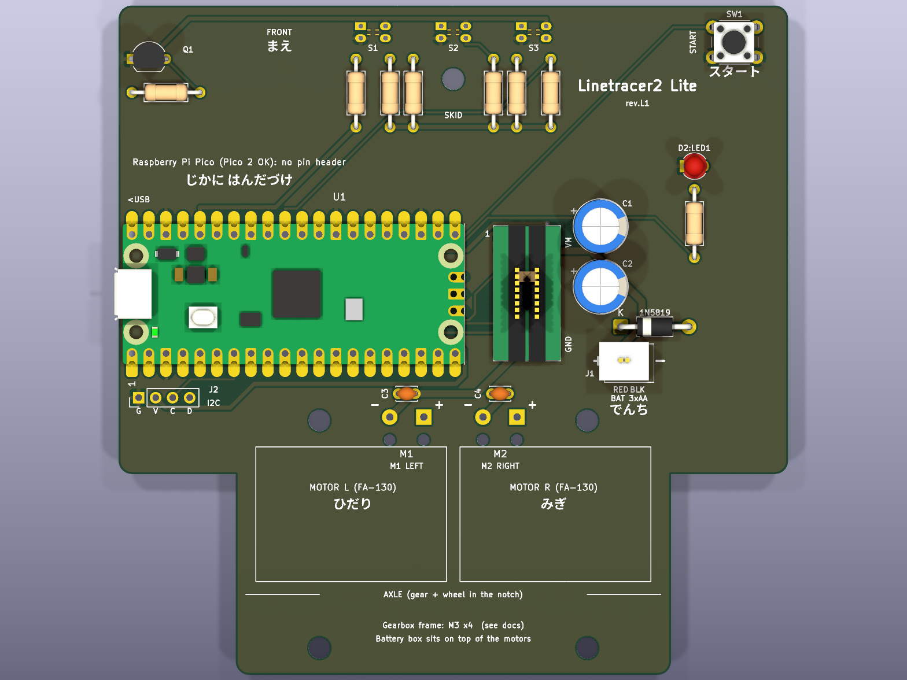
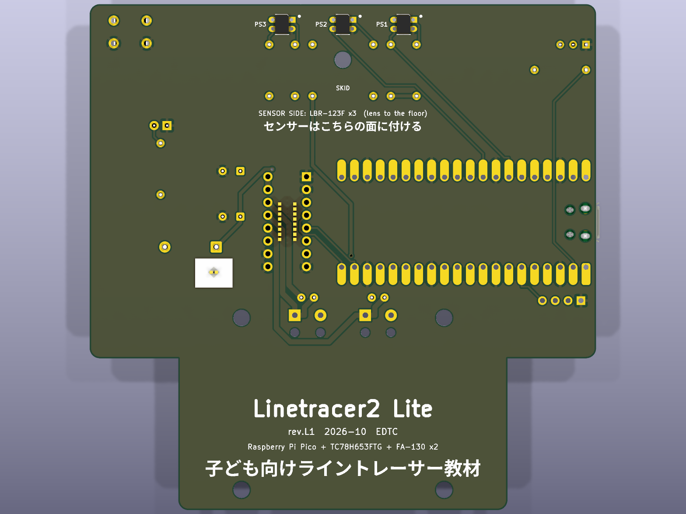
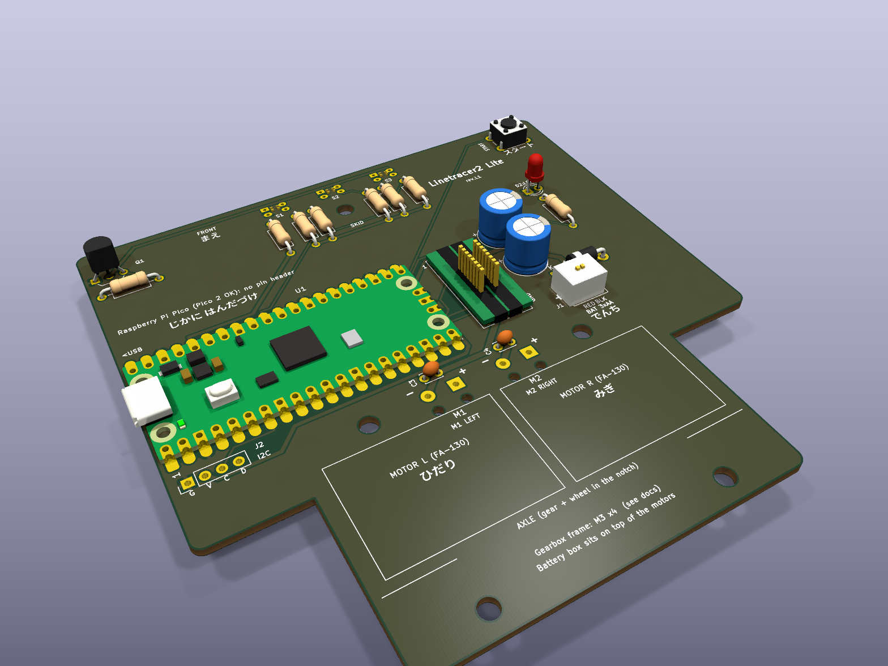

# 低コスト版「Linetracer2 Lite」（rev.L1）

> 最終更新: 2026-10-05（rev.L1、**未製造・未試作**）
> 標準版（rev.A1）から部品を減らして安くした版。**3D プリント部品・ねじ・モーター・電池ボックス・基板の外形とねじ穴は標準版と共通**で、違うのは基板の中身とソフトだけ。
> **Lite のファイルはすべてこの `lite/` フォルダの中**（下のパスは `lite/` からの相対パス）。標準版のファイル（リポジトリ直下の `hardware/` `docs/` `firmware/`）とは混ざらない。
> 回路図: `hardware/kicad/Linetracer2-Lite.kicad_sch`（PDF: `docs/Linetracer2-Lite_schematic.pdf`）
> 製造データ: `hardware/Linetracer2-Lite_rev.L1_gerber.zip`　ソフト: `firmware/micropython/`
> 部品付き基板の 3D（STEP）: `hardware/kicad/Linetracer2-Lite_pcb.step`　組立図: `docs/Linetracer2-Lite_assembly_top.pdf` / `_bottom.pdf`

| 上面（3D） | 裏面（3D、センサー面） |
|---|---|
|  |  |



---

## 1. 依頼内容と結論

2026-10-05 の依頼: 「低コスト版を作って。ピンヘッダを付けない／センサーを 3 つに（アナログマルチプレクサいらなくなるかも）／ブザーなし／O リングなしで今ある TPU で作った O リング（タイヤ）を使う／LED 1 個／ボタン 1 個。どれくらい安くなったかも」

| | 標準版 rev.A1 | **Lite rev.L1** | 差 |
|---|---|---|---|
| **1 台の部品代（全部新品）** | 約 ¥2,400 | **約 ¥2,080** | **−¥320（−13%）** |
| Pico 以外の部品代 | 約 ¥1,570 | 約 ¥1,280 | −¥290 |
| はんだ付けの箇所 | 約 230 | **約 130** | −100（約 4 割減） |
| 基板に付ける部品（モーター線のパッドも 1 個と数える） | 44 個 | 24 個 | −20 |
| センサー | 6 個（4051 で切替） | 3 個（ADC に直結、**4051 不要**） | |
| Pico の付け方 | ピンヘッダ（80 か所） | **基板にじかにはんだ付け（40 か所）** | |
| ボタン / LED / ブザー | 2 / 3 / オプション | 1 / 1（＋Pico の LED）/ なし | |
| タイヤ | O リング P-24 | **TPU 印刷タイヤ**（`tire_tpu.stl`） | |
| 電池電圧の測り方 | 分圧抵抗 → GP27 | **Pico の中の VSYS/3（GP29）** | 部品 3 個減 |

- **アナログマルチプレクサ（TC4051BP）は不要になった**。Pico の外部 ADC はちょうど 3 本（GP26/27/28）なので、センサー 3 個を 1 本ずつ直結した。
- その代わり ADC が全部埋まるので、**電池電圧の分圧回路（R13/R14/C3）も外し、Pico の基板の中にある「VSYS/3 → GP29」**で測る（§3.2）。
- 安くなるのは主に「センサー 3 個分 ¥120」「O リング ¥80」「LED・ボタン・コンデンサ・抵抗 ¥75」「ピンヘッダ ¥35」「4051 ¥15」。

### ⚠ Pico を「貸し出し・再利用」する運用だと、かえって高くなる

標準版の「¥1,500 に近づける」案は **Pico を講座で貸し出して再利用する**（基板にピンソケット／ピンヘッダで付け外しする）ことが前提だった（`../docs/05_bom.md` §3 の B 案）。
Lite は Pico を**基板にじかにはんだ付け**するので、**Pico は 1 台に 1 個、使い切り**になる。

| 運用 | 標準版 | Lite |
|------|-------|------|
| Pico も持ち帰り（全部新品） | 約 ¥2,400 | **約 ¥2,080（−¥320）** |
| Pico を貸し出して再利用 | 約 ¥1,570 | できない（Pico 込みで約 ¥2,080 → **+¥510**） |

→ **「作ったロボットを子どもが持ち帰る」講座なら Lite が安い**。「Pico は回収して次の講座でも使う」なら標準版のほうが安い。

---

## 2. 変更点の一覧と理由

| # | 変更 | 理由・気をつけたこと |
|---|------|-------------------|
| 1 | **Pico を基板にじかにはんだ付け**（ピンヘッダ ¥35 なし） | Pico は端が「キャスタレーション（半分に切った穴）」になっていて、基板に平らに置いてはんだ付けできる（公式の使い方の一つ）。はんだ付けは 80 → 40 か所。専用フットプリント `RaspberryPi_Pico_DirectSolder` を作った（§4.2） |
| 2 | Pico を標準版より 1 mm 左（基板の端寄り）に | Pico を平らに置くと USB プラグの太い部分が基板の高さまで下がる。USB コネクタの口を基板の端から 0.67 mm 外に出して、プラグが基板に当たらないようにした |
| 3 | **センサー 6 → 3 個**、x = 38 / 50 / 62 mm（12 mm 間隔） | 間隔は標準版と同じ 12 mm。19 mm の線なら、真ん中だけ黒・2 個黒・端だけ黒、の 5 段階で位置が分かる（§7） |
| 4 | **4051 マルチプレクサなし**、S1→GP28、S2→GP27、S3→GP26 | ADC 3 本に直結。基板の上で 3 本の線が交差しない順番にした |
| 5 | 電池電圧は **GP29（Pico 内部の VSYS/3）** で測る | ADC が全部埋まるため。電池電圧 ≒ VSYS + 0.3 V（D1 の電圧降下）。分圧抵抗 2 本とコンデンサ 1 個が減った |
| 6 | **ブザーなし**（BZ1・R18 を削除） | 音の代わりに LED の点滅で知らせる（ソフト） |
| 7 | **LED 1 個**（赤、GP18）。電源ランプ・黄 LED なし | 赤（¥10）は Vf が低く、3.3 V・1 kΩ でも十分光る（標準版の LED1 と同じ部品・同じ GPIO）。電源 ON はソフトで赤 LED を点けて知らせる。**Pico に付いている緑の LED（`Pin("LED")`）も 2 個目の表示に使える**（部品代 0） |
| 8 | **ボタン 1 個**（START、GP16） | 「短く押す＝スタート／ストップ」「長押し＝速さの切り替え」をソフトで分ける |
| 9 | **O リングなし → TPU の印刷タイヤ** | すでにある `tire_tpu.stl`（TPU 95A）を標準にした。車輪 `wheel.stl` は同じ |
| 10 | **スキッドの穴を (50, 4) → (50, 11) に移動** | 真ん中のセンサーが元のスキッドの位置に来るため。センサーの 7 mm 後ろ（スキッドの縁とセンサー本体のすき間 1.0 mm、OpenSCAD で確認） |
| 11 | スキッドのナットを**ナイロン → ふつうの鉄ナット** | 穴が後ろに下がり、ナットの角からいちばん近いはんだ（PS2）まで 2.3 mm 離れたので金属でよい（¥20 → ¥8）。ねじ・ナットの種類が 1 つ減る |
| 12 | EXT ヘッダ J3 を削除、I2C の **J2 は穴だけ残す**（ヘッダは買わない） | J3 は 4051 の空きチャンネル用だった。J2 は穴だけなので 0 円。OLED を付けたくなったら 1×4 ヘッダをはんだ付けすればよい |
| 13 | モーターの 0.1 µF（C3/C4）を 1 mm 後ろへ | Pico のパッドが外に伸びた分、間を空けた（はんだのブリッジ防止） |
| 14 | ねじ頭・ナットの下に「配線禁止エリア」 | 鉄のねじ頭（枠の 4 本、裏面）とスキッドのナット（表面）がレジストを削っても信号線とショートしないように、半径 3.5 mm には配線・ビアを通さない（GND ベタだけ可） |

**変えていないもの**: 基板の外形（100×100 mm、後ろの切り欠き）、枠のねじ穴 4 つ、モーター・電源まわりの配置（U2・C1・C2・D1・J1・M1・M2）、3D プリント部品の STL、ねじ（M3×20 ×4、皿 M3×8 ×3）、ピン番号（モーター・START・LED1・センサー LED は標準版と同じ GPIO）。

---

## 3. 回路

回路図: `docs/Linetracer2-Lite_schematic.pdf`。電源・モータードライバ・センサー 1 個分の回路は標準版と同じ（`../docs/03_circuit.md` §2・§4・§5.1）。

### 3.1 ピン割り当て（Lite）

| GPIO | Pico ピン | ネット名 | つながる先 | 標準版との違い |
|------|----------|----------|-----------|--------------|
| GP1 | 2 | SENS_LED_EN | R7 1kΩ → Q1 ベース（赤外 LED 3 個） | 同じ |
| GP4 / GP5 | 6 / 7 | I2C_SDA / SCL | J2（穴だけ） | 同じ |
| GP11 | 15 | MOT_STBY | U2 STBY | 同じ |
| GP12〜15 | 16, 17, 19, 20 | MOT_IN1〜4 | U2 IN1〜4 | 同じ |
| GP16 | 21 | SW1 | START ボタン（内部プルアップ） | 同じ |
| GP18 | 24 | LED1 | 赤 LED（R8 1kΩ） | 同じ |
| **GP26 / ADC0** | 31 | SENS3 | **右**センサー PS3 | 標準版は 4051 の出力 |
| **GP27 / ADC1** | 32 | SENS2 | **真ん中**センサー PS2 | 標準版は電池電圧 |
| **GP28 / ADC2** | 34 | SENS1 | **左**センサー PS1 | 標準版は EXT |
| GP29 / ADC3 | — | （Pico 内部） | VSYS/3 → **電池電圧** | 新しく使う |
| GP24 | — | （Pico 内部） | VBUS 検出（USB をつなぐと 1） | 新しく使う |
| GP25 | — | （Pico 内部） | Pico の緑 LED | 表示に使ってよい |
| GP0, 2, 3, 6〜10, 17, 19〜22 | | — | 未使用 | ブザー・SW2・LED2・MUX がなくなった |

### 3.2 電池電圧（分圧回路なし）

- Pico / Pico 2 の基板には VSYS を 1/3 にする抵抗（200 kΩ/100 kΩ）があり、GP29（ADC3）で読める（Pico の公式回路）。
- VSYS = 電池 − D1（1N5819）の電圧降下 ≒ 0.25〜0.3 V（150 mA 程度で）。ソフトでは **電池 = VSYS/3 の読み × 3 + 0.3 V** として計算（`linetracer.py` の `D1_DROP`）。誤差 ±0.1 V はモーター電圧の ±3% 程度で、速さの補正には十分。
- **USB をつないでいる間は VSYS ≒ 4.7 V（USB から）になり、電池の電圧は測れない**。GP24（VBUS 検出）で USB を見分け、「USB 接続中は電池チェックしない」ようにした。USB と電池を両方つないだときは、実際より高い電圧と思ってデューティを下げる側（安全側）にずれる。
- **Pico W / Pico 2 W は非推奨**: GP29・GP25 が無線チップ用と共用で、そのままでは電池電圧が読めない（標準版は外付けの分圧で GP27 を使うので W でも動く）。

### 3.3 センサー

- 赤外 LED 3 個 × 約 19 mA = 約 57 mA を Q1（2SC1815）で ON/OFF（外乱光キャンセルは標準版と同じ）。
- 1 回の読み取り: LED 点灯 0.3 ms → 3 個読む → 消灯 0.3 ms → 3 個読む ＝ 約 0.7 ms（標準版は MUX の切替があり約 1 ms）。

---

## 4. 基板

### 4.1 仕様（標準版との比較）

| 項目 | 標準版 rev.A1 | Lite rev.L1 |
|------|-------------|------------|
| 外形・層・板厚 | 100×100 mm、2 層、1.6 mm | **同じ**（3D プリント部品がそのまま付く） |
| フットプリント | 52（取付穴 5 含む） | **30**（取付穴 5、未実装の J2 を含む） |
| パッド / 配線 / ビア | 193 / 300 本 / 5 | **126 / 154 本 / 2** |
| 配線の総延長 | 1,507 mm | **917 mm**（表 566 / 裏 351） |
| ERC / DRC | エラー 0、警告 3（GND の橋配線） | **エラー 0、警告 0、未接続 0** |
| 基板代 | 1 枚 ¥40〜100（JLCPCB 30 枚） | 同じ（大きさが同じなので値段も同じ） |

> **標準版（rev.A1）の基板とは別物**。Lite を作るには Lite の Gerber で基板を発注する。発注の設定は標準版と同じ（`../docs/04_pcb.md` §5）。

### 4.2 Pico 直付けのフットプリント `Linetracer2:RaspberryPi_Pico_DirectSolder`

`../scripts/gen_lib.py`（共通）の `fp_pico_direct()` で作る。

- **1 ピンに 1 つのスルーホールパッド**。穴（φ1.0）は Pico の穴の真下（ピンヘッダでも付けられる）、銅は外側へ伸ばして **Pico の端から 1.9 mm はみ出す**（4.3 × 1.7 mm の長円、穴からのオフセット 1.35 mm）。はんだごてを「基板のパッド」と「Pico の半円の穴」に同時に当てられる。
- KiCad 標準の `RaspberryPi_Pico_Common_Unspecified` から次をコピー:
  - **Pico の裏の USB コネクタの足が出る所の穴**（4 つ、銅なし）
  - **Pico の裏のむき出しのテストパッド（TP1〜TP7、デバッグ端子）の下の銅禁止エリア**（配線・ビア・ベタを置かない。Pico の裏の銅と基板の配線がショートしないように）。USB の足の穴が TP2・TP3 のエリアに少しかかるので、このエリアは「穴は可」に変えた
- 3D モデルはピンヘッダなしの `RaspberryPi_Pico.step`。

### 4.3 配置

```
 前 ─────────────────────────────────────────────────
  Q1 R7       FRONT   [S1]   [S2]   [S3]        SW1 START
                      R1 R4  R2 (SKID) R5  R3 R6      Linetracer2 Lite
                             ●(50,11)
  Raspberry Pi Pico : じかに はんだづけ                 D2 LED1
 ┌─(USB 左端)──── Pico（平らに置く）────────┐ ┌U2┐ C1     R8
 │                                           │ │  │ C2
 └───────────────────────────────────────────┘ └──┘ D1 1N5819
  J2(I2C 穴だけ)          C3  M1(+-)   C4  M2(+-)   J1(電池)
 ───(切欠)── [モーター L] [モーター R] ──(切欠)──
 後
```

- 真ん中のセンサー PS2 の抵抗（R2・R5）は、スキッドをよけて x = 44 / 56 に置いた。左右のセンサーの抵抗は標準版と同じく真後ろ。
- 空いた右前の場所に「Linetracer2 Lite」と印刷。
- 基板の生成手順・自動配線は標準版と同じ（6 回試して最短を採用、§9）。

---

## 5. 部品表（1 台分）

機械可読の部品表: `hardware/kicad/bom/Linetracer2-Lite_bom.csv`。価格は `../docs/05_bom.md` と同じ（秋月 2026-10-05 確認、≒ は目安）。

### 5.1 基板に載る部品（すべて秋月）

| 記号 | 部品 | 数 | 秋月 通販コード | 単価 | 小計 | 標準版との差 |
|------|------|----|---------------|------|------|------------|
| U1 | Raspberry Pi Pico（Pico 2 も可、W は不可） | 1 | 116132 | ¥800 | ¥800 | ピンヘッダ不要（−¥35） |
| U2 | モータードライバーモジュール AE-TC78H653FTG | 1 | 114746 | ¥200 | ¥200 | 付属の 1×8 ピンヘッダ 2 本を使う（追加費用なし） |
| PS1〜PS3 | フォトリフレクタ LBR-123F | 3 | 116455 | ¥40 | ¥120 | −3 個（−¥120） |
| Q1 | トランジスタ 2SC1815-GR | 1 | 117089（20 個 ¥100） | ¥5 | ¥5 | |
| D1 | ショットキーダイオード 1N5819 | 1 | 117244（10 個 ¥100） | ¥10 | ¥10 | |
| R1〜R3 | 抵抗 100Ω（茶黒茶） | 3 | 125101（100 本 ¥200） | ¥2 | ¥6 | −4 本 |
| R4〜R6 | 抵抗 10kΩ（茶黒橙） | 3 | 125103（100 本 ¥100） | ¥1 | ¥3 | −5 本 |
| R7, R8 | 抵抗 1kΩ（茶黒赤） | 2 | 125102（100 本 ¥100） | ¥1 | ¥2 | −2 本 |
| C1, C2 | 電解コンデンサ 470µF 16V | 2 | 108426 | ¥10 | ¥20 | |
| C3, C4 | 積層セラミック 0.1µF（モーター用） | 2 | 113582（10 個 ¥100） | ¥10 | ¥20 | −2 個 |
| D2 | LED 3mm 赤 | 1 | 111577 | ¥10 | ¥10 | −2 個（黄・黄緑） |
| SW1 | タクトスイッチ 6mm | 1 | 108075 | ¥10 | ¥10 | −1 個 |
| J1 | XH ベース付ポスト 2P | 1 | 112247 | ¥10 | ¥10 | |
| J2 | （I2C の穴。**何も付けない**） | — | — | — | — | |
| | | | | | **¥1,216** | 標準版 ¥1,461 → **−¥245** |

使わなくなった部品: ピンヘッダ 1×40（100167）、TC4051BP（110914）、LED 黄（111639）・黄緑（111637）、圧電スピーカー（104118、オプション）。

### 5.2 機械部品

| 部品 | 数 | 買う所 | 小計 | 標準版との差 |
|------|----|-------|------|------------|
| DC モーター FA-130RA-2270 | 2 | 秋月 106437 | ¥300 | |
| 電池ボックス 単3×3 スイッチ・XH 付 | 1 | 秋月 112243 | ¥130 | |
| タミヤ 8T ピニオン（15289） | 2 | 模型店・ヨドバシ・Amazon | ¥77 | |
| 真鍮丸棒 φ2 × 20 mm | 2 | ホームセンター | ≒¥15 | |
| **TPU タイヤ（`tire_tpu.stl`）** | 2 | P1S で印刷（TPU 95A、2 本で約 2.1 cm³ ≒ 2.5 g） | ≒¥15 | O リング ≒¥80 の代わり（**−¥65**） |
| 3D プリント部品（PLA） | 1 式 | P1S | ≒¥90 | 同じ（STL 共通） |
| なべ小ねじ M3×20 | 4 | ホームセンター | ≒¥60 | |
| 皿小ねじ M3×8 | 3 | ホームセンター | ≒¥30 | |
| 六角ナット M3（鉄） | **7** | ホームセンター／秋月 114372 | ≒¥58 | +1 個（スキッド用） |
| ナイロンナット M3 | **0** | — | — | 不要に（**−¥20**） |
| モーター用の電線 | 少々 | | ≒¥10 | |
| | | | **≒¥785** | 標準版 ≒¥862 → **−¥77** |

> TPU の値段は 1 kg ¥5,000 前後（¥5/g）として計算。サークルにあるフィラメントを使えば実際の出費は 0 円。

### 5.3 合計

| | 標準版 rev.A1 | Lite rev.L1 | 差 |
|---|---|---|---|
| 基板に載る部品 | ¥1,461 | ¥1,216 | −¥245 |
| 基板（JLCPCB 30 枚の目安） | ¥80 | ¥80 | 0 |
| 機械部品 | ≒¥862 | ≒¥785 | −¥77 |
| **合計（全部新品）** | **約 ¥2,400**（¥2,403） | **約 ¥2,080**（¥2,081） | **−¥322（−13%）** |
| 参考: Pico 以外 | 約 ¥1,570 | 約 ¥1,280 | −¥287 |
| 参考: 標準版でブザーも付けていた場合 | 約 ¥2,430 | 約 ¥2,080 | −¥352 |

- **¥1,500 には届かない**。いちばん大きいのは相変わらず Pico ¥800（全体の 38%）。
- 10 台分なら約 **¥3,200 安くなる**。はんだ付けの時間も約 4 割減る（§6）。

### 5.4 授業 10 台分の買い物リスト（Lite）

| 店 | 品物（通販コード） | 数 |
|----|------------------|----|
| 秋月 | Pico 116132 ×10、AE-TC78H653FTG 114746 ×10、LBR-123F 116455 ×30、2SC1815 117089 ×1 袋、1N5819 117244 ×1 袋、抵抗 125101・125103・125102 ×各 1 袋、470µF 108426 ×20、0.1µF 113582 ×2 袋、LED 赤 111577 ×10、タクトスイッチ 108075 ×10、XH ポスト 112247 ×10、電池ボックス 112243 ×10、FA-130RA 106437 ×20 | |
| 模型店・ヨドバシ・Amazon | タミヤ 15289 ×3 袋（真ちゅうだけ使うなら ×5 袋） | |
| ホームセンター | 真鍮丸棒 φ2 ×1 本、なべ小ねじ M3×20 ×40、皿小ねじ M3×8 ×30、六角ナット M3 ×70、（電線） | |
| ヨドバシ・Amazon | PLA フィラメント（300 g 程度）、TPU 95A（サークルの手持ちでよい、10 台で約 25 g） | |

（O リング・ナイロンナット・ピンヘッダ・TC4051BP は買わなくてよい）

---

## 6. 組み立て（標準版 `../docs/06_assembly.md` との違い）

はんだ付けの箇所: **Pico 40 ＋ モジュール 32 ＋ センサー 12 ＋ 抵抗 16 ＋ その他 21 ＋ モーター線 8 ＝ 約 130 か所**（標準版 約 230）。

### 6.1 Pico を基板にじかにはんだ付けする（いちばん大事）

> **やり直しがきかない**ので、はじめての子は先生がとなりで見る。低学年なら先生が先に付けておく。

1. **先に MicroPython を書き込んで、動くことを確かめておく**（`../docs/07_firmware.md` §1。はんだ付けした後でも書き込めるが、不良品を付けてしまうと外すのが大変）。
2. Pico を**部品面を上**にして、**USB が基板の左端に来る向き**で枠の中に置く（逆向きだと USB が基板の上に乗るのですぐ分かる）。40 個の半円の穴が、基板の 40 個の細長いパッドの真ん中に乗るように位置を合わせる。
3. Pico を指（または洗濯ばさみ）で押さえ、**対角の 2 か所（1 番と 21 番など）だけ先にはんだ付け**。Pico が浮いていないか横から見る。浮いていたら、その 1 か所を温め直しながら押さえる。
4. 残りを 1 か所ずつ: こて先を**基板のパッド（Pico の外にはみ出した所）と半円の穴の両方**に当てて 2 秒 → はんだを当てる → 半円の穴にはんだが吸い上がって山になればよい。
5. 全部付けたら、**となりのピンとのブリッジ（はんだがつながっていないか）**をルーペで見る。つながっていたら、はんだ吸い取り線で取る。
6. Pico の裏に USB コネクタの足が出ていても、基板の穴に逃げるので Pico は浮かない（はんだ付け不要）。

### 6.2 その他の違い

| 標準版の手順 | Lite |
|------------|------|
| 4051（IC）・J3・ブザー・SW2・LED 2 個・R13〜R19 | **ない**（とばす） |
| センサー 6 個 | 3 個（PS1〜PS3、**基板の裏**に付けるのは同じ） |
| スキッドはナイロンナット | **ふつうの鉄ナット**。穴の位置は真ん中のセンサーの 7 mm 後ろ（シルクに SKID） |
| タイヤは O リング P-24 | **TPU の印刷タイヤ**を車輪のみぞにはめる（引っぱって伸ばしながら） |
| 電源ランプ D4 で電源 ON を確認 | 電源ランプはない。**電池のスイッチを入れて `main.py` が動くと赤 LED が点く** |
| モーターモジュールのヘッダ | 同じ（モジュールに付属のヘッダを使う） |

### 6.3 最初の確認（テスター）

1. 電池を入れずに、J1 の + と − の間がショートしていないか（標準版と同じ）。
2. Pico の 40 本のうち、**となりどうしがつながっていないか**（特に GND のとなり: 3・8・13・18・23・28・33・38 番）。
3. USB をつなぎ、Thonny で `examples/01_led_blink.py` → 赤 LED と Pico の緑 LED が交互に光れば Pico のはんだ付けは OK。

---

## 7. 性能への影響（3 センサーにしたこと）

| 項目 | 標準版（6 個） | Lite（3 個） |
|------|-------------|------------|
| 線を見つけられる幅（19 mm 線） | 中心から ±39.5 mm | **±21.5 mm** |
| 位置の分かり方 | 6 段階＋各センサーの境目で連続的 | **5 段階**（左だけ／左＋中／中だけ／中＋右／右だけ）＋境目 |
| 位置の値 | −2500〜+2500 | −1000〜+1000（1000 = センサー 1 個分 = 12 mm は同じ） |
| 1 回の読み取り | 約 1 ms | 約 0.7 ms |
| 前の荷重（スキッド、見積り） | 約 44 g | 約 43 g（部品が減った分とスキッドが後ろに下がった分がほぼ相殺） |

- **急なカーブを速く曲がるのは苦手になる**（線がセンサーの外に出やすい）。見失ったら最後に見えた側へ強く曲がる処理は標準版と同じなので、ゆっくりならたいていのコースは走れるはず。
- ソフトの Kp は、最大の誤差が ±1000 しかないので標準版の約 2 倍を初期値にした（`main.py` の `LEVELS`）。**実機で調整が必要**（`../docs/07_firmware.md` §4 の手順と同じ）。
- 3 個だと位置が階段状に変わるので、D（微分）の値をなめらかにするフィルタを入れた（`d_f`）。
- 線幅が 15 mm でも 25 mm でも動く間隔（12 mm）にしてある。線幅が決まっていて 19 mm より太いなら、間隔を広げると見つけられる幅が増える（`gen_pcb_lite.py` の `SENSOR_X`）。

---

## 8. ソフト（`firmware/micropython/`）

標準版と同じ書き方で使えるように作った。違う所だけ:

```python
from linetracer import Robot
robot = Robot()

v = robot.sensors.read()        # [S1, S2, S3] 0(白)〜1000(黒)
pos = robot.sensors.position()  # -1000(左)〜0(真ん中)〜+1000(右)、見失うと None
kind = robot.wait_press()       # ボタンを押して離すまで待つ → "short" か "long"（0.8 秒以上）
robot.blink(3)                  # 赤 LED を 3 回点滅（ブザーの代わり）
robot.led_pico.value(1)         # Pico の緑 LED（2 個目の表示）
robot.battery.read()            # 電池電圧 [V]（USB 接続中は測れない → robot.battery.usb() で確認）
```

| 標準プログラム `main.py` | 操作 |
|------------------------|------|
| START を短く押す（1 回目） | 自動キャリブレーション（線の上で左右に回る） |
| START を短く押す（2 回目から） | 赤 LED が 3 回点滅して走り出す。もう一度押すと止まる |
| START を長押し（Pico の緑 LED が点いたら離す） | 速さのレベル 1→2→3→1。赤 LED がレベルの数だけ点滅 |
| 赤 LED が点きっぱなし | 準備 OK（電源ランプの代わり） |
| 赤 LED が速く 5 回点滅 | 電池が少ない |

授業のサンプル: `01_led_blink.py`（赤と緑の LED）、`02_button.py`（ボタン・押した回数）、`03_sensor_monitor.py`（3 個の値）、`04_motor_test.py`（標準版と同じ）、`05_simple_tracer.py`（S1 と S3 で ON/OFF 制御）。

> 標準版の `../firmware/micropython/` は Lite では動かない（ピンと ADC の使い方が違う）。逆も同じ。

---

## 9. 作り直し方（スクリプト）

共通のスクリプト（リポジトリ直下の `scripts/`）に環境変数 `LT2_VARIANT=lite` を付けると、出力先が `lite/hardware/` になる。付けなければ標準版。Lite 専用のスクリプトは `lite/scripts/` にある。コマンドはリポジトリ直下の `scripts/` で実行する。

```bash
cd scripts
export LT2_VARIANT=lite
python3 gen_lib.py && python3 gen_3d.py && python3 gen_lib.py   # 2 回目で 3D モデルがフットプリントに入る
./kc fp upgrade ../lite/hardware/kicad/lib/Linetracer2.pretty && ./kc sym upgrade ../lite/hardware/kicad/lib/Linetracer2.kicad_sym
python3 gen_project.py
python3 ../lite/scripts/gen_schematic_lite.py && ./kc sch upgrade ../lite/hardware/kicad/Linetracer2-Lite.kicad_sch
./kc sch export netlist --format kicadsexpr -o ../lite/hardware/kicad/reports/Linetracer2-Lite.net ../lite/hardware/kicad/Linetracer2-Lite.kicad_sch
python3 build_pcb.py 6          # 配置（lite/scripts/gen_pcb_lite.py）→ 自動配線 → シルク（lite/scripts/post_pcb_lite.py）→ DRC、約 5 分
./kpy sync_pcb.py
./export_outputs.sh             # Gerber・BOM・PDF・STEP・3D 画像（lite/hardware/, lite/docs/）
```

| ファイル | 役目 |
|---------|------|
| `scripts/kicad_env.py`（共通） | `LT2_VARIANT` で出力先（`hardware/kicad/` か `lite/hardware/kicad/`）とプロジェクト名を切り替え |
| `lite/scripts/gen_schematic_lite.py` | Lite の回路図 |
| `lite/scripts/gen_pcb_lite.py` | Lite の部品配置（`scripts/gen_pcb.py` の関数を使い、配置だけ差し替え）＋ねじ頭・ナットの下の配線禁止エリア |
| `lite/scripts/post_pcb_lite.py` | Lite のシルク |
| `scripts/gen_lib.py`（共通） | Pico 直付けフットプリントを追加（両方の版で共通のライブラリ） |
| `hardware/mechanical/linetracer2_mech.scad`（共通） | `-D LITE=true` でスキッド位置・センサー・TPU タイヤを Lite にして干渉チェック |

## 10. まだ確かめていないこと（試作で見る）

- [ ] Pico の直付けを子どもができるか（パッドの長さ 1.9 mm で足りるか、ブリッジしないか）
- [ ] USB プラグが基板の端に当たらないか（ケーブルの形による。当たるなら Pico をもう 0.5 mm 左へ）
- [ ] 3 センサーでどのくらいの速さ・カーブまで走れるか（`LEVELS` の調整）
- [ ] GP29 で読んだ電池電圧が、テスターで測った電池電圧と ±0.1 V で合うか（合わなければ `D1_DROP` を直す）
- [ ] TPU タイヤの外径（31.2 mm）で、センサーと床の距離がちょうどよいか（スキッド 3.5 / 4.0 / 4.5 mm で調整）
- [ ] 長押し 0.8 秒が子どもに分かりやすいか
