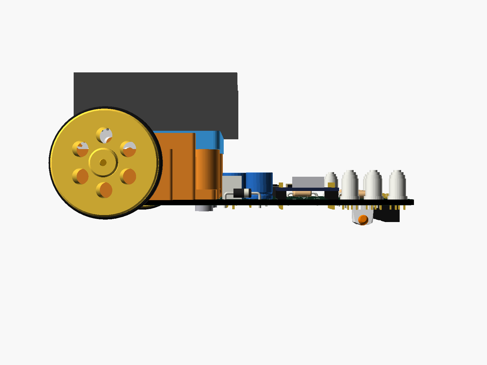
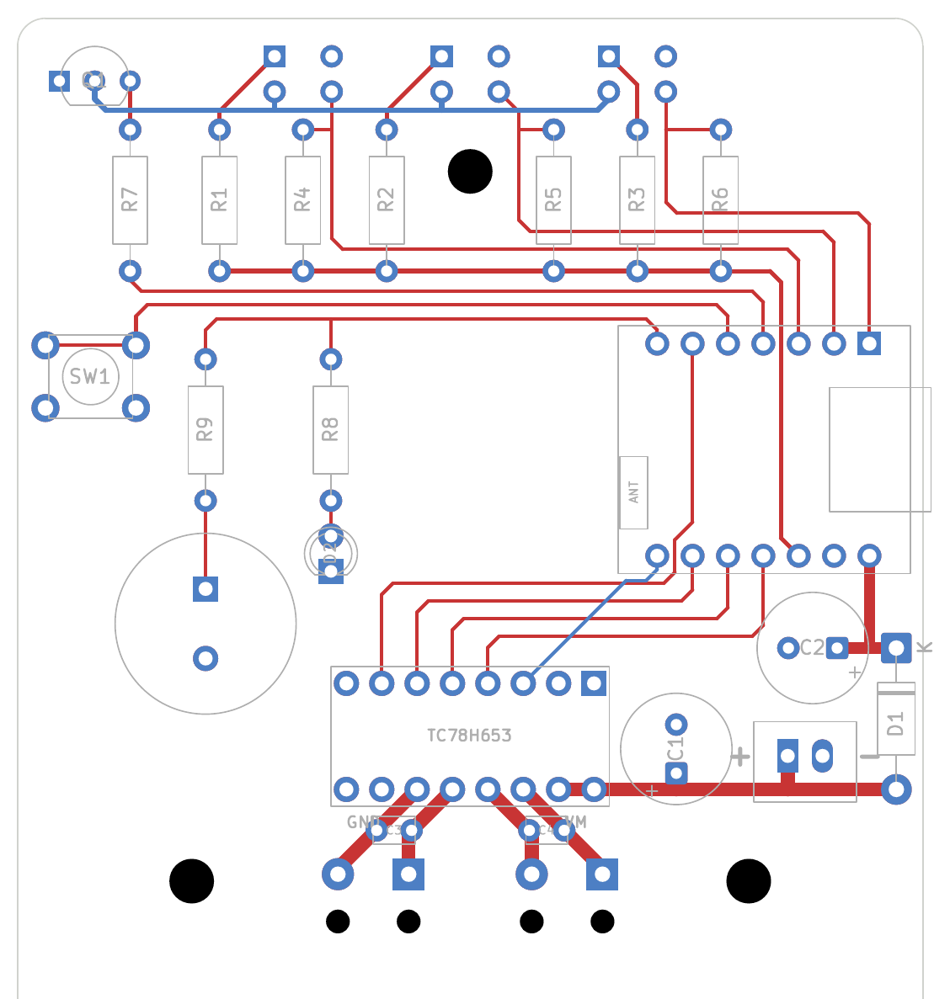

# Linetracer2 Lite（rev.L3：XIAO ESP32C6（ピンヘッダ）＋ LBR-127HLD ＋ ブザー ＋ フルカラー LED）

> 最終更新: 2026-10-08（rev.L3、**未製造・未試作**）
> 標準版（rev.A1）から部品を減らした版。マイコンは **Seeed Studio XIAO ESP32C6**、センサーは **LBR-127HLD**。rev.L3 で **XIAO をピンヘッダで付ける**ようにし、**ブザー**と**フルカラー LED 6 こ**、**テストパッド**を足し、**配線を全部手で引き直して**（自動配線をやめた）、**Lite 用のボールキャスター**を作った（§1）。
> **枠・デッキ・平歯車・車輪の 3D プリント部品、ねじ、モーター、電池ボックス、枠のねじ穴は標準版と共通**。違うのは基板（外形と中身）・ソフト・**前の支え（高さ 7.5 mm のボールキャスターかスキッド）**。
> **Lite のファイルはすべてこの `lite/` フォルダの中**（下のパスは `lite/` からの相対パス）。標準版のファイル（リポジトリ直下の `hardware/` `docs/` `firmware/`）とは混ざらない。
> 回路図: `hardware/kicad/Linetracer2-Lite.kicad_sch`（PDF: `docs/Linetracer2-Lite_schematic.pdf`）
> 製造データ: `hardware/Linetracer2-Lite_rev.L3_gerber.zip`　ソフト: `firmware/micropython/`　組み立て手順書: [`docs/assembly.md`](docs/assembly.md)
> **ロボット全体の 3D モデル**: `hardware/Linetracer2-Lite_assembly.stl`（GitHub 上でそのまま回して見られる）、色つき `hardware/Linetracer2-Lite_assembly.glb`。部品付き基板だけの STEP: `hardware/kicad/Linetracer2-Lite_pcb.step`
> 前の版 rev.L2（XIAO じか付け、自動配線）は git の履歴とプルリクエスト #3 に、rev.L1（Pico ＋ LBR-123F）はコミット `1db5a53` に残っている。

| ロボット全体（3D） | 横から |
|---|---|
|  |  |

| 基板の上面（3D） | 裏面（3D、センサー面） |
|---|---|
|  |  |

| シルク（表。子どもが読む印刷） | シルク（裏、下から見た向き） |
|---|---|
|  |  |

---

## 1. 依頼内容と結論（rev.L3）

2026-10-06 の依頼（4 回目）と、その結果:

| # | 依頼 | 結果 |
|---|------|------|
| 1 | ブザーを追加 | **圧電スピーカー 13 mm（秋月 104118）**を追加。空いているピンが無いので、**START ボタンと同じピン（D4）**に 100 Ω（R9）でつなぎ、ボタンには 1 kΩ（R10）を入れた（§3.5）。LED とブザーは別々に使え、ボタンを押したままでも鳴る。ソフトに `robot.beep()` / `robot.melody()`、サンプル `06_buzzer.py`。（最初は赤 LED と同じ D6 にしたが、鳴っている間 LED が光る・起動ログで「プツッ」と鳴るので 2026-10-07 に移した） |
| 2 | 配線をもっときれいに（部品の位置は変えてよい） | **自動配線をやめて、全部手で引いた**（`scripts/layout_lite.py`）。ルール: 縦・横・45° だけ、直角の角は 45° で面取り、同じ方向へ行く線はそろえた間隔で並べる（バス）、表では線を交差させない。**ビア 0 個**、配線 838 mm（rev.L2 は 737 mm）、裏はフルカラー LED の電源と信号ほか数本（§2.2） |
| 3 | シルクの雰囲気はこのまま | 記号だけ、のまま。数字はつくる順番 ①〜⑮ に付け直した |
| 4 | センサーが背高になったので、Lite 用のスキッド（玉）を作って付ける | **Lite 用ボールキャスター**（**φ6 の玉が中で一緒に印刷される＝外れない**、床とのすき間 0.89 mm）を作った。基板の裏のキャスターの場所（x 45〜55、y 6.5〜21）には部品・はんだが来ないように配置した（§4.5） |
| 5 | センサーの向きをシルクで（どっちの色がどっち、角が欠けている方） | 裏のセンサーの四角の中に **● ＝ 黒いレンズ、○ ＝ 透明なレンズ**、**欠けた角に ◤** |
| 6 | LED はそのまま → **フルカラー LED 6 こを両側に**（2026-10-08・09 の依頼） | 赤 LED と R8 をやめ、**PL9823（5 mm、NeoPixel 型）を 6 こ**、基板の左右の端に 3 こずつ縦に並べ、1 本の信号線（D6）でつないだ（§3.6）。**走っている間は両側で光が前からうしろへ流れる**（その側の車輪の速さで）。ソフト `robot.led`、サンプル `07_rgb_led.py` |
| — | テスターでどこがこわれているか分かるように（2026-10-09 の依頼） | **テストパッド 7 こ**（GND・3V3・VSYS・S1・S2・S3・IR）と、D1 の上のパッドに「VBAT」（§4.9）。先生用のプログラム `08_test_pads.py` |
| 7 | 電解コンデンサの極性をもっと分かりやすく | 黒くぬった半分（＝コンデンサの白い帯の側）の中に**白い「−」を 2 つ**抜き、白い半分に**大きい「＋」を 2 つ** |
| 8 | ギヤボックスがちゃんとはまるか、干渉しないか確認。だめなら作り直し | **ロボット全体の 3D モデルを作って干渉を確認**（基板の部品 24 個 × 枠・デッキ・電池ボックス・モーター・ギヤ・車輪・キャスター・ねじ: すべて 0.3 mm 以上すき間あり、§4.7）。その途中で**ピニオン（外径 5 mm）が枠の穴（3 mm）を通らず、組み立てられないことが分かったので、枠を直した**: 穴を 5.6 mm にし、ピニオンを先にモーターに付けて、モーターを 10.5 mm 内側に置いてから外へすべらせる（すべらせる道すじの干渉チェック 4 つ、`../hardware/mechanical/README.md`）。また、**OpenSCAD の図は実物の鏡像**だったので、左右の枠のファイル名と刻印 L / R を実物どおりにした。さらに**ギヤボックスの 3D モデルをモーターのデータシートと突き合わせて見直した**（§4.8）: 軸が長めのモーターでは軸の先が外かべに当たりうる → 外かべに逃げ穴、モーターが内側へずれるとピニオンが外れうる → デッキの下にリブ、ピニオンを歯のある形に |
| 9 | XIAO は**ピンヘッダ**で（じか付けではなく） | **2 列 × 7 ピンのスルーホール**に変えた（ピンヘッダは 1×40 を切って使う）。XIAO は基板から 2.5 mm 浮く |
| 10 | 抵抗も分かりやすく | **同じ色の抵抗を 1 つの番号でまとめて付ける**: ① ちゃ（100 Ω ×4）→ ② だいだい（10 kΩ ×3）→ ③ あか（1 kΩ ×2）。右前の角に**抵抗の絵（3 本目の帯に ▲）と「① ちゃ ② だいだい ③ あか」**を印刷 |
| 11 | 全部（スキッド・モーター・ギヤボックス・電池・基板・部品）を合わせて STEP か STL で | **`hardware/Linetracer2-Lite_assembly.stl`**（12 万三角形、6 MB）と色つきの **`.glb`**。作り方は §9 |
| — | 子ども向けか（組み立てにくい・すべる・角がとがっている・危ない所）を別のエージェントでも確認 | 3D プリント部品は角を丸め、枠に L / R の刻印（`../hardware/mechanical/README.md` §6）。電子工作の側のレビューは §11 |

| | 標準版 rev.A1 | Lite rev.L2 | **Lite rev.L3** |
|---|---|---|---|
| マイコン | Pico（ピンヘッダ） | XIAO ESP32C6（じか付け） | **XIAO ESP32C6（ピンヘッダ）** |
| センサー | LBR-123F ×6 ＋ 4051 | LBR-127HLD ×3 | LBR-127HLD ×3 |
| ブザー | あり（オプション） | なし | **あり（START ボタンと同じピン）** |
| LED | 3 こ（赤・黄・黄緑） | 赤 1 こ | **フルカラー 6 こ（PL9823、両側に 3 こずつ、信号線 1 本）** |
| 前の支え | スキッド 4.0 mm | スキッド 7.5 mm | **ボールキャスター 7.5 mm**（スキッドも可） |
| **1 台の部品代（全部新品）** | 約 ¥2,370 | 約 ¥2,480 | **約 ¥2,760** |
| はんだ付けの箇所 | 約 230 | 約 100 | **約 140**（ピンヘッダの分 +14、ブザー・R9・R10、フルカラー LED 6 こ） |
| 基板の配線 | 自動配線 | 自動配線（ビア 0、裏が中心） | **手で引いた配線**（ビア 0、表が中心、交差なし） |
| 基板の大きさ | 100 × 100 mm（後ろに切り欠き） | 65 × 100 mm | 65 × 100 mm |
| シルク | 英語＋ひらがな少し | 記号だけ | 記号だけ（つくる順番 ①〜⑮、抵抗の絵、＋−） |

---

## 2. 変更点と理由

### 2.1 rev.L2 → rev.L3 の変更

| # | 変更 | 理由・気をつけたこと |
|---|------|-------------------|
| 1 | **XIAO をピンヘッダで付ける**（フットプリント `XIAO_ESP32C6_Header`: 2 列 × 7 個のスルーホール φ1.0、ピッチ 2.54、列の間 15.24 mm） | 依頼。じか付けより失敗しにくく、浮いた分 XIAO の裏の電池パッド・テストパッドが基板に触れない。**ピンソケットにすれば XIAO を抜いて使い回せる**（手順書 §3）。アンテナの下とその先 4 mm は両面とも銅なしのまま |
| 2 | **ブザー BZ1 ＋ R9（100 Ω）を D4（START ボタンと同じピン）に。ボタンとの間に R10（1 kΩ）** | XIAO の信号ピン 11 本は全部使っていて空きが無い。圧電スピーカーは直流を通さないので、ボタンを読むとき（入力・プルアップ）にはじゃまにならない。鳴らすときだけ D4 を PWM の出力にする。R10 があるので、**ボタンを押したままでも鳴り**、ピンが GND とじかにつながらない（§3.5）。はじめは赤 LED と同じ D6 にしたが、鳴っている間 LED がうすく光る・起動ログで「プツッ」と鳴る・LED とブザーを別々に使えない、ので移した |
| 3 | **部品の配置を全部やり直し**（`scripts/layout_lite.py`） | モータードライバーを**真ん中**に置いて左右のモーターへ**左右対称**に配線。XIAO の後ろの列 → ドライバーの入力を**4 本並んだバス**で。電源（C1・C2・J1・D1）は右うしろにまとめ、**VBAT は 1 本のまっすぐな線**。ボタン・ブザーは左、フルカラー LED は真ん中 |
| 4 | **ピンの割り当てを 2 か所入れかえ**: D3 ⇄ D4（赤外 LED の ON/OFF とボタン）、D8 ⇄ D10（IN1 と IN4） | 表の線が 1 本も交差しないように。入れかえたのは同じ性質のピンどうし（GPIO18〜23、リセット中だけプルアップ）なので、起動のときにモーターが回らない理由は変わらない（§3.1） |
| 5 | **自動配線をやめて手で引いた配線に**（`scripts/route_lite.py`） | 依頼「もっときれいに」。Freerouting は毎回ちがう形で、斜めの線や遠回りが混ざる。決まった形を毎回同じに作れる（§2.2） |
| 6 | **抵抗を色ごとにまとめて付ける**（つくる順番 ①〜③）、右前に**抵抗の絵と色の表** | 依頼「抵抗も分かりやすく」。1 回の手順で 1 種類だけを扱えば、取りちがえが減る |
| 7 | **電解コンデンサの印を強く**（黒い半分に白い −、白い半分に大きい ＋） | 依頼。本物のコンデンサの白い帯には「−」が並んでいるので、同じ絵にした |
| 8 | **センサーの印**（● 黒いレンズ、○ 透明なレンズ、◤ 欠けた角）を四角の中に | 依頼。レンズの色は秋月の注意どおりロットで変わることがあるので、**手順書では「欠けた角」をいちばん確かな目印**にした。センサーのコートヤードを小さくして、すぐ後ろの抵抗の穴と重ならないようにした |
| 9 | 0.1 µF（C3・C4）を**モーターへの 2 本の斜めの線の上に**またがせた | 2 本の線は 2.54 mm 間隔の平行線なので、ちょうど足の間隔（2.5 mm）が合う。線を増やさずに付けられる |
| 10 | 前の支えを**ボールキャスター**に（スキッドも使える） | 依頼。センサーが 5.6 mm と背高なので、標準版のキャスター（玉が基板の外）ではなく、**基板の真下（穴 (50, 11)）に玉**が来る形にした。裏の x 45〜55 / y 6.5〜21 mm には部品もはんだも置いていない |
| 11 | **赤 LED（D2・R8）→ フルカラー LED PL9823 ×6（D2〜D7）、左右の端に 3 こずつ**（2026-10-08・09） | 依頼。信号線は 1 本（D6）のまま。場所をあけるため Q1 を R7 の前へ、抵抗の絵を真ん中へ動かし、S3 の線を 1.3 mm 内側へ。背が 8.7 mm と高いので、つくる順番を ⑦ ボタン → ⑧ ブザー → ⑨ でんち → ⑩ ドライバー → ⑪ XIAO → **⑫ フルカラー LED** → ⑬ 470 µF に付け直した（§3.6） |

**変えていないもの**: 枠のねじ穴 4 つ、キャスター（スキッド）の穴 (50, 11)、モーターのパッド（M1・M2）、センサーの位置（x = 38 / 50 / 62、y = 4）、回路の定数（100 Ω・10 kΩ・1 kΩ・470 µF・1N5819）。

### 2.2 配線のルール（手で引いた配線）

「人が見てきれい」と感じる基板には、だいたい次の決まりがある（手で配線する人がよく使うやり方）。これを `scripts/layout_lite.py` に書いて、`scripts/route_lite.py` で KiCad に入れた。

| ルール | 基板のどこで |
|-------|-------------|
| 線は**縦・横・45° だけ**。直角の角は **45° で 0.8 mm 面取り** | 全部（`check_angles()` で確かめる） |
| **同じ所へ行く線はバスにする**（同じ順番・同じ間隔で並べて、いっしょに曲げる） | センサーの 3 本（1.3 mm 間隔）、ボタン・赤外 LED・フルカラー LED の信号の 3 本（1.0 mm）、XIAO → ドライバーの 4 本（1.27 mm）、モーターの 4 本 |
| **表（部品面）では線を交差させない**。どうしても交差する線だけ裏へ | 裏は「赤外 LED のマイナス側をまとめる線」（センサーも裏なので）、「STBY の 1 本」、フルカラー LED の「電源（VSYS）」と「信号の入口」だけ |
| **ピンの並び順を、相手の部品の並び順と合わせる**（バスが交差しないように） | XIAO のピン割り当てを 2 か所入れかえた（§3.1） |
| **左右対称にできる所は対称に** | ドライバーを中心線に置き、左右のモーターへ同じ形の 45° の線 |
| 太さは電流で決める: 信号 0.25、センサーの LED 0.3、3V3・LED のマイナス 0.4（XIAO のピンの間を通る所だけ 0.3）、VSYS 0.8、モーター・VBAT 1.0 mm | |
| **GND は線を引かず**、両面のベタ（全面の銅）でつなぐ。全部スルーホールなので、裏のベタにすべての GND のピンがつながる | |
| ビア（表と裏をつなぐ穴）を使わない | 0 個 |



（赤 = 表、青 = 裏の配線。GND のベタは消して描いた。後ろ 30 mm は枠の下で配線なし）

- 配線を考えるときは、KiCad を開かずに `scripts/preview_layout.py` で絵を出して確かめた（配置・配線・まだ引いていない線・禁止エリア・枠の位置が 1 枚の PNG で見える）。
- 結果: DRC エラー 0・警告 0・未接続 0、回路図との不一致 0。

---

## 3. 回路

回路図: `docs/Linetracer2-Lite_schematic.pdf`。モータードライバ・センサー 1 個分の回路は標準版と同じ考え方（`../docs/03_circuit.md` §4・§5.1）。

### 3.1 ピン割り当て（rev.L3）

XIAO を USB を上にして上から見たときのピン番号。基板の上では **USB が右**、ピン 1〜7（D0〜D6）が**前の列**（右から D0）、ピン 14〜8（5V〜D7）が**後ろの列**。**★ が rev.L2 から変わったピン。**

| XIAO ピン | GPIO | ネット名 | つながる先 | 起動のときの状態（ESP32-C6） |
|----------|------|----------|-----------|-----------------------------|
| 1 D0 | GPIO0 / ADC | SENS3 | **右**センサー PS3 | プルなし |
| 2 D1 | GPIO1 / ADC | SENS2 | **真ん中**センサー PS2 | プルなし |
| 3 D2 | GPIO2 / ADC | SENS1 | **左**センサー PS1 | プルなし |
| 4 D3 | GPIO21 | SENS_LED_EN ★ | R7 1 kΩ → Q1（赤外 LED 3 個） | リセット中だけプルアップ（赤外 LED が一瞬つくが見えない） |
| 5 D4 | GPIO22 | SW1 ★ | START ボタン（R10 1 kΩ、内部プルアップ）**＋ ブザー BZ1（R9 100 Ω）** | リセット中だけプルアップ（ブザーは鳴らない） |
| 6 D5 | GPIO23 | MOT_IN2 | U2 IN2（左モーター） | リセット中だけプルアップ |
| 7 D6 | GPIO16（TX） | RGB_DIN | フルカラー LED D2〜D7 の信号（D2 の DIN、基板の裏） | 起動ログが出る（LED が一瞬光ることがある。プログラムが始まると消える） |
| 8 D7 | GPIO17（RX） | MOT_STBY | U2 STBY | リセット中はプルなし、リセット後はプルアップ |
| 9 D8 | GPIO19 | MOT_IN1 ★ | U2 IN1（左モーター） | リセット中だけプルアップ |
| 10 D9 | GPIO20 | MOT_IN3 | U2 IN3（右モーター） | 同上 |
| 11 D10 | GPIO18 | MOT_IN4 ★ | U2 IN4（右モーター） | 同上 |
| 12 3V3 | — | +3V3 | センサーの抵抗（XIAO の中の降圧電源の出力） | |
| 13 GND | — | GND | | |
| 14 5V | — | VSYS | D1 の後ろ（電池 − 0.3 V）。USB をつなぐと USB の 5 V | |
| （XIAO の上） | GPIO15 | — | 黄色の LED（**0 で点灯**）。2 個目の表示に使える | |

- **モーターが勝手に回らない理由**（rev.L2 と同じ）: リセット中は IN1〜IN4 がプルアップで H、STBY（RX）はプルなしでドライバの中の 150 kΩ プルダウンにより L（＝待機）。リセットが終わると IN1〜IN4 はプルなしになりドライバのプルダウンで L、STBY は RX のプルアップで H になるが、IN が全部 L なので「止まっている（L/L）」。
- **TX/RX（GPIO16/17）**: 起動ログが出て、MicroPython は UART にも REPL を開いている。ここには「信号が出ても困らない出力」（フルカラー LED の信号、STBY）だけをつないだ。**ボタンやブザーを RX につないではいけない**（RX は入力でもあるので、ブザーの PWM が文字として REPL に入り、運が悪いと Ctrl-C ＝プログラム停止になる）。ブザーは TX にもつながない（起動ログで「プツッ」と鳴る）。
- **ピンの並びとバス**: XIAO の後ろの列は左から D7（STBY）・D8・D9・D10、ドライバーの入力は左から IN2・IN1・IN3・IN4・STBY。D8/D9/D10 を IN1/IN3/IN4 にすると 3 本が平行なバスになる。IN2（前の列の D5）は XIAO の下（ピンヘッダで浮いている）を通って後ろの列の D7 と D8 のすき間から出し、バスのいちばん左に並べた。STBY（D7）だけは IN の線をまたぐので裏を通る。

### 3.2 電源

```
単3×3 ─ VBAT ─┬─ モータードライバ VM（C1 470µF）
              └─ D1 1N5819 ─ VSYS（C2 470µF）─ XIAO 5V ピン ─[XIAO の中]─ ショットキー ─ 降圧 SGM6029 ─ 3V3
                                     USB-C の 5 V もここにつながる（D1 があるので電池には流れない）
```

- XIAO の 5V ピンは USB の VBUS と直結。XIAO の中で **ショットキー → 降圧 DC-DC（入力 2.5〜5.5 V）→ 3.3 V** になる（Seeed の回路図 v1.0）。
- 降圧なので、3.3 V を保てるのは **電池が約 4.0 V 以上**のとき。計算では電池が約 3.4 V（1 本 1.13 V）あたりで XIAO がリセットする（実測はまだ）。**アルカリ電池推奨**。
- **単3×4本は不可**（新品アルカリ 6.4 V。XIAO の 5V 入力の過電圧保護が 6 V あたりで働く）。
- XIAO の裏の **BAT＋/BAT− パッドには何もつながない**（リチウムイオン電池の充電回路につながっている）。ピンヘッダで 2.5 mm 浮いているので基板の線にも触れない。
- 電池だけで動かしているとき、XIAO の**充電ランプ（赤）が点滅することがある**（リチウム電池が無いため。故障ではない）。

### 3.3 電池電圧は測れない

- XIAO ESP32C6 で ADC が使えるピンは **D0〜D2 の 3 本だけ**で、センサー 3 個で使い切る。ソフトは電池の電圧を **`BATTERY_VOLT = 4.2`（アルカリ 3 本で走っているときの目安）と決め打ち**してモーターの電圧を計算する。電池が減ると**だんだん遅くなり**、ほぼ空になると**モーターが動き出した瞬間に XIAO がリセットする**（電池を替えるサイン）。ニッケル水素なら `BATTERY_VOLT` を 3.7 に。

### 3.4 センサー（LBR-127HLD）

- 赤外 LED: (3.3 V − 1.2 V − 0.1 V) ÷ 100 Ω ≒ **20 mA**。3 個で約 60 mA を Q1 で ON/OFF（外乱光キャンセル）。
- フォトトランジスタ: 10 kΩ でプルアップ（白 → 電圧が下がる、黒 → 3.3 V 近く）。
- **データシートに床との距離のグラフが無い**ので、ちょうどよい高さは試作で確かめる（§10）。キャスター（スキッド）7.0 / 7.5 / 8.0 mm でセンサーと床が約 1.7 / 2.25 / 2.8 mm。

### 3.5 ブザー（rev.L3 で追加）

```
D4 (GPIO22) ─┬─ R10 1kΩ ── START ボタン SW1 ── GND
             └─ R9 100Ω ── 圧電スピーカー BZ1 (+) ── (−) GND

D6 (GPIO16/TX) ── フルカラー LED D2 → D3 → D4 → D5 → D6（§3.6）
```

- 圧電スピーカー（PKM13EPYH4000-A0）は**電気を通さない部品**（コンデンサのようなもの）。
- **ボタンを読むとき**: D4 は入力（内部プルアップ）。スピーカーは直流を通さないので、ボタンの読み取りにはじゃまにならない。押すと D4 は R10 を通して GND につながり 0 になる（1 kΩ と内部プルアップ約 45 kΩ で約 0.07 V）。
- **鳴らすとき**: ソフトが D4 を出力にして PWM（4 kHz くらいで速く ON/OFF）。鳴らし終わったら、いったん 1 を出して（スピーカーにたまった電気をそろえる）から入力・プルアップに戻す（`robot.beep()` の中でやっている）。
- **R10 1 kΩ**: 鳴らしているときにボタンを押していても、ピンが GND とじかにつながらない（流れるのは最大 3.3 mA）。だから**ボタンを押したままでも鳴る**（長押しの「カチッ」）。R10 が無いと、押している間は音が止まり、ピンにも大きな電流が流れる。
- **R9 100 Ω**: 3.3 V のピンから急に充放電する電流を 33 mA 以下に抑える。
- できないこと: **鳴っている間（`beep()` の 0.1 秒ほど）はボタンを読めない**。標準プログラムは走っている間は鳴らさないので、走りの止め方には関係ない。
- LED は D6 だけにつながるので、音と関係なく点けたり消したりできる。起動ログ（TX）で「プツッ」と鳴ることも無い。
- いちばん大きく鳴るのは 4 kHz 付近（部品の共振）。ドレミ（500 Hz〜1 kHz）も鳴るが小さめ。
- ソフト: `robot.beep(freq=4000, ms=100)`、`robot.melody([(1047, 150), (1319, 150), ...])`。標準プログラム `main.py` は電源を入れたとき・スタートの前・レベル変更・失敗のときに鳴る。
- 最初の案（2026-10-07 の朝まで）は**赤 LED と同じ D6**だった（LED は直流、ブザーは PWM なので両立はする）。鳴っている間 LED がうすく光る、起動ログで小さく鳴る、LED とブザーを別々に使えない、の 3 つがいやなので D4 に移した。部品は R10（¥1）が 1 本増えただけ。

### 3.6 フルカラー LED（2026-10-08 に赤 LED から変更、2026-10-09 に 6 こ・両側に）

```
D6 (GPIO16/TX) → D2 → D3 → D4 → D5 → D6 → D7   (D7 の DO は空き)
                 左のうしろ→前   右の前→うしろ
VSYS ─ D2〜D7 の VDD（裏の線）      GND ─ D2〜D7 の GND（ベタ）
```

- 部品: **PL9823-F5**（秋月 108411、¥40、5 mm、足 4 本: DIN・VDD・GND（いちばん長い）・DO、1.27 mm 間隔）。中にマイコンが入っていて、1 本の信号線で何こでもつなげる（NeoPixel = WS2812 と同じしくみ、1 こ 24 ビット）。
- 並び: **基板の左の端と右の端に 3 こずつ**、前から後ろへ縦に 7 mm 間隔（センサーの抵抗の両わき、XIAO の前まで）。信号は左のうしろ（D2）から左の前（D4）へ、前の端にそって右へわたり、右の前（D5）から右のうしろ（D7）へ。ソフトの番号は 0〜5（`LEFT_SIDE = (2, 1, 0)`、`RIGHT_SIDE = (3, 4, 5)` が前→うしろ）。
- **走っている間は「流れる光」**: 両側で光が前からうしろへ流れ、**その側の車輪が速いほど速く流れる**（カーブでは内側がゆっくり、その場で回ると片側がうしろから前へ）。線を見失うと赤。`robot.led.flow(左, 右)`。
- 電源は **VSYS**（電池 − D1 = 新品で約 4.2 V、USB では 5 V）。基板の裏の線で、XIAO の 5V ピン → 右の列の内側 → 前の方を横切って（y 14.5）→ 左の列の内側。
  - **PL9823 の決まりは 4.5〜6 V**。電池では少し足りないが、ふつうは光る。電池が減ると青と緑が暗くなる（赤っぽくなる）。
  - 秋月のもう 1 つの 5 mm フルカラー LED **OST4ML5B32A**（3.5〜6 V）は電圧は合うが、信号が 3 段階（H・中間・L）の独自のしくみで、ふつうはピンが 2 本要る。ピン 1 本で作る方法もあるが、H と読まれる電圧がデータシートに無いので、こちらにした。
- 信号: XIAO は 3.3 V。PL9823 が H と読む電圧（目安 VDD の 0.7 倍）は、電池の 4.2 V では 2.9 V で足りる。**USB だけ（5 V）では 3.5 V になり、足りないかもしれない**（光らない・色がおかしい）。試作で確かめる（§10）。だめなら、LED の電源に 1N5819 を 1 本はさむ（次の版の候補）。
- 電流: 1 こ 白でいっぱいに光らせて約 60 mA、6 こで 0.36 A。**ソフトで明るさを 60/255 におさえている**（`RGB_MAX`）。0.1 µF は付けていない（VSYS の 470 µF（C2）だけ。LED が多い試作の帯（テープ）と同じ考え。ちらつくようなら次の版で足す）。
- D6 は TX なので、**電源を入れた直後に起動ログで一瞬光ることがある**。プログラムが始まると消える。
- **向きをまちがえると VDD と GND が入れかわる**（こわれて熱くなることがある）。基板の丸の中の **● の点のすぐとなりの穴に、いちばん長い足（GND）**（● は丸の外がわ＝基板の端の側）。穴は前後に互いちがい（±0.9 mm）で、足の間 1.27 mm のままよりブリッジしにくい。**まっすぐ 1 列の穴（足をそのまま差せる）にしない理由**: 1.27 mm 間隔だとパッドの間が 0.2〜0.3 mm しかなく、**となりどうしの VDD と GND がはんだでつながると電源がショート**する（電池が熱くなる）。互いちがいならパッドの間は約 0.9 mm。足を 1 本おきに前・うしろへ少し開くだけで差せる（先生が先に開いておいてもよい）。
- ソフト: `robot.led[i] = "red"` → `robot.led.show()`、`robot.led.fill("blue")`、`robot.led.side(左, 右)`、`robot.led.flow(左, 右)`（流れる光）、`robot.led.bar(pos)`（線のある側）、`robot.led.count(n)`（前から n こ）、`robot.led.value(1)`（ふつうの LED と同じ。色は `robot.led.color`）。標準プログラムは 準備 OK = 緑、キャリブレーション中 = 青、失敗 = 赤、走っている間 = 流れる光、速さのレベル = 黄色の数。

---

## 4. 基板

### 4.1 仕様（rev.L2 との比較）

| 項目 | Lite rev.L2 | **Lite rev.L3** |
|------|-------------|-----------------|
| 外形・層・板厚 | 65 × 100 mm、2 層、1.6 mm | 同じ |
| フットプリント | 29（取付穴 5 を含む） | **43**（BZ1・R9・R10・フルカラー LED 6・テストパッド 7 が増え、赤 LED・R8 が減った） |
| パッド / 配線 / ビア | 96 / 131 本 / 0 | **125 / 135 本 / 0** |
| 配線の総延長 | 737 mm（表 97 / 裏 640） | **838 mm（表 624 / 裏 214）** |
| 配線のしかた | Freerouting（6 回やっていちばん短いもの） | **手で引いた配線（毎回同じ）** |
| ERC / DRC | エラー 0、警告 0、未接続 0 | **エラー 0、警告 0、未接続 0、回路図との不一致 0** |

> **rev.L2 の基板とは別物**。rev.L3 の Gerber（`hardware/Linetracer2-Lite_rev.L3_gerber.zip`）で発注する。発注の設定は標準版と同じ（`../docs/04_pcb.md` §5）。

### 4.2 XIAO のフットプリント `Linetracer2:XIAO_ESP32C6_Header`

`../scripts/gen_lib.py`（共通）の `fp_xiao_header()` で作る。

- 2 列 × 7 個のスルーホール（φ1.0、パッド φ1.7、1 番ピンは四角）。列の間 15.24 mm（XIAO の穴と同じ）。
- **アンテナの下とその先 4 mm は両面とも銅なし**（配線・ビア・ベタ禁止）。
- 3D モデルはピンヘッダ（2.5 mm）の上に XIAO が乗った形（`../scripts/gen_3d.py`）。

### 4.3 配置

```
 前 ──── フルカラー LED の信号（表、前の端にそって）────────────────
 (D4)  Q1⑥ ▲まえ [S1]  ⑭うら [S2]       [S3]           ⑫ (D5)
 (D3)  R7 R1 IR R4 R2 S1  (キャスター) R5 S2 R3 R6 S3      (D6)
 (D2)  あか ちゃ だいだい ちゃ  3V3 ●  だいだい ちゃ だいだい  (D7)
  ⑫   ══ 3V3 ══ ボタン＋ブザー・赤外 LED の 2 本 ══    GND ●
       R10  R9   ┌抵抗の絵┐ Linetracer2   ┌── XIAO ESP32C6 ⑪ ─┐
       あか ちゃ  ①ちゃ…   Lite rev.L3     │ マイコン      USB ─┼→ USB-C
  SW1⑦           └────────┘               └────────────────────┘ ● VSYS
  スタート  ブザー⑧   ╚═ XIAO → ドライバーの 4 本のバス ═╝   C2⑬  D1④
         ┌ U2⑩ モーター ドライバー ┐ C1⑬  J1⑨ でんち         VBAT
         └──────────────────────────┘ ══ VBAT ═════════╝
          C3 ⑤ C4（モーターの線の上）
     [M1 ひだり −  +]  ⑮  [M2 みぎ −  +]
 ───────── 枠・モーター・電池ボックス（後ろ 40 mm）─────────
 後            （D2〜D7 = フルカラー LED、● = テストパッド）
```

- センサーは基板の**裏**（レンズが床を向く）。LED 側（欠けた角）が左、フォトトランジスタ側が右（上から見て）。各センサーの左の抵抗が 100 Ω（LED）、すぐ右（または真ん中のセンサーでは右）が 10 kΩ（プルアップ）。
- 部品の位置はすべて `scripts/layout_lite.py` の `PLACE`。

### 4.4 配線の中身

| 線 | 層 | 形 |
|----|----|----|
| センサーの LED（A） → 100 Ω | 表 | 45° の 1 本 |
| センサーのコレクタ → XIAO D2/D1/D0 | 表 | まっすぐ後ろ → **3 本のバス**（y 14.0 / 15.3 / 16.6）→ XIAO の前の列へ。10 kΩ は横に 1 本だけ出してつなぐ |
| 3V3 | 表 | 抵抗の後ろのパッドを**1 本の横線**でつなぎ、XIAO の D3 と D2 のすき間から XIAO の下を通って 3V3 ピンへ |
| ボタン＋ブザー・赤外 LED の ON/OFF・フルカラー LED の信号 | 表 | XIAO の前の列から**3 本のバス**で左へ。D4 の線は R10（ボタンへ）と R9（ブザーへ）の 2 つに分かれる |
| フルカラー LED の信号 | **裏**→表 | XIAO の D6 から裏で XIAO のピンのすぐ前を左へ（y 21.8）→ 左のうしろの LED。そこから表で、列の中は DO → 次の DIN（1 段の 45°）、左の前 → 前の端にそって右の前へ |
| フルカラー LED の電源（VSYS） | **裏** | XIAO の 5V ピンから右の端を回って右の列の内側の縦線 → y 14.5 で前の方を横切る → 左の列の内側の縦線。LED ごとに短い枝 |
| テストパッド | 表 | 3V3・S1〜S3 は線の上にのせた。VSYS・IR は短い枝。GND はベタ |
| モーターの入力 IN1〜IN4 | 表 | XIAO の後ろの列から**4 本のバス**でドライバーへ（IN2 は XIAO の下から） |
| STBY | **裏** | 1 本の 45° の線 |
| 赤外 LED のマイナス（LED_K） | **裏** | センサーのすぐ後ろの横線 → Q1 |
| モーター OUT1〜4 | 表 | 左右対称の 45° の線。C3・C4 が線の上にまたがる |
| VBAT | 表 | ドライバーの VM から D1 まで 1 本の横線、C1・J1 は短い枝 |
| VSYS | 表 | XIAO の 5V ピンからまっすぐ D1 へ、C2 も同じ線の上 |

- 配線禁止: 枠のねじの頭の下（裏、半径 3.5 mm）、キャスターのツメの上（表、半径 2.6 mm）、XIAO のアンテナ（両面）。

### 4.5 センサーの高さと前の支え（機械）

- LBR-127HLD は高さ 5.6 mm。標準版の高さ（基板の下面が床から 4.0 mm）のままだと床に当たるので、**前の支えを 7.5 mm** にした。後ろは車輪で高さが決まるので、ロボットは**後ろに 2.9° 傾く**。
- **ボールキャスター**（`../hardware/mechanical/caster_lite_print_h75.stl`）が標準: **φ6 の玉が穴の 5.4 mm 後ろ**で中に一緒に印刷され、外れない。床とのすき間 0.89 mm（玉を穴の真下に置いた φ4.5 の `caster_lite_print45_h75.stl` は 0.37 mm）。**向きがある**（刻印の矢印を前へ。逆向きだと真ん中のセンサーに当たって入らない）。スキッド（`skid_clip_h75.stl`）も同じ穴 (50, 11) にパチッと押し込める。**ダイソーのパール調ビーズ φ6 を押し込む版** `caster_lite_bead6_h75.stl` もある（2026-10-09、同じ形で玉がピンの後ろ、床とのすき間 1.1 mm、先生がビーズを入れる）。くわしい寸法・高さ違い（7.0 / 8.0 mm）は `../hardware/mechanical/README.md` §2.4。
- キャスターは基板の裏の x 48.8〜54.6、y 7.7〜20.6 mm を使う（この中には部品も、はんだも、銅のパッドも置いていない）。

| 前の支えの高さ | 傾き | センサーと床 |
|---|---|---|
| 7.0 mm | 2.5° | 1.7 mm |
| **7.5 mm（標準）** | **2.9°** | **2.25 mm** |
| 8.0 mm | 3.3° | 2.8 mm |

### 4.6 シルク（子ども向けの印刷）

**基板には記号だけを印刷し、記号の意味と手順は組み立て手順書 `docs/assembly.md` に書いた**（依頼者の指示）。

| 記号 | 場所 | 意味（くわしくは手順書 §1） |
|------|------|------|
| 丸い数字 ④〜⑮（①〜③ は右前の抵抗の絵） | 部品のそば | つくる順番（背の低い部品から、1 つの番号に 1 種類）。⑩ ドライバー → ⑪ XIAO → ⑫ フルカラー LED → ⑬ 470 µF |
| ちゃ / だいだい / あか | 抵抗の上 | 抵抗の 3 本目の帯の色 |
| 抵抗の絵（3 本目に ▲）と ① ちゃ ② だいだい ③ あか | 右前の角 | 3 本目の帯の数え方と、色ごとの順番 |
| 丸（左右に 3 こずつ）と ● の点 | フルカラー LED | ● の点のすぐとなりの穴に、いちばん長い足（GND） |
| GND・3V3・VSYS・VBAT・S1〜S3・IR（小さい字） | テストパッド | 先生がテスターで測る所（§4.9） |
| 黒い半分（中に白い −）、白い半分（＋）、丸の外の − ＋ | C1・C2 | コンデンサの白い帯（−）を黒い方に。外の印は缶をのせたあとの確認用 |
| 太い線 | D1 | 白い帯の側 |
| 半円 | Q1 | 部品の形と同じ向き |
| ＋（ブザーの中） | BZ1 | ブザーの ＋ の足 |
| ＋ −、RED / BLK | J1 | 赤い線が ＋ |
| VM・1 / USB | ドライバー / マイコン | モジュールの「VM」の字と切り欠きを右 / USB を右の端に |
| ⑭ うら | 左前 | センサーは裏に付ける |
| ▲まえ、S1〜S3、スタート、ブザー、でんち、モーター ドライバー、マイコン、ひだり / みぎ | | 短い名前だけ（ひらがな・カタカナ） |
| 裏: センサーの四角、◤（欠けた角）、●（黒いレンズ）、○（透明なレンズ）、キャスター、⑭ センサー、ロボットの名前 | 裏 | センサーは裏から、欠けた角を合わせる |

- 部品番号（R1 など）は印刷しない。先生用の組立図 PDF（F.Fab）には残っている。
- シルクの DRC を 0 にするための注意（`../docs/08_knowledge.md` C2）: ひらがなは 1.1〜1.3 mm 以上。丸数字（①）は細すぎるので、丸を線で描いて中に数字を書いた。

### 4.7 ロボット全体の 3D モデルと干渉チェック

- `../scripts/export_assembly.sh` が、KiCad の基板（全部の部品つき、VRML）と OpenSCAD の部品（枠・デッキ・電池ボックス・モーター・ピニオン・平歯車・軸・車輪・タイヤ・キャスター・ねじ・ナット）を 1 つにまとめて `hardware/Linetracer2-Lite_assembly.stl` / `.glb` と、絵 `docs/assembly_*.png` を作る。
- 同じスクリプトで**干渉チェック**: 基板の部品 24 個の外形（KiCad の 3D モデルの箱 ＋ 0.3 mm）と機械部品の重なりを OpenSCAD で計算 → **枠・デッキ・電池ボックス・モーター・ギヤと車輪・キャスター・ねじとナット、すべて「空」**（0.3 mm 以上すき間がある）。確認のため枠をわざと 3 mm 前にずらすと重なりを検出する。
- 注意（`../docs/08_knowledge.md`）: OpenSCAD の座標（x 右、y 後ろ、z 上）は**左手系**なので、OpenSCAD の中の絵は本物の**鏡像**になる。印刷した部品は本物と同じ向き。まとめた 3D モデルは KiCad と同じ右手系（x 右、y 前、z 上）で、印刷部品は中心線のまわりに 180° 回して並べている。

### 4.8 ギヤボックスの 3D モデルの見直し（2026-10-07）

依頼「ギヤボックスの 3D モデル、これでいいか見ておいて」。モーター FA-130RA-2270 のデータシート（Mercury Motor）の寸法・公差と、3D モデルを 1 つずつ突き合わせた。くわしくは `../hardware/mechanical/README.md` §2.6。


| 見たところ | 結果 | 直したこと |
|---|---|---|
| モーターの寸法（缶 φ20.1 × 厚さ 15.0、長さ 24.8、前の出っぱり φ6.0 × 1.7、軸 φ2.0、全長 38.0） | モデルはデータシートの値どおり | — |
| **軸の先と外かべ** | 軸の出っぱりは 9.5 ±0.5 mm、さらに軸が前後に 0.05〜0.4 mm 動く。モデルのすき間は 0.5 mm しかなく、**軸が長めの個体ではピニオンと軸の先が外かべに最大 0.4 mm 当たる** | 外かべに**逃げ穴 φ6.5**（車輪がふたをする）。穴のまわりに肉を残すため、外かべを 3 mm 前へのばした。軸が 0.9 mm 長くても当たらないことをチェック `check_shaft_wall` で確認（穴が無いと当たる） |
| **モーターの前後の位置** | モーターは、はめ込みのツメの摩擦だけで止まっていた。入れるときに 10.5 mm 滑らせる道があるので、内側へずれても止める物が無い。ずれるほど歯の重なりが減り、4.5 mm で外れる | **デッキの下にリブ**（厚さ 1 mm）を付け、2 つのモーターの後ろの出っぱりの間に入れた。すき間は左右 0.5 mm ずつ。モーターが板に当たるまで入っていないとデッキが約 7 mm 浮くので、押しこみ忘れにも気づける |
| ピニオン | 3D モデルではただの円柱だった | 歯のある 8T（平歯車とかみ合う向き）で描くようにした（見た目と干渉チェック用。実物はタミヤのピニオン） |
| かみ合い | 軸間 12.0 mm（m0.5 ×（8 ＋ 40）÷ 2）、歯の幅の重なり 3.5 mm（軸が長い個体でも 2.6 mm） | そのままで OK |

- 枠・デッキ・ツメ版デッキの STL を書き出し直した（基板には関係ない。干渉チェックは全部「空」のまま）。
- 図は `../scripts/gearbox_figure.py` で作る（OpenSCAD の 3 つの見え方に名前を付けたもの）。

### 4.9 テストパッド（テスターでこわれた所をさがす、2026-10-09）

基板の表に**銅の丸いパッド（φ1.5、部品なし）**を 7 こ付け、となりに名前を印刷した。テスターの**黒を GND**、赤を測りたいパッドに当てる。電池を入れてスイッチ ON（USB だけのときは VBAT 0 V、VSYS 5 V）。先生用のプログラム `firmware/micropython/examples/08_test_pads.py` が、赤外 LED を 5 秒ずつ ON / OFF したり、フルカラー LED を 1 こずつ光らせたりするので、そのあいだに測る。

| パッド | 場所 | ふつうの値（目安） | ちがうときにうたがう所 |
|---|---|---|---|
| **GND** | 真ん中（XIAO の左前） | 0 V（基準） | — |
| **VBAT** | D1 の上（うしろ）のパッド（字は「VBAT」） | 3.6〜4.8 V（アルカリ 3 本） | 電池・電池ボックスのスイッチ、J1 のはんだと向き |
| **VSYS** | D1 の前、XIAO の右うしろ | VBAT より 0.2〜0.3 V 低い（USB だけなら 5 V） | D1 の向き・はんだ、C2 |
| **3V3** | 真ん中（センサーの抵抗のうしろの線の上） | 3.3 V | XIAO のピンヘッダ（3V3・GND・5V）のはんだ・ブリッジ、XIAO の向き |
| **IR** | Q1 のうしろ | 赤外 LED が ON: 約 0.1 V、OFF: 約 2 V | Q1 の向き・はんだ、R7（あか）、センサーの足（LED 側）・向き |
| **S1 / S2 / S3** | センサーの線の上 | 赤外 LED ON で、白い紙の上: 低い（0.3〜1 V）、黒い線の上: 約 3 V | センサーの向き・高さ・はんだ、10 kΩ（だいだい）、100 Ω（ちゃ） |

- **モーター**: 「ひだり」「みぎ」のパッドで、`04_motor_test.py` で前進のとき 2〜3 V（向きで ＋ / −）。0 V ならドライバー（⑩）のはんだと向き、STBY。
- **フルカラー LED**: `08_test_pads.py` で 1 こずつ白く光る。**光らない LED の 1 つ前**までは信号が来ている → 光らない LED か、その 1 つ前の LED の DO のはんだを見る。
- 値は目安（まだ試作していない）。**ちゃんと動く 1 台で測って、この表を書きなおす**（§10）。

---

## 5. 部品表（1 台分）

**秋月のリンクつきの部品表と 10 台分の注文リスト: [docs/bom.md](docs/bom.md)**。機械可読の部品表: `hardware/kicad/bom/Linetracer2-Lite_bom.csv`。価格は秋月のサイトで確認（2026-10-05）、≒ は目安。

### 5.1 基板に載る部品（すべて秋月）

| 記号 | 部品 | 数 | 秋月 通販コード | 単価 | 小計 | rev.L2 との差 |
|------|------|----|---------------|------|------|------------|
| U1 | Seeed Studio XIAO ESP32C6 | 1 | 129481 | ¥1,100 | ¥1,100 | |
| — | **ピンヘッダ 1×40**（7 ピン × 2 本を切る） | 14 ピン | **100167**（1 本 ¥35） | — | ≒¥14 | **+¥14**（1 本で 2 台半分） |
| U2 | モータードライバーモジュール AE-TC78H653FTG | 1 | 114746 | ¥200 | ¥200 | 付属の 1×8 ピンヘッダ 2 本を使う |
| PS1〜PS3 | フォトリフレクタ LBR-127HLD | 3 | 104500 | ¥80 | ¥240 | |
| **BZ1** | **圧電スピーカー 13mm PKM13EPYH4000-A0** | 1 | **104118** | ¥30 | ¥30 | **+¥30** |
| Q1 | トランジスタ 2SC1815-GR | 1 | 117089（20 個 ¥100） | ¥5 | ¥5 | |
| D1 | ショットキーダイオード 1N5819 | 1 | 117244（10 個 ¥100） | ¥10 | ¥10 | |
| R1〜R3, **R9** | 抵抗 100Ω（ちゃ くろ **ちゃ** きん） | **4** | 125101（100 本 ¥200） | ¥2 | ¥8 | +¥2 |
| R4〜R6 | 抵抗 10kΩ（ちゃ くろ **だいだい** きん） | 3 | 125103（100 本 ¥100） | ¥1 | ¥3 | |
| R7, **R10** | 抵抗 1kΩ（ちゃ くろ **あか** きん） | 2 | 125102（100 本 ¥100） | ¥1 | ¥2 | |
| C1, C2 | 電解コンデンサ 470µF 16V | 2 | 108426 | ¥10 | ¥20 | |
| C3, C4 | 積層セラミック 0.1µF（モーター用） | 2 | 113582（10 個 ¥100） | ¥10 | ¥20 | |
| **D2〜D7** | **フルカラー LED PL9823-F5**（5 mm、NeoPixel 型） | **6** | **108411** | ¥40 | ¥240 | **+¥230**（赤 LED ¥10 の代わり） |
| TP1〜TP7 | テストパッド（基板の銅のパッドだけ。部品なし） | — | — | — | — | |
| SW1 | タクトスイッチ 6mm | 1 | 108075 | ¥10 | ¥10 | |
| J1 | XH ベース付ポスト 2P | 1 | 112247 | ¥10 | ¥10 | |
| | | | | | **≒¥1,912** | rev.L2 ¥1,636 → **+¥276** |

- （やり方 B）XIAO を抜き差しできるようにするなら、秋月のピンソケット(メス) 1×7(7P)（[104285](https://akizukidenshi.com/catalog/g/g104285/)、1 個 ¥20）が 2 個要る（授業で使い回すなら XIAO 1 個 ¥1,100 が浮く）。高さ 8.5 mm の分 XIAO が上がっても、機械部品には当たらない（3D モデルで確認）。

### 5.2 機械部品

rev.L2 と同じ（約 ¥767）。違うのは**前の支えを `caster_lite_print_h75.stl`（ボールキャスター、玉ごと印刷）**にしたことだけ（PLA が 1 g ほど増えるだけで値段は同じ。スキッド `skid_clip_h75.stl` でもよい）。内訳は rev.L2 と同じ（モーター ¥300、電池ボックス ¥130、ピニオン ¥77、軸 ≒¥15、TPU タイヤ ≒¥15、PLA 部品 ≒¥90、ねじ・ナット ≒¥130、電線 ≒¥10）。車軸は 18 mm に切るだけ（車輪の六角のハブが平歯車を直接回すので、すべらない。`../hardware/mechanical/README.md` §2.7）。ビーズ版のキャスターにするならダイソーのパール調ビーズ φ6（1 袋 ¥110）。

### 5.3 合計

| | 標準版 rev.A1 | Lite rev.L2 | **Lite rev.L3** |
|---|---|---|---|
| 基板に載る部品 | ¥1,461 | ¥1,636 | **≒¥1,912** |
| 基板（JLCPCB 30 枚の目安） | ¥80 | ¥80 | ¥80 |
| 機械部品 | ≒¥832 | ≒¥767 | ≒¥767 |
| **合計（全部新品）** | **約 ¥2,370** | 約 ¥2,480 | **約 ¥2,760** |

### 5.4 授業 10 台分の買い物リスト（rev.L3）

| 店 | 品物（通販コード） |
|----|------------------|
| 秋月 | XIAO ESP32C6 129481 ×10、**ピンヘッダ 1×40 100167 ×4**、AE-TC78H653FTG 114746 ×10、LBR-127HLD 104500 ×30、**圧電スピーカー 104118 ×10**、2SC1815 117089 ×1 袋、1N5819 117244 ×1 袋、抵抗 125101・125103・125102 ×各 1 袋、470µF 108426 ×20、0.1µF 113582 ×2 袋、**フルカラー LED 108411 ×60**、タクトスイッチ 108075 ×10、XH ポスト 112247 ×10、電池ボックス 112243 ×10、FA-130RA 106437 ×20 |
| 模型店・ヨドバシ・Amazon | タミヤ 15289 ×3 袋（8T ピニオン） |
| ホームセンター | 真鍮丸棒 φ2（車軸、18 mm に切る）、なべ小ねじ M3×20 ×40、皿小ねじ M3×8 ×20、六角ナット M3 ×60、（電線） |
| ヨドバシ・Amazon | PLA フィラメント（300 g 程度）、TPU 95A（10 台で約 25 g） |
| （電池） | 単3 アルカリ ×30 |

---

## 6. 組み立て

**組み立て手順書: [docs/assembly.md](docs/assembly.md)**（基板の記号の見かた、つくる順番 ①〜⑮、マイコンのピンヘッダ、センサー、ブザー、最初の確認、機械の組み立てのちがい）。

はんだ付けの箇所: **XIAO 28（XIAO 側 14 ＋ 基板 14） ＋ モジュール 32 ＋ センサー 12 ＋ 抵抗 18 ＋ フルカラー LED 24 ＋ その他 21 ＋ モーター線 8 ＝ 約 140 か所**。

---

## 7. 性能への影響

3 センサーでの走り方（センサーの間隔 12 mm、Kp の初期値など）は rev.L2 と同じ。ブザーは START ボタンとピンを分け合うので、**鳴っている間（0.1 秒ほど）はボタンを読めない**。走っている間は鳴らさないので、走り・止め方には関係ない。

---

## 8. ソフト（`firmware/micropython/`）

### 8.1 MicroPython を入れる

1. micropython.org の **ESP32_GENERIC_C6**（ESP32-C6 用の公式ファームウェア、2026-08 時点 v1.29.0）を使う。
2. **Thonny**: 「ツール → オプション → インタプリタ」で「MicroPython (ESP32)」を選び、「MicroPython をインストールまたは更新（esptool）」で family **ESP32-C6** を選んで書き込む。一覧に無いときは esptool で:

```bash
pip install esptool
```

```bash
esptool.py --chip esp32c6 erase_flash
```

```bash
esptool.py --chip esp32c6 --baud 460800 write_flash 0 ESP32_GENERIC_C6-20260824-v1.29.0.bin
```

3. 書き込めないときは、XIAO の **BOOT ボタンを押したまま USB を差す**と書き込みモードになる。
4. `linetracer.py` と `main.py` を XIAO に保存（Thonny:「/ にアップロード」）。

### 8.2 ライブラリの使い方

```python
from linetracer import Robot
robot = Robot()

v = robot.sensors.read()        # [S1, S2, S3] 0(白)〜1000(黒)
pos = robot.sensors.position()  # -1000(左)〜0(真ん中)〜+1000(右)、見失うと None
kind = robot.wait_press()       # ボタンを押して離すまで待つ → "short" か "long"（1.5 秒以上。「カチッ」と鳴る）
robot.led[0] = "red"            # フルカラー LED（0〜2 = 左のうしろ→前、3〜5 = 右の前→うしろ）。色の名前か (赤, 緑, 青)
robot.led.show()                # show() で光る。robot.led.fill("blue") は 6 こ全部、robot.led.side("red", "off") は左右
robot.led.flow(left, right)     # 流れる光（何度も呼ぶ）。その側の車輪の速さ -100〜100 で流れる
robot.blink(3)                  # LED を 3 回点滅（robot.led.value(1) / (0) は ふつうの LED と同じ使い方）
robot.beep()                    # ブザー「ピッ」（4 kHz、0.1 秒）。robot.beep(880, 300) で「ラ」を 0.3 秒
robot.melody([(1047, 150), (1319, 150), (1568, 300)])   # ド ミ ソ
robot.volume = 0.2              # 音の大きさ 0〜1（標準 0.4）。0 = しずかモード（音の代わりに LED が光る）
robot.motors.off()              # モーターを止めてドライバーを待機に（try: ... finally: で使う）
robot.led_xiao(True)            # XIAO の黄色い LED（2 個目の表示）
robot.motors.battery_volt = 3.7 # 電池の電圧（決め打ち）。ニッケル水素なら 3.7
```

- **rev.L3 でピン番号が 4 つ変わった**（§3.1 の ★）。rev.L2 用の `linetracer.py` は rev.L3 の基板では動かない（ボタンと赤外 LED、左右のモーターの片側が入れかわる）。
- ピン番号は ESP32-C6 の GPIO 番号（`Pin(16)` など）。XIAO の「D0」などの名前は使わない。

| 標準プログラム `main.py` | 操作 |
|------------------------|------|
| 電源 ON | 「ド・ミ・ソ」が鳴って LED が緑（準備 OK） |
| START を押したまま電源 ON | しずかモード（音を出さず、LED が光る） |
| START を短く押す（1 回目） | 「ピッ」→ 1 秒後に自動キャリブレーション（線の上で左右に回る。**手を離す**）。うまくいくと「ピロッ」、失敗は低い「ブー」（白と黒の差が `CAL_MIN_SPAN` より小さい） |
| START を短く押す（2 回目から） | 「ピッ・ピッ・ピッ・ピー」で走り出す。もう一度押すと止まる |
| START を長押し（**1.5 秒で「カチッ」と鳴り、LED が消えたら離す**） | 速さのレベル 1→2→3→1。レベルの数だけ「ピッ」と黄色の LED |
| USB だけつないでいる | **モーターは動かない**（モーターの電源は電池だけ。D1 があるので USB からは来ない）。キャリブレーションは必ず「失敗」になる |
| 走り出すと LED が消えて止まる（XIAO がリセット） | 電池が少ない → 電池を替える |

授業のサンプル: `01_led_blink.py`、`02_button.py`、`03_sensor_monitor.py`、`04_motor_test.py`、`05_simple_tracer.py`、**`06_buzzer.py`（ドレミ）**、**`07_rgb_led.py`（フルカラー LED: 色・流れる光・線のある側）**、**`08_test_pads.py`（先生用: テストパッドを測るとき）**。

---

## 9. 作り直し方（スクリプト）

共通のスクリプト（リポジトリ直下の `scripts/`）に環境変数 `LT2_VARIANT=lite` を付けると、出力先が `lite/hardware/` になる。Lite 専用のスクリプトは `lite/scripts/` にある。コマンドはリポジトリ直下の `scripts/` で実行する。

```bash
cd scripts
export LT2_VARIANT=lite
python3 gen_lib.py && python3 gen_3d.py && python3 gen_lib.py   # 2 回目で 3D モデルがフットプリントに入る
./kc fp upgrade ../lite/hardware/kicad/lib/Linetracer2.pretty && ./kc sym upgrade ../lite/hardware/kicad/lib/Linetracer2.kicad_sym
python3 gen_project.py
python3 ../lite/scripts/gen_schematic_lite.py && ./kc sch upgrade ../lite/hardware/kicad/Linetracer2-Lite.kicad_sch
./kc sch export netlist --format kicadsexpr -o ../lite/hardware/kicad/reports/Linetracer2-Lite.net ../lite/hardware/kicad/Linetracer2-Lite.kicad_sch
python3 build_pcb.py            # 配置 → 手で引いた配線 → シルク → DRC（数秒。自動配線は使わない）
./kpy sync_pcb.py
./export_outputs.sh             # Gerber・BOM・PDF・STEP・3D 画像（lite/hardware/, lite/docs/）
./export_assembly.sh            # ロボット全体の STL / GLB・絵・干渉チェック
python3 gearbox_figure.py       # ギヤボックスの図（機械を変えたとき）
```

配置や配線を変えるとき（KiCad を開かずに絵で確かめられる）:

```bash
LT2_VARIANT=lite ./kpy ../lite/scripts/dump_footprints.py
```

```bash
python3 ../lite/scripts/preview_layout.py ../.tmp/preview.png
```

| ファイル | 役目 |
|---------|------|
| `lite/scripts/layout_lite.py` | **部品の位置（`PLACE`）と配線（`route(...)`）**。KiCad を使わない普通の Python。配線は「パッド → 横へ x まで → 縦へ y まで → 45° で x まで → パッド」のように書く（直角の角は自動で 45° に面取り） |
| `lite/scripts/gen_pcb_lite.py` | 配置を KiCad の基板に入れ、外形と配線禁止エリアを足す |
| `lite/scripts/route_lite.py` | `layout_lite.py` の配線を KiCad の基板に入れ、GND のベタを作る |
| `lite/scripts/post_pcb_lite.py` | Lite のシルク |
| `lite/scripts/preview_layout.py`, `dump_footprints.py` | 配置・配線の絵（確認用） |
| `lite/scripts/gen_schematic_lite.py` | Lite の回路図 |
| `scripts/gen_lib.py`, `gen_3d.py`（共通） | フットプリント（XIAO ピンヘッダ、LBR-127HLD、ブザー PKM13、PL9823 など）と簡単な 3D モデル |
| `scripts/export_assembly.sh`, `asm3d.py`, `board_boxes.py`（共通） | ロボット全体の 3D モデルと干渉チェック |
| `scripts/gearbox_figure.py`（共通） | ギヤボックスの見直しの図 `hardware/mechanical/gearbox_review.png`（§4.8） |
| `hardware/mechanical/linetracer2_mech.scad`, `assembly_export.scad`, `check_board_lite.scad`（共通） | 機械部品、組み立て位置の部品、基板の部品との干渉チェック |

## 10. まだ確かめていないこと（試作で見る）

- [ ] **LBR-127HLD のちょうどよい高さ**（キャスター 7.0 / 7.5 / 8.0 mm のどれで白と黒の差がいちばん大きいか。`03_sensor_monitor.py` で比べる）
- [ ] ボールキャスターの転がり方（床のテープの継ぎ目、カーペット）。だめならスキッドに替える
- [ ] ブザーの音の大きさ（4 kHz・ドレミ）。START を押したままの「カチッ」が鳴るか（R10 があるので鳴るはず）
- [ ] **フルカラー LED が USB だけ（5 V）でも光るか**、電池（約 4.2 V）で色が正しいか、電池が減ったときの色。赤と緑が入れかわるなら `RGB_ORDER` を (1, 0, 2) に
- [ ] フルカラー LED の互いちがいの穴に、子どもが足を開いて差せるか（ブリッジしないか）。左右の端の LED が手やものに当たって曲がらないか
- [ ] 0.1 µF なしで 6 こがちらつかないか（モーターが回っているとき）
- [ ] テストパッドの値（§4.9 の表）を、ちゃんと動く 1 台で測って表に書きこむ
- [ ] ピンヘッダの付け方（基板を治具にして XIAO 側から）が子どもにできるか
- [ ] 電池の電圧が下がったとき、どこで XIAO がリセットするか。`BATTERY_VOLT` の値
- [ ] 3 センサーでどのくらいの速さ・カーブまで走れるか（`LEVELS` の調整）
- [ ] シルクの記号・抵抗の絵・つくる順番 ①〜⑮ を、低学年の子が手順書といっしょに読んで分かるか
- [ ] 右モーター（M2 の ＋ が OUT4）の向き。`04_motor_test.py` で逆なら `RIGHT_INVERT` を True に
- [ ] `CAL_MIN_SPAN`（キャリブレーションの合格ライン 4000）が実物の白と黒の差に合っているか（`03_sensor_monitor.py`）
- [ ] モーターをすべらせて入れるやり方（ピニオンを先に付ける）が実物でできるか、スナップがゆるまないか、デッキのリブがモーターの間に入るか（§4.8）
- [ ] 買ったモーターの軸の長さ（缶の前の面から軸の先まで。データシート 9.5 ±0.5 mm）を何個か測る（外かべの逃げ穴が要るかの確認）
- [ ] 次の基板（rev.L4）の候補: 電池の ＋ に**リセッタブルヒューズ（PTC）**（ショートのとき電池と線を守る）、モータードライバーのパッドを 1.6 mm に（ブリッジを減らす）、モジュールが逆に入らない工夫

## 11. 子ども向けの確認（別のエージェントによるレビュー）

依頼「子どもに合っているか（組み立てにくい・すべる・角がとがっている・危ない所）を、ほかのエージェントにも確認させて」に合わせて、**2 つのエージェントに別々にレビューさせた**。

- **3D プリント部品**（機械担当のエージェント）: 角の丸め、車輪の面取り、枠の L / R 刻印、玉が外れないキャスター、**ピニオンが入らない問題の発見と修正**、左右の枠の鏡像の修正。表は `../hardware/mechanical/README.md` §6。
- **電子工作と組み立て**（レビュー専用のエージェント、ファイルは読むだけ）: 25 件。重要なものと対応:

| # | 見つかったこと | 危険度 | 対応 |
|---|---------------|--------|------|
| 1 | モータードライバーを**逆向きに差しても入り**、モジュールの GND が基板の VBAT に来て**電池がショート**する | 高 | 基板に「VM」を印刷（モジュールの字と同じ）、手順 ⑩（2026-10-08 に番号を付け直す前は ⑪）を「VM と切り欠きを右・先生が見てからはんだ」に、§6 の先生チェック |
| 2 | 470 µF を逆に付けると USB や電池で熱くなる。**缶をのせると丸の印が隠れて**、あとで確かめられない | 高 | 丸の**外にも − と ＋**、§6 の向きのチェック表、最初の電気は USB だけで 10 秒見る |
| 3 | 電池コネクターの ＋ と − のパッドの間が 0.7 mm しかない。手順では電池ボックスを差したままはんだ付け | 高 | パッドを 1.5 mm 幅に（間 1.0 mm）、「でんちは いれない・スイッチ OFF」、⑨（前は ⑩）のすぐあとにテスター |
| 4 | 背の高い 470 µF が XIAO より先だと、XIAO の 3V3 / GND / 5V のはんだ付けのじゃまになる | 中 | 順番を **⑩ ドライバー → ⑪ XIAO →（⑫ フルカラー LED）→ ⑬ 470 µF** に |
| 5 | LED の絵の「＋」が LED の四角い穴（−）の横に来ていた | 中 | 絵を上へずらし、四角い穴の横に「−」（その後フルカラー LED に替えたので、今は ● の点で GND の足を示す） |
| 6 | XIAO を逆に付けると 5V が D6 に入る | 中 | 「USB の口と小さいボタン 2 個が上、USB は右の端」、2 か所付けたところで先生が確認 |
| 7 | D1 を逆に付けても見ただけでは分からない | 中 | §6 にテスターのダイオードレンジの確認 |
| 8〜9 | ピンヘッダの足は硬く、切ると飛ぶ。モジュールの足は切らないと床から約 1 mm。保護めがねと、はんだ（鉛）の注意が無い | 中 | 足は先生が切る、全員めがね、食べない・手を洗う・煙は扇風機で横へ |
| 10 | ブリッジしやすい所（J1、モジュール、XIAO） | 中 | ★ 先生がとなりで見る手順、休けいの場所 |
| 11 | 抵抗の 3 本目のちゃ・あか・だいだいは見分けにくい（色の見え方が人とちがう子も） | 中 | 先生が **① ② ③ の袋**に分けて渡す |
| 12 | 手順書の子ども向けの所に漢字が多い | 中 | **こどもへ（ひらがな）と先生への列**に分け、**手順ごとの絵**（`docs/steps/`）を付けた |
| 13 | センサーを表から差したり逆にしたりしやすい | 低 | 表に「⑭ うら」、「長い足 2 本が前」 |
| 15 | KiCad の小さい「＋」が D1 や VM のそばに残っていた | 低 | 消した |
| 17 | 2 けたの番号の字が小さい | 低 | 丸と字を大きく、⑮ を ⑤ から離した |
| 19 | モーターの線のはんだ付けで、こてが枠に当たりやすい | 低 | ⑮ は枠を付けたあと（§7）、「こてを枠に当てない」 |
| 21 | USB だけでは動かないことが書いていない／電池が少ないとメロディーが何度も鳴る | 中 | こども用の「うごかしかた」カード（手順書 §8） |
| 22 | キャリブレーションが START を離して 30 ms で始まる（手で押してしまう）。合格の判定が甘い | 中 | 「ピッ」のあと 1 秒待つ、`CAL_MIN_SPAN = 4000` |
| 23 | 長押し 0.8 秒は子どものふつうの押し方でもなる | 低 | 1.5 秒＋「カチッ」 |
| 24 | Thonny で止めたとき（Ctrl-C）モーターが回ったままになりうる。4 kHz の音が大きい | 低 | `try: ... finally: motors.off()`、音量 `robot.volume`（標準 0.4）、しずかモード |
| 25 | 最初の確認に、はかったときの目安の値が無い | 低 | §6 に目安と順番（`linetracer.py` を先に保存、センサー・モーターのテスト） |

- 次の基板で直したいもの（§10）: 電池の ＋ に PTC ヒューズ、モータードライバーのパッドを小さく。
