# Linetracer2 Lite 組み立て手順書（rev.L3、先生用・子ども用）

> 対象: 小学校低学年〜（はんだ付けは先生がそばについて行う）
> 最終更新: 2026-10-08（rev.L3: XIAO ESP32C6 を**ピンヘッダ**で付ける、ブザー（START ボタンと同じピン、R10 を追加）、**フルカラー LED 6 こ**（赤 LED の代わり、左右の端に 3 こずつ。⑦〜⑫ の番号を付け直した）、**テストパッド**、ボールキャスター、配線のやり直し、子ども向けレビューの反映、デッキのリブ）
> **基板には記号（丸い数字・＋−・絵・色の名前）だけを印刷してある。記号の意味と手順はこの手順書に書く。**
> §2 の表は「こどもへ」（ひらがな）と「先生へ」に分けた。道具・ねじ・機械部分の組み方は標準版の手順書 `../../docs/06_assembly.md` と同じ（ちがう所だけここに書く）。

| 基板の表（記号） | 基板の裏（下から見た向き） |
|---|---|
|  |  |

---

## 0. 先生が事前に準備しておくもの

| もの | 準備 |
|------|------|
| **安全** | **保護めがねを全員**（見ている子も）。はんだの煙は小さい扇風機で横へ流す。はんだは鉛フリーでも鉛入りでもよいが、**作業中は食べない・飲まない、終わったら手を洗う**（標準版の手順書の「鉛入り推奨」より、こちらを優先）。こての台は子どもの利き手の反対側に |
| マイコン XIAO ESP32C6 | **MicroPython を先に書き込んで、動くことを確かめておく**（`../README.md` §8.1） |
| **ピンヘッダ** | 1×40 ピンヘッダ（秋月 100167）から **7 ピン × 2 本**を先生がニッパーで切る（1 本の 1×40 から 7 ピンが 5 本＝2 台半分）。切り口のバリはやすりで落とす |
| **抵抗を色ごとに分ける** | テープから切って、**「① ちゃ」4 本・「② だいだい」3 本・「③ あか」2 本**の袋（または台紙）に分けておく。3 本目の帯のちゃ・あか・だいだいは小さくて見分けにくく、色の見え方が人とちがう子もいる（男子の約 5 %）。**子どもには袋の番号で渡す** |
| ブザー | 圧電スピーカー 13 mm（秋月 104118、PKM13EPYH4000-A0） |
| **フルカラー LED** | PL9823-F5（秋月 108411）×6。**4 本の足のうち いちばん長い足（GND）**を子どもに見せておく。足の間が 1.27 mm とせまいので、基板の穴は前後に互いちがい: 足を少し前後に開いて差す（§5） |
| 前の支え | **ボールキャスター** `../../hardware/mechanical/caster_lite_print_h75.stl`（玉は中で一緒に印刷される）または スキッド `skid_clip_h75.stl`。どちらも 7.5 mm |
| タイヤ | **TPU の印刷タイヤ `tire_tpu.stl`** ×2（O リングは使わない） |
| 電池 | **はんだ付けが全部終わって §6 のチェックが済むまで、電池は入れない**。電池ボックスのスイッチは OFF |
| 時間と休けい | ①〜⑦ で 45 分くらい → 休けい → ⑧〜⑪ → 休けい → ⑫〜⑭ → §6 のチェック → §7 機械。★ の手順は先生がとなりで見る |

---

## 1. 基板の記号の見かた（先生が子どもに説明する）

| 記号（基板の白い印刷） | 場所 | 意味 |
|------|------|------|
| **▲まえ** | 左前 | ロボットの前。センサーがある側 |
| **丸い数字 ④〜⑮** | 部品のそば | **つくる順番**（§2）。1 つの番号で使う部品は 1 種類だけ |
| **抵抗の絵と ① ちゃ ② だいだい ③ あか** | 右前の角 | ①〜③ は抵抗の順番。絵の **▲ の帯が 3 本目**（きん色の帯と反対の端から数える）。① で「ちゃ」の袋、② で「だいだい」、③ で「あか」 |
| **ちゃ / だいだい / あか** | 抵抗の上 | その場所に入れる抵抗の **3 本目の帯の色**。どの抵抗も「ちゃ・くろ・**？**・きん」で、3 本目だけがちがう。ちゃ = 100 Ω、だいだい = 10 kΩ、あか = 1 kΩ |
| 半円の形 | トランジスタ Q1（⑥） | 部品の形と同じ向きに差す（平らな面が前、まるい面がうしろ） |
| **左右の端の丸（3 こずつ）、● の点** | フルカラー LED（⑫） | 丸 1 つに LED 1 こ。**いちばん長い足を ● の点の すぐとなりの穴**に（● は丸の中の、基板の端の側） |
| GND・3V3・VSYS・VBAT・S1〜S3・IR（小さい字）と銅の丸 | テストパッド | 部品は付けない。先生がテスターで測る所（§6、`../README.md` §4.9） |
| **黒い半分（中に白い −）、白い半分に ＋**、外にも **− と ＋** | 大きいコンデンサ C1・C2（⑬） | コンデンサの**白い帯（− の印が並んでいる）を黒い方**に。**長い足が ＋**。コンデンサを付けると丸の印は隠れるので、**外の − の向きで確かめる** |
| 太い線 | ダイオード D1（④） | ダイオードの **白い帯を太い線の側**に |
| **＋**（ブザーの中） | ブザー（⑧） | ブザーの **＋ の足を ＋ の四角い穴**に |
| **＋ −**、RED / BLK | でんち（⑨） | 赤い線が ＋ |
| **VM**、半円のくぼみ、**1** | モータードライバー（⑩） | モジュールに印刷してある **「VM」の字と、モジュールのはしの半円の切り欠きを右**（でんちの側）に。基板の「1」も右 |
| **USB**、**1** | マイコン（⑪） | マイコンの **USB を右の端**に。「1」は XIAO の D0 のピン |
| **⑭ うら** | 左前 | センサー（⑭）は**基板のうらに付ける** |
| **ひだり / みぎ**、**＋ −** | モーターのパッド（⑮） | 左のモーターは「ひだり」、右は「みぎ」。モーターの ＋ 端子（赤い印）を ＋ に。逆でもソフトで直せる |
| **S1 S2 S3** | 前 | センサーの番号（ひだり・まんなか・みぎ） |
| 裏の **四角、黒い三角のかど、● と ○** | 裏の前（⑭） | センサーは **裏から** 差す。**黒い三角のかどにセンサーのかけたかど**、**● に黒いレンズ**、**○ に透明なレンズ** |
| 裏の **キャスター** | 裏の前のまんなか | ボールキャスター（またはスキッド）を差す穴 |

---

## 2. はんだ付けの順番（基板の ①〜⑭、⑮ は §7）

**こどもへ — いつも おなじ やりかた**:
1. ぶひんを さす（えの きいろい ところ）→ 2. うらがえして はんだ（こては 3 びょうまで）→ 3. あしを きる（**はんだの やまの すぐ うえで きる。きる ときは あしを ゆびで おさえる**。めがねを かける）

| 番号 | え（きいろ ＝ いま つける ぶひん） | こどもへ | 先生へ |
|------|------|----------|--------|
| ① | 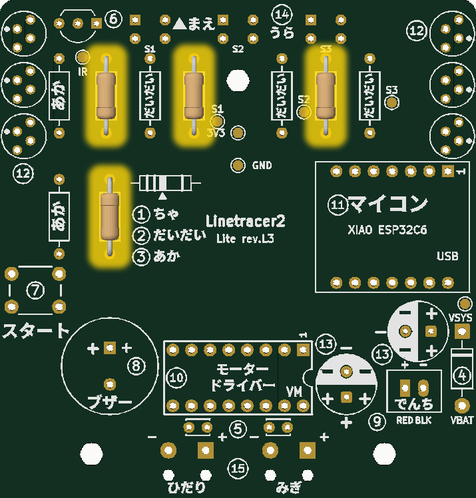 | 「①」の ふくろの ていこう 4 ほん。「ちゃ」と かいて ある ところに。むきは どちらでも よい | 100 Ω（R1〜R3、R9）。足を 10 mm 間隔に曲げる |
| ② | 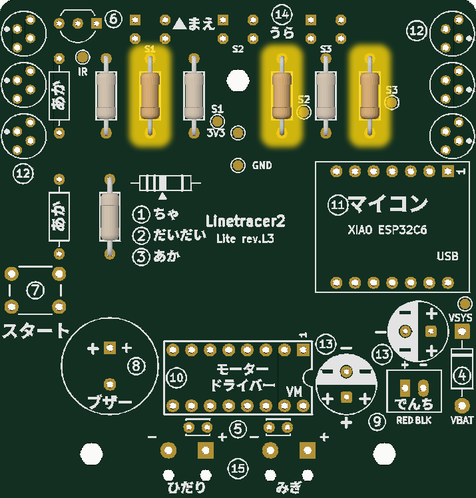 | 「②」の ふくろの ていこう 3 ぼん。「だいだい」の ところ | 10 kΩ（R4〜R6） |
| ③ | 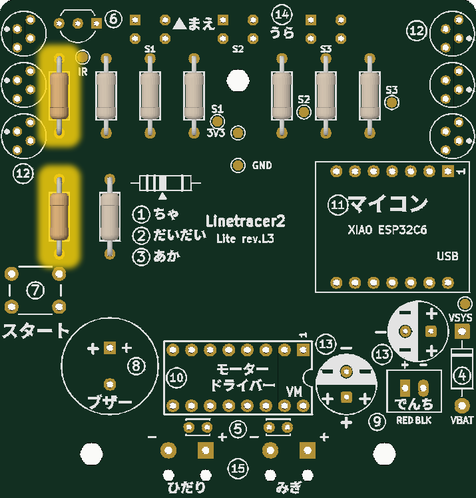 | 「③」の ふくろの ていこう 2 ほん。「あか」の ところ | 1 kΩ（R7、R10） |
| ④ | 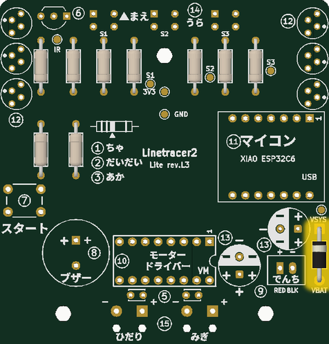 | くろい つつ（ダイオード）。**しろい おびを ふとい せんの ほう**に | 1N5819。逆だと電池で動かず、USB と電池を両方つなぐと USB の 5 V が電池に流れ込む（§6 の 4 で確かめる） |
| ⑤ | 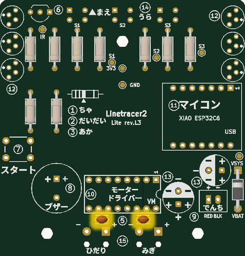 | ちいさい ちゃいろの つぶ 2 こ。**まっすぐ たてる**（うしろへ すこし たおれても よい） | 0.1 µF（C3、C4）。前（モジュール側）へ倒れると ⑩ が浮く |
| ⑥ | 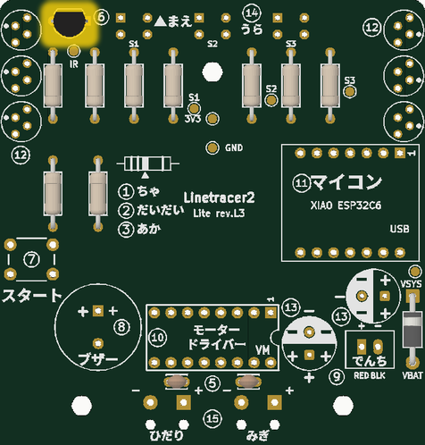 | くろい あし 3 ぼんの ぶひん。**えの かたちと おなじ むき**に（まるい ほうが うしろ） | 2SC1815（Q1）。逆でもこわれないが、センサーが動かない |
| ⑦ | 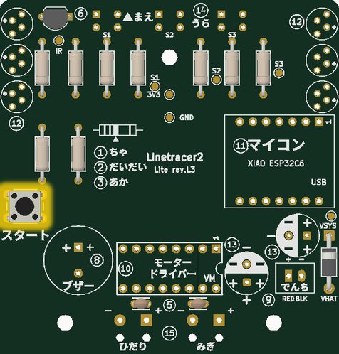 | スタート ボタン。4 ほんの あしを パチッと おくまで。**はいる むきなら どちらでも よい** | 足の間隔が 6.5 × 4.5 mm なので、入る向きは 2 通り（どちらでも同じ） |
| ⑧ | 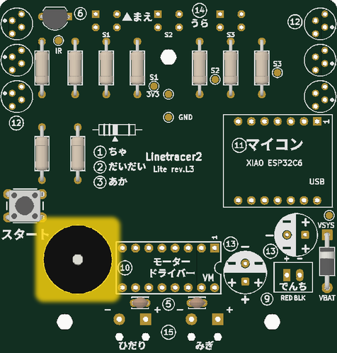 | ブザー。**＋ の あしを ＋ の しかくい あな**に。そこを きばんに くっつけて | 逆でも鳴る（直さなくてよい） |
| ⑨ ★ | 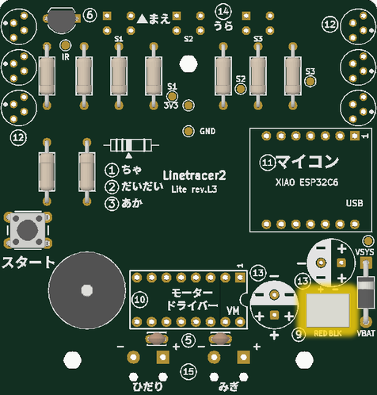 | でんちの コネクター。**でんちは いれない。スイッチは OFF**。せんせいと いっしょに | **先に電池ボックスのプラグ（電池なし）を差して、赤い線が ＋（RED）に来る向きで置いてから**はんだ付け。＋ と − のパッドの間は 1.0 mm: **はんだ付けのすぐあと、テスターで ＋ と − がつながっていないか見る**（§6 の 1） |
| ⑩ ★ | 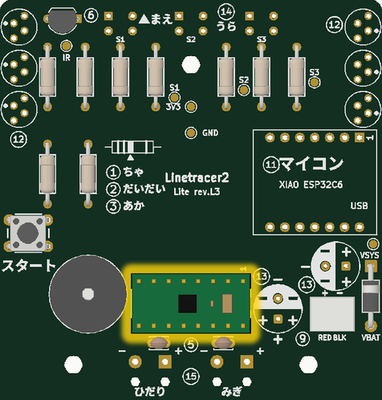 | モーター ドライバー（みどりの いた）。**「VM」の じと はんえんの かけた ところを みぎ**に。**せんせいが むきを みてから** はんだ | **逆向きに差しても入ってしまい、そのまま電池を入れると電池がショートする**（モジュールの GND が基板の VBAT に来る）。先生がモジュールに付属のピンヘッダを付けておき、裏に出た足は先生が切る（1.5 mm 残す。切らないと床から約 1 mm でこすれる） |
| ⑪ ★ | 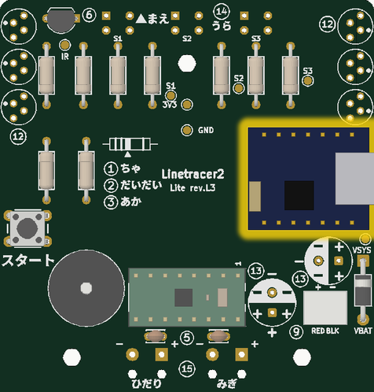 | マイコン（XIAO）。**USB の くちと ちいさい ボタン 2 こが うえ、USB は みぎの はし**（§3） | XIAO 側 14 ＋ 基板 14 ＝ 28 か所。対角の 2 か所を付けたところで先生が向きと浮きを確かめる |
| ⑫ ★ | 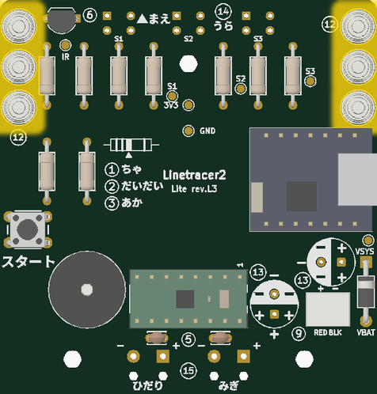 | フルカラー LED 6 こ（ひだりの はしに 3 こ、みぎの はしに 3 こ）。**いちばん ながい あしを ● の となりの あな**に。1 こ さして、はんだを 1 か所 → せんせいが みる → のこりの 3 か所 | PL9823（D2〜D7）。**逆に付けると電源（VDD）と GND が入れかわり、LED がこわれて熱くなることがある** → 1 こめで向きを確かめてから続ける（§5）。足の間がせまいので、ブリッジをルーペで見る |
| ⑬ | 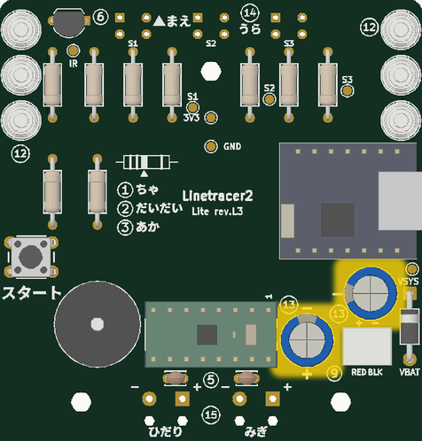 | おおきい コンデンサ 2 こ（いちばん せが たかい）。**しろい おび（−）を くろい ほう**に。**ながい あしが ＋** | 470 µF（C1、C2）。**逆だと USB や電池をつないだとき熱くなり、ふくらむ・破裂することがある**。付けたあと、外の「−」の印と帯がそろっているか先生が見る |
| ⑭ ★ | 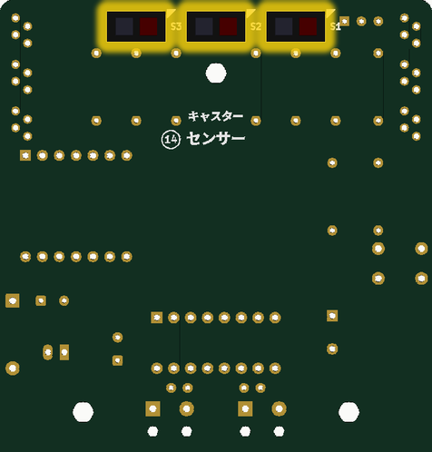 | センサー 3 こ。**きばんの うらから** さす。**ながい あし 2 ほんを まえ（▲まえ の ほう）**に（§4） | LBR-127HLD。逆向き・表から差してもこわれないが動かない。外すのは先生（4 本の足） |

- 番号の ★ は先生がとなりで見る手順。**⑨・⑩・⑪・⑫・⑬ の向きは、電気を入れる前に §6 でもう一度確かめる。**
- ⑮（モーターの線）は、枠を付けたあとに付ける（§7）。
- 絵は `../scripts/step_images.py` が KiCad の 3D データから作る（部品の位置を変えたら作り直す）。

---

## 3. マイコン（XIAO）をピンヘッダで付ける（⑪）

> 基板を「治具（じぐ）」にして、まっすぐ付ける。はんだは **XIAO の側 14 か所 ＋ 基板の裏 14 か所 ＝ 28 か所**。

1. 7 ピンのピンヘッダ 2 本を、**長いほうの足を下にして基板の表から**、マイコンの 2 列の穴に差す（黒いプラスチックが基板の上に乗る）。
2. その上に XIAO をかぶせる: **USB の口と小さいボタン 2 個が上（見える側）、USB は右の端**（印刷の「USB」の側）。14 本の短い足が XIAO の 14 個の穴から出ればよい。
3. **XIAO の上で、対角の 2 か所（いちばん左前といちばん右うしろ）だけ先に**はんだ付け → **先生が向き（USB が右）と、XIAO が傾いていないかを見る** → 残りの 12 か所。XIAO の小さい部品にこてを当てない。
4. 基板を裏返して、**基板の裏の 14 か所**をはんだ付け。足は**先生が切る**（1.5 mm 残す。真ちゅうの角ピンは硬く、切った先が飛ぶので全員めがね）。
5. **となりのピンとのブリッジ**をルーペで見る。特に**うしろの列の右の 3 本（3V3・GND・5V）**は、つながると電源がショートする。

- 逆向き（USB が内側）に付けると、5V が XIAO の D6 に、3V3 がボタンの線に入り、XIAO がこわれる。手順 3 で必ず止めて確かめる。
- ピンヘッダのおかげで XIAO は基板から 2.5 mm 浮いている。XIAO の裏の小さなパッドが基板の線に触れることはない。
- 低学年のクラスでは、XIAO 側の 14 か所は先生が予備の基板を治具にして先に付けておいてもよい。
- **（やり方 B）ピンソケット**を基板にはんだ付けして XIAO を差し込むと、XIAO を**抜いて別の機体や次の授業に使い回せる**（1 台 ¥1,100 の部品）。7 ピンのソケット 2 本（1×40 の分割ソケットを切る、など）が要る。

## 4. センサー（LBR-127HLD）を裏に付ける（⑭）

1. センサーを**基板の裏から**差す。**長い足 2 本が前（▲まえ の側）**。裏の四角の印の**黒い三角のかどに、センサーのかけたかど**を合わせる。レンズは **黒いほうが ●、透明なほうが ○**。
   - 秋月の注意: ロットによって見た目（レンズの色）が変わることがある。**いちばん確かなのは「長い足が前」と「かけたかど」**。
2. 本体を基板の裏に**すきまなく押し付けて**、表ではんだ付け（**1 本 3 秒まで**。本体がはんだのすぐ近くなので熱が伝わる）、足を切る。浮くとセンサーの高さが変わる。
3. 3 個とも同じ向き・同じ高さか横から見る。

## 5. ブザー（⑧）とフルカラー LED（⑫）

- ブザーは **START ボタンと同じピン（D4）**につながっている（ボタンの側には 1 kΩ の R10）。ブザーは電気を通さない部品なので、ボタンを読むじゃまにはならない。ソフトで音を出す（`robot.beep()`）ときだけ、そのピンを速く ON/OFF する。
- ボタンを押したままでも鳴る（長押しの「カチッ」）。鳴っている間（0.1 秒ほど）だけはボタンを読めない。
- フルカラー LED は別のピン（D6）なので、音と関係なく光らせられる。
- 音が大きすぎるときは `robot.volume = 0.2` など（0〜1）。**START を押したまま電源を入れると「しずかモード」**（音の代わりに LED が光る）。

**フルカラー LED（PL9823、6 こ）**

- 4 本の足は **DIN（信号が入る）・VDD（＋）・GND（−）・DO（次の LED へ）** の順。**いちばん長い足が GND**。基板の丸の中の **● の点のすぐとなりの穴が GND**（● は基板の端の側）。
- 穴は前後に互いちがい（足の間 1.27 mm のままだとブリッジしやすいので）。足を少し前後に開いてから差す。
- **向きをまちがえると VDD と GND が入れかわり、こわれて熱くなることがある**。1 こめを付けたら先生が見てから残りを付ける。6 こ全部付けたら §6 で確かめる。
- 6 こは 1 本の信号線でつながっている（左のうしろ → 左の前 → 前の端をわたって → 右の前 → 右のうしろ）。ソフトでは 0〜5 番（`robot.led[0] = "red"`）。**走っている間は、両側で光が前からうしろへ流れる**（その側の車輪が速いほど速く。`examples/07_rgb_led.py`）。
- 左右の端にあるので、**持つときに LED を曲げない**（持つのは電池ボックス）。
- 電源は電池（D1 のあと、約 4.2 V）。PL9823 の決まりは 4.5〜6 V で少し足りないが、ふつうは光る。**電池が減ると青と緑が暗くなる**。USB だけのとき光らなかったら §6 の「はじめての電気」の注意を見る。

## 6. でんきを いれる まえの チェック（先生がする。ここを通るまで電池も USB もつながない）

**向き（写真や §2 の絵と見くらべる）**

| 部品 | 正しい向き |
|------|-----------|
| C1・C2（470 µF） | 帯（−）が、基板の**外の「−」の印**の側 |
| D1 | 白い帯が太い線の側（右の端のダイオードの前） |
| モータードライバー | モジュールの「VM」と半円の切り欠きが右 |
| XIAO | USB が右の端 |
| J1 | 電池ボックスの赤い線が ＋（RED） |
| フルカラー LED 6 こ | いちばん長い足（GND）が、● の点のすぐとなりの穴（基板の端の側）に入っている（付けたあとは ● が LED の下にかくれるので、⑫ で 1 こずつ先生が見る） |

**テスター**（電池は入れない）

1. **J1 の ＋ と −**（抵抗のレンジ）: 0 Ω やブザーが鳴りっぱなしは**ショート**（ブリッジを探す）。数値がゆっくり上がっていくのは C1 が充電されているだけなので OK。
2. **XIAO の 5V と GND、3V3 と GND**: 同じく 0 Ω でないこと。
3. XIAO の 14 本・モジュールの 16 本・J1 の 2 本で、となりどうしがつながっていないか（ルーペ）。
4. **D1**（ダイオードのレンジ）: 赤のテスト棒を J1 の ＋、黒を C2 の ＋ → **0.2〜0.3 V**。入れかえると **OL**（表示なし）。逆なら D1 が逆。
5. 基板の上と机の上の、切った足のくずを払う（はさまるとショートする）。

**テストパッドで測る**（電気を入れたあと。こわれた所をさがすとき）

- テスターの黒を **GND** のパッド、赤を **VBAT（D1 の上のパッド）→ VSYS → 3V3** の順に。目安は 3.6〜4.8 V → それより 0.2〜0.3 V 低い → 3.3 V。最初に値がおかしくなった所の手前がこわれている（表は `../README.md` §4.9）。
- `examples/08_test_pads.py` を動かすと、赤外 LED を 5 秒ずつ ON / OFF する → **IR** が約 0.1 V ↔ 約 2 V、**S1〜S3** が白い紙で低く黒い線で約 3 V。フルカラー LED は 1 こずつ光り、光らない LED の 1 つ前までは信号が来ている。

**はじめての電気**

1. **USB だけ**つなぐ（電池なし）。10 秒、熱い・におい・音がないか見る。あれば**すぐ抜く**。
2. Thonny で **`linetracer.py` を先に XIAO に保存**してから、`../firmware/micropython/examples/01_led_blink.py`（フルカラー LED 6 こ（緑）と XIAO の黄 LED が交互に光る）→ `07_rgb_led.py`（6 こが ちがう色、流れる光）→ `06_buzzer.py`（ドレミ）→ `03_sensor_monitor.py`（白い紙と黒い線で値が変わる。3 個とも）。
   - **USB だけでフルカラー LED が光らない・色がおかしい**ときは、電池を入れてスイッチ ON で試す（USB の 5 V のときは LED が信号を読みにくいことがある）。電池でも光らないなら、LED の向きとブリッジを見る。
3. 電池を入れてスイッチ ON、**車輪を浮かせて** `04_motor_test.py`（前・後・右回り・左回り）。

## 7. 機械の組み立て（標準版とのちがい）

標準版の手順書 `../../docs/06_assembly.md` のとおり。ちがいは次のとおり:

| 標準版 | Lite |
|-------|------|
| ギヤボックスの枠は M3×20 ねじ 4 本で基板・枠・デッキを共締め | **同じ**（電池ボックスはモーターの上のデッキに付ける）。枠は刻印の **L を左、R を右** |
| モーターの線は基板のパッドへ | **⑮ 枠を付けたあと、デッキを付ける前**に、モーターの線を「ひだり」「みぎ」のパッドへ。**こてを枠（プラスチック）に当てない**（枠の切り欠きのふちまで約 2 mm） |
| デッキをのせる | **同じ**。デッキの下の**うすい板（リブ）が、2 つのモーターのおしりの間**に入る（モーターが内側へずれてギヤが外れないように）。**デッキが浮いて柱にのらないときは、モーターが板に当たるまで入っていない** → 車輪の側へ押しこむ。モーターの線を真ん中のすき間に入れない |
| スキッド `skid_clip_h40.stl` を (50, 4) の穴 | **ボールキャスター `caster_lite_print_h75.stl`**（またはスキッド `skid_clip_h75.stl`）を、裏の「キャスター」の穴（真ん中のセンサーの 7 mm 後ろ）に**下からパチッと押し込む**。ロボットは少し後ろに傾く（2.9°）が正しい |
| タイヤは O リング P-24 | **TPU の印刷タイヤ**を車輪のみぞにはめる（引っぱって伸ばしながら） |
| 電源ランプで電源 ON を確認 | 電源ランプはない。**電池のスイッチを入れると「ド・ミ・ソ」が鳴り、フルカラー LED が緑に光る** |

- 電池のプラグは C1・C2・D1 に囲まれていて抜きにくい。**ふだんは電池ボックスのスイッチで切る。プラグは先生がはずす**（線を引っぱると切れる）。
- 組み上がった形は 3D で見られる: `../hardware/Linetracer2-Lite_assembly.stl`（GitHub でそのまま回して見られる）、色つきは `../hardware/Linetracer2-Lite_assembly.glb`。

## 8. うごかしかた（こども用カード）

| こうすると | こうなる |
|-----------|---------|
| でんちの スイッチを ON | 「ド・ミ・ソ」が なって、LED が みどりに ひかる（じゅんび OK） |
| ロボットを せんの うえに おいて スタートを みじかく おす（1 かいめ） | 「ピッ」と LED が あお → **てを はなす** → 1 びょう たって、ロボットが その ばで くるくる まわる（せんを おぼえる）。「ピロッ」と みどりで できた。ひくい「ブー」と あかは しっぱい（せんの うえに おいて もう いちど） |
| もう いちど スタートを みじかく おす | 「ピッ・ピッ・ピッ・ピー」で はしりだす。**りょうがわで ひかりが まえから うしろへ ながれる**（カーブでは うちがわが ゆっくり。せんを みうしなうと あか）。もう いちど おすと とまる |
| スタートを ながく おす（「カチッ」と なるまで） | はやさが 1 → 2 → 3 → 1 と かわる。「ピッ」の かずと きいろい LED の かず（まえから）が はやさ |
| USB だけ つないで いる | **モーターは うごかない**（モーターは でんちだけで うごく）。でんちの スイッチを ON に |
| はしりだすと LED が きえて、また 「ド・ミ・ソ」が なる | **でんちが へって いる** → でんちを かえる |
| スタートを おしたまま スイッチを ON | しずかモード（おとの かわりに LED が ひかる） |
