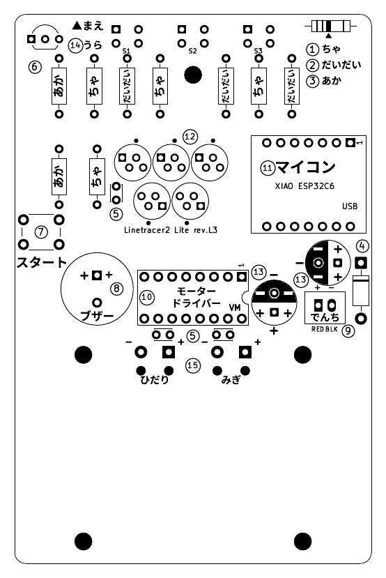
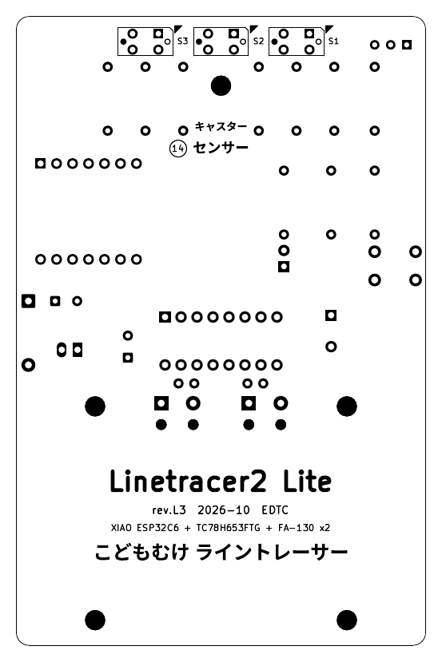

# Linetracer2 Lite 組み立て手順書（rev.L3、先生用・子ども用）

> 対象: 小学校低学年〜（はんだ付けは先生がそばについて行う）
> 最終更新: 2026-10-07（rev.L3: XIAO ESP32C6 を**ピンヘッダ**で付ける、ブザー、ボールキャスター、配線のやり直し）
> **基板には記号（丸い数字・＋−・絵・色の名前）だけを印刷してある。記号の意味と手順はこの手順書に書く。**
> 道具・ねじ・機械部分の組み方は標準版の手順書 `../../docs/06_assembly.md` と同じ（ちがう所だけここに書く）。

| 基板の表（記号） | 基板の裏（下から見た向き） |
|---|---|
|  |  |

---

## 0. 先生が事前に準備しておくもの（標準版とのちがい）

| もの | ちがい |
|------|-------|
| マイコン XIAO ESP32C6 | **MicroPython を先に書き込んで、動くことを確かめておく**（`../README.md` §8.1）。ピンヘッダを付けたあとでも書き込めるが、先に確かめておくと故障の切り分けが楽 |
| **ピンヘッダ** | 1×40 ピンヘッダ（秋月 100167）から **7 ピン × 2 本**をニッパーで切っておく（1 本の 1×40 から 7 ピンが 5 本取れる＝2 台半分）。切り口のバリはやすりで落とす |
| ブザー | 圧電スピーカー 13 mm（秋月 104118、PKM13EPYH4000-A0）。足が短ければそのまま、長ければ先生が 5 mm 間隔に合っているか見る |
| 前の支え | **ボールキャスター**（`../../hardware/mechanical/caster_lite_print_h75.stl`、玉が中で一緒に印刷される）または **スキッド** `skid_clip_h75.stl`。どちらも高さ 7.5 mm、基板の「キャスター」の穴に押し込む（§7） |
| タイヤ | **TPU の印刷タイヤ `tire_tpu.stl`** ×2（O リングは使わない） |

---

## 1. 基板の記号の見かた

| 記号（基板の白い印刷） | 場所 | 意味 |
|------|------|------|
| **▲まえ** | 左前 | ロボットの前。センサーがある側 |
| **丸い数字 ①〜⑮** | 部品のそば | **つくる順番**（§2）。1 つの番号で使う部品は 1 種類だけ |
| **ちゃ / だいだい / あか** | 抵抗の上 | 抵抗の **3 本目の帯の色**。どの抵抗も「ちゃ・くろ・**？**・きん」で、3 本目だけがちがう |
| **抵抗の絵と ① ちゃ ② だいだい ③ あか** | 右前の角 | 絵の **▲の帯が 3 本目**（きん色の帯と反対の端から数える）。① で「ちゃ」の抵抗、② で「だいだい」、③ で「あか」を付ける。ちゃ = 100 Ω、だいだい = 10 kΩ、あか = 1 kΩ |
| 半円の形 | トランジスタ Q1（⑥） | 部品の形と同じ向きに差す（平らな面がうしろ） |
| **LED の絵**（長い足に ＋） | LED のそば（⑦） | LED は **長い足が ＋**。パッドの横の **＋** の穴に長い足 |
| **丸の半分が黒、黒い中に白い −** | 大きいコンデンサ C1・C2（⑪） | コンデンサの**白い帯（− の印が並んでいる）を黒い方**に。**白い方の ＋ に長い足** |
| 太い線 | ダイオード D1（④） | ダイオードの **白い帯を太い線の側**に |
| **＋**（ブザーの中） | ブザー（⑨） | ブザーの **＋ の足を ＋ の四角いパッド**に |
| **＋ −**、RED / BLK | でんち（⑩） | 赤い線が ＋ |
| **1** | モータードライバーの右はし（⑫） | モジュールの **1 番ピンを右**に |
| **USB** | マイコンの右はし（⑬） | マイコンの **USB を右の端**に |
| **ひだり / みぎ**、**＋ −** | モーターのパッド（⑮） | 左のモーターは「ひだり」、右は「みぎ」。モーターの ＋ 端子（赤い印）を ＋ に。逆でもソフトの設定で直せる |
| **S1 S2 S3** | 前 | センサーの番号（ひだり・まんなか・みぎ） |
| 裏の **四角、かけた角の ◤、● と ○** | 裏の前（⑭） | センサーは **裏から** 差す。**◤ の角にセンサーのかけた角**、**● に黒いレンズ**、**○ に透明なレンズ** |
| 裏の **キャスター** | 裏の前のまんなか | ボールキャスター（またはスキッド）を差す穴 |

---

## 2. はんだ付けの順番（基板の ①〜⑮）

背の低い部品から順に付ける。どの部品も「差す → 裏返して はんだ → 足を切る」。**足を切るときは、切った足が飛ばないように指で押さえる**（目に入ると危ない）。

| 番号 | 部品 | 数 | 向き・気をつけること |
|------|------|----|----------------|
| ① | **抵抗「ちゃ」**（100 Ω） | 4 | 3 本目の帯が**ちゃいろ**の抵抗を、「ちゃ」と書いてある所に。向きはどちらでもよい。足を 10 mm 間隔に曲げる |
| ② | **抵抗「だいだい」**（10 kΩ） | 3 | 3 本目の帯が**だいだい色** |
| ③ | **抵抗「あか」**（1 kΩ） | 2 | 3 本目の帯が**あか** |
| ④ | **ダイオード** D1（1N5819） | 1 | 白い帯を、印刷の太い線の側に |
| ⑤ | **小さいコンデンサ** C3・C4（0.1 µF） | 2 | 向きはどちらでもよい（モーターの線の上に乗る位置） |
| ⑥ | **トランジスタ** Q1 | 1 | 半円の形に合わせる（平らな面がうしろ） |
| ⑦ | **LED**（赤） | 1 | 長い足を ＋ に |
| ⑧ | **ボタン**（スタート） | 1 | 4 本の足をパチッと奥まで。向きはどちらでもよい（四角なので） |
| ⑨ | **ブザー** | 1 | ＋ の足を ＋ に。底を基板に押し付けて |
| ⑩ | **でんちのコネクタ** J1 | 1 | **先に電池ボックスのプラグを差して、赤い線が ＋（RED）に来る向きで置いてから**はんだ付け（逆だと壊れる） |
| ⑪ | **大きいコンデンサ** C1・C2（470 µF） | 2 | 白い帯（−）を黒い方に。長い足が ＋ |
| ⑫ | **モータードライバー**（AE-TC78H653FTG） | 1 | 先生がモジュールに付属のピンヘッダを付けておく。**1 番ピンを右**に（印刷の 1） |
| ⑬ | **マイコン** XIAO ESP32C6（**ピンヘッダで**） | 1 | §3 |
| ⑭ | **センサー** LBR-127HLD | 3 | §4。**裏から** |
| ⑮ | **モーターの線** | 4 本 | 標準版と同じ（`../../docs/06_assembly.md`）。左のモーターは「ひだり」、右は「みぎ」 |

---

## 3. マイコン（XIAO）をピンヘッダで付ける

> 基板を「治具（じぐ）」にして、まっすぐ付ける。はんだは **XIAO の側 14 か所 ＋ 基板の裏 14 か所 ＝ 28 か所**。

1. 7 ピンのピンヘッダ 2 本を、**長いほうの足を下にして基板の表から**、マイコンの 2 列の穴に差す（黒いプラスチックが基板の上に乗る）。
2. その上に XIAO を、**部品の面を上・USB を右**（印刷の「USB」の側）にしてかぶせる。14 本の短い足が XIAO の 14 個の穴から出ればよい。
3. **XIAO の上で、対角の 2 か所（いちばん左前といちばん右うしろ）だけ先に**はんだ付け → XIAO が傾いていないか横から見る → 残りの 12 か所。
4. 基板を裏返して、**基板の裏の 14 か所**をはんだ付け。足が長く出ていたら 1.5 mm くらいを残して切る（とがった先は指でさわらない）。
5. **となりのピンとのブリッジ**をルーペで見る。特に **5V と GND、GND と 3V3**（いちばん右の 3 本）はつながると電源がショートする。

- ピンヘッダのおかげで XIAO は基板から 2.5 mm 浮いている。XIAO の裏の小さなパッドが基板の線に触れることはない。
- **（やり方 B）ピンソケット**を基板にはんだ付けして XIAO を差し込むと、XIAO を**抜いて別の機体や次の授業に使い回せる**（1 台 ¥1,100 の部品）。7 ピンのソケット 2 本（1×40 の分割ソケットを切る、など）が要る。高さが 8 mm くらい上がるが、マイコンの上には何もないので問題ない。

## 4. センサー（LBR-127HLD）を裏に付ける

1. センサーを**基板の裏から**差す。裏の四角の印の **◤ の角（かけた角）に、センサーのかけた角**を合わせる。レンズは **黒いほうが ●、透明なほうが ○**（長い足 2 本はアノードとエミッタ）。
   - 秋月の注意: ロットによって見た目（レンズの色）が変わることがある。**いちばん確かなのは「かけた角」**。
2. 本体を基板の裏に**すきまなく押し付けて**、表ではんだ付けし、足を切る。浮くとセンサーの高さが変わる。
3. 3 個とも同じ向き・同じ高さか横から見る。

## 5. ブザー

- ブザーは **赤い LED と同じピン**につながっている。LED を「点けっぱなし」にしてもブザーは鳴らない。ソフトで音を出すと（`robot.beep()`）、鳴っている間は LED がうすく光る。
- 電源を入れた直後に「プツッ」と小さく鳴ることがある（マイコンが起動の文字を出すため。故障ではない）。

## 6. 最初の確認（テスター）

1. 電池を入れずに、J1 の ＋ と −、**XIAO の 5V と GND、3V3 と GND** がショートしていないか。
2. XIAO の 14 本のうち、となりどうしがつながっていないか。
3. USB をつなぎ、Thonny で `../firmware/micropython/examples/01_led_blink.py` → 赤 LED と XIAO の黄 LED が交互に光れば OK。`06_buzzer.py` でドレミが鳴れば OK。

## 7. 機械の組み立て（標準版とのちがい）

標準版の手順書 `../../docs/06_assembly.md` のとおり。ちがいは次のとおり:

| 標準版 | Lite |
|-------|------|
| ギヤボックスの枠は M3×20 ねじ 4 本で基板・枠・デッキを共締め | **同じ**（電池ボックスはモーターの上のデッキに付ける） |
| スキッド `skid_clip_h40.stl` を (50, 4) の穴 | **ボールキャスター `caster_lite_print_h75.stl`**（またはスキッド `skid_clip_h75.stl`）を、裏の「キャスター」の穴（真ん中のセンサーの 7 mm 後ろ）に**下からパチッと押し込む**。ロボットは少し後ろに傾く（2.9°）が正しい |
| タイヤは O リング P-24 | **TPU の印刷タイヤ**を車輪のみぞにはめる（引っぱって伸ばしながら） |
| 電源ランプで電源 ON を確認 | 電源ランプはない。**電池のスイッチを入れて `main.py` が動くとメロディーが鳴り、赤 LED が点く** |

- 組み上がった形は 3D で見られる: `../hardware/Linetracer2-Lite_assembly.stl`（GitHub でそのまま回して見られる）、色つきは `../hardware/Linetracer2-Lite_assembly.glb`。
